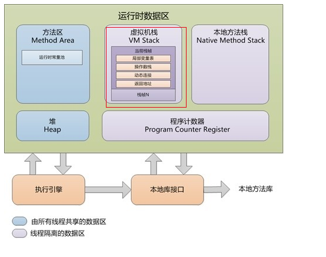

线程是执行的基本单位，执行需要依靠程序计数器与方法栈。
进程是拥有资源的基本单位，资源包括堆、方法区、常量池。

**程序计数器**：线程私有，用于指示线程的下一条需要执行的字节码指令。
**JVM栈**：线程私有，每执行一个方法，为这个方法创建一个栈帧放入栈中。栈帧存放的是当前方法的局部变量表（某个方法的局部变量表在编译期间就已经确定，因此运行时需要为某个方法分配多大的栈空间是确定的）、操作数栈、动态连接、方法出口等信息。当栈深度溢出，则报错StackOverflowError，当栈无法申请到足够内存，则报错OutOfMemoryError。
**本地方法栈**：和JVM栈类似，唯一区别是本地方法栈为native方法服务。
**Java堆**：所有线程共享。几乎所有对象都在堆上分配。
**方法区**：所有线程共享，存储已经被虚拟机加载的类型信息、常量、静态变量、即时编译器编译后的代码缓存。
**常量池**：存放编译期间生成的各种字面量与符号引用。
**直接内存**：直接内存不是虚拟机运行时数据区的一部分，也不是虚拟机规范中定义的内存区域。主要用在NIO操作中，用于直接开辟一块系统内存。

**永久代**：是Hotspot特有的，**在1.7之前使用永久代来实现方法区**。主要存放常量、类信息、静态变量等数据。通常不会进行垃圾回收。
**元空间**：也是Hotspot特有的，**在1.8之后使用元空间实现方法区**，元空间使用的是系统内存，默认情况下只受系统内存的限制。

线程内的OOM，不会导致主线程结束

如果A类和B类互相包含引用，然后将某个对象转成json格式时，会产生栈溢出
如果java程序占用CPU过高，jstack 可以用来定位java进程和线程
如果java程序发生线程死锁，jstack 也可以进行定位

jps：查看当前系统中有哪些java进程
jmap：查看堆内存占用情况，只能查看某个时刻
jconsole：图形化界面，可以连续查看堆内存使用情况、线程情况、CPU使用情况等
jvirsualvm：图形化界面，可视化方式来观察java虚拟机

**JVM 中的 new 关键字执行过程**
1. 在常量池中定位这个类的符号引用。如果这个符号引用代表的类没有被加载则需要执行类加载过程。
2. 在堆中为这个对象分配内存。
由于对象所需的内存在类加载完成后就确定了，因此这一步就是将一块确定大小的内存区域从堆中划分出来。根据堆内存是否规整可以将这个划分方式分成“指针碰撞”与“空间列表”两种方式。
如何保证并发情况下多个线程同时在堆中分配内存的线程安全问题？两种解决方案：①采用CAS配上失败重试保证保证更新操作的原子性；②在堆中为每一个线程分配一个分配缓冲区。每个线程都在自己的缓冲区中分配。只有自己的缓冲区用完了去申请新的缓冲区才需要同步锁定。
3. 将分配的内存空间初始化为零值。
4. 设置对象头。将GC分代年龄、是否使用偏向锁、哈希码等信息放在对象头中。
5. 执行构造函数。

## JVM内存参数
**堆内存大小设置**
新生代：存放较新的对象。内部分为eden、from、to。
老年代：存放活过了好多次GC的对象。

-Xmx10240m：代表JVM最大内存是多少，m表示单位。这里的含义是JVM虚拟机最大占用10G
-Xms10240m：最小内存
-Xmn5120m：代表新生代的内存。剩下的给老年代使用。
-XX:SurvivorRatio=3：新生代内存分为eden、from、to。from和to的比例永远是1:1，这里SurvivorRatio=3代表eden:from=3。默认值为8:1

-XX:NewRatio=2：新生代和老年代的比例，默认为2。
-XX:MaxNewSize：新生代最大内存
-XX:NewSize：新生代最小内存。如果MaxNewSize=NewSize，那么可以直接用-Xmn设置。

**元空间大小设置**
classspace：存放 类最基本的信息如类名称，类方法入口。
non-class space：存放 方法的字节码，类上的注解。

-XX:CompressedClassSpaceSize：classspace的最大内存。
-XX:MaxMetaspaceSize：元空间最大内存。默认无上限

-XX:ReservedCodeCacheSize：代码缓存区大小，代码缓存区是缓存JIT编译后的机器码的。

**栈空间设置**
-Xss：栈空间大小。如果不设置会和物理机有关。如linux为1M