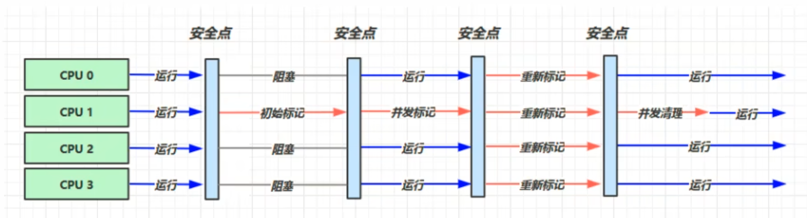

# 垃圾回收算法

如何判断对象已死：使用可达性分析算法进行。

**可达性分析算法**：如果从GC Roots出发到某个对象是可达（存在一条引用链），那么这个对象就不能被回收。

**引用类型**：强引用、软引用、弱引用、虚引用。
* **强引用**：最常用最普通的引用。只要从GC Roots可达就不能回收。
* **软引用**：用来描述还有用，但是非必须的对象。jdk1.2之后用SoftReference来实现软引用。如果发生垃圾回收，内存仍然不够就回收软引用。如果够了就不回收
* **弱引用**：和软引用类似。jdk1.2之后用WeakReference来实现弱引用。和软引用的区别在于，无论当前内存是否足够，只要发生垃圾回收，就回收弱引用。
* **虚引用**："虚引用"顾名思义，就是形同虚设，与其他几种引用都不同，虚引用并不会决定对象的生命周期。如果一个对象仅持有虚引用，那么它就和没有任何引用一样，在任何时候都可能被垃圾回收。虚引用主要用来跟踪对象被垃圾回收的活动。

**对方法区的回收**：一般不会发生回收行为。方法区的回收内容主要分为两部分：废弃的常量以及不在使用的类型。废弃的常量代表没有任何对象引用这个常量。不再使用的类型需要满足以下三个条件：1）该类所有实例都已被回收；2）加载该类的类加载器已被回收；3）该类对应的java.lang.Class对象没有在任何地方被引用，即不会有任何地方通过反射使用该类的属性或方法。在大量使用反射、动态代理、CGLib等字节码框架时，需要java虚拟机具备类型卸载能力。

## 垃圾回收算法
**分代收集理论**：1）绝大多数对象都是朝生夕死的；2）熬过越多次垃圾收集的对象，就越难消亡。3）**跨代引用的情况非常少。因此使用记忆集解决跨代引用的问题**。基于此三条，垃圾收集器的设计原则就是主要关注刚出生的对象，把年纪大的对象统一进行管理，等空间实在不足再去收集老对象。同时对跨代引用的情况进行特殊处理。

* **标记-清除算法**：标记存活对象，回收未被标记的对象。主要缺点在于当有大量对象可以清除的时候，标记清除算法速度较慢，且存在内存碎片。
* **标记-复制算法**：将内存中留出一块区域(Survivor区域)。每次垃圾回收的过程如下：标记存活对象，然后将所有存活对象统一复制到预留出来的内存区域中即可。通常情况下存活对象都只占少部分，因此预留出来的区域只需要占内存区比较小的一部分。如果存活对象超过了Survivor区域容量，则将部分对象塞到其它内存区域（通常是老年代）。**特点**：适用于对象存活率低的情况；不产生内存碎片；需要其它区域做担保；
* **标记-整理算法**：因为标记-复制算法需要其它内存区域做担保，而且对象存活率高的时候需要进行较多的复制操作。因此效率会很低。**针对老年代**提出了标记-整理算法。先标记存活对象，然后让所有存活对象向内存一端移动。**特点**：适用于对象存活率高得情况；不存在内存碎片

## HotSpot的垃圾回收
HotSpot将堆内存区域分为新生代和老年代。新生代又分为Eden区和两个Survivor区，比例为8:1:1。大部分对象都在Eden区域出生，当发生垃圾收集时，将Eden和Survivor from区的尚存活对象放入Survivor to区，然后交换from和to的标签。如果Survivor to放不下，那么会将一部分未满年龄的对象提前送到老年代中。默认情况下，熬过了16次垃圾回收的对象会晋升到老年代中。

### HotSpot的算法细节实现
jdk1.9之后，默认垃圾收集器是G1。另一个比较重要的垃圾收集器是CMS

#### 可以随时GC么？
只有在安全点或者安全区域才可以进行GC。
* **安全点**：必须所有工作线程都执行到安全点位置时，GC线程才能开始垃圾回收。至于为什么一定要走到安全点才能GC，这是为了方便的获取所有GC Roots做的妥协。
* **安全区域**：在某个区域内对象引用不会发生变化，那么线程可以在这个区域内的任何地方停下来。

#### 如何解决跨代引用
**跨代引用**：老年代中的对象引用了新生代的对象。因此如果需要找出新生代中的所有存活对象，不得不在固定的GC Roots之外，再额外遍历整个老年代中所有对象来确保可达性分析的正确性。
**记忆集与卡表**：记忆集是抽象的，卡表是记忆集的具体实现。**使用记忆集解决跨代引用问题**。由于跨代引用非常稀少，因此可以使用记忆集来优化这个过程。
具体的：将老年代中的内存划分为“卡页”，如果一个卡页中存在某个对象跨代引用了其它对象，那么就将这个卡页做一个标记表示这个卡页变脏了。在标记阶段将所有变脏的卡页找出来，并将里面的对象加入到GC Roots中一并扫描。

#### 并发GC的可达性分析
使用**三色标记法**进行可达性分析
* 黑色：该对象已经被扫描过，且该对象的所有引用都被扫描过
* 白色：该对象还没有被扫描过。如果标记结束后是白色，说明这个对象不会被使用到了，可以放心收集。
* 灰色：该对象已经被扫描过，但是存在某些引用没有被扫描过

**并发时会出现的问题**：
* 黑色被错误标记成白色：在并发标记过程中，如果一个白色对象原本能够被扫描到，但此时所有灰色对象到这个白色对象的引用都被断掉了，且增加了黑色对象到这个白色对象的引用（**注意，这两个条件缺一不可**）。那么就会导致这个对象被错误标记成白色导致被错误的当成垃圾回收掉了。这个问题是不可容忍的。
* 白色被错误标记成黑色：在并发过程中，如果其它所有对象到一个黑色对象的引用全部断开，那么这个黑色对象应该变成白色对象被回收。这种本应该在这次GC时被收集掉的垃圾意外地躲过了GC的对象称为**浮动垃圾**。这个问题可以容忍。

**如何解决黑色被错误标记成白色？**：增量更新与原始快照
* **增量更新**：当插入一个黑色对象引用到白色对象的引用关系时，将这个新插入的引用记录下来。等到并发扫描结束之后，再从这些黑色对象开始重新扫描一次。
* **原始快照**：当灰色对象要删除指向白色对象的引用时，就将这个要删除的引用记录下来。在并发扫描结束之后，再从这些灰色对象开始重新扫描一次。

假设标记过程是单线程的，那么如果一个对象在染色结束之后还是白色，那么说明这个对象找不到了，不可能会存在某个黑色对象引用这个白色对象的情况。原始快照可以简单理解为，无论引用关系怎么变，都会按照刚开始扫描那一刻的对象图快照进行搜索。按照原始快照进行搜索不可能会发生将黑色对象标记成白色的情况。

# 垃圾回收器

## Serial
新生代、单线程、适合小的客户端应用。采用复制算法

## ParNew
是Serial的多线程版本。在GC时可以有多个GC线程，但是还是需要全程STW。

并行：同一时间可以有多条GC线程协同工作。但是工作线程仍然需要等待
并发：同一时间GC线程可以和工作线程同时执行。

## Parallel Scavenge
新生代、标记复制算法、并行（和ParNew类似）。

关注吞吐量：处理器用于用户代码的时间 与 处理器总消耗时间的比值。

提供两个参数
-XX:MaxGCPauseMills：控制最大垃圾收集停顿时间
-XX:GCTimeRatio：控制吞吐量大小。
吞吐量和垃圾停顿时间是相违背的。也就是如果希望吞吐量高，就只能牺牲垃圾收集停顿时间。

## Serial Old
老年代、单线程、标记整理算法

## Parallel Old
是Parallel Scavenge的老年代版本。支持多线程并行收集。基于标记整理算法。

在注重吞吐量或者处理资源较为稀缺的场景时，可以使用Parallel Scavenge/Parallel Old

## Concurrent Mark Sweep (CMS)
关注响应时间优先。适合作为服务器的垃圾收集器。标记清除算法。
整个过程分为四个部分：
* **初始标记**：需要STW。仅标记以下GC Roots能直接关联到的对象，速度很快。
* **并发标记**：不需要STW。从初始标记被标记的对象开始，遍历整个对象图的过程。耗时较长。
* **重新标记**：需要STW。在并发标记阶段有些对象之间的引用会被修改。这一阶段就是标记这些对象的。比初始标记长但是比并发标记短。
* **并发清除**：不需要STW。清除已经死亡的对象。
  

缺点：
* CMS对处理器资源非常敏感。因为需要GC线程处理GC任务。
* 无法处理浮动垃圾。可能会导致并发失败，退化成并行执行。
* 基于标记清除算法。导致会有大量空间碎片产生。

## G1
基于Region实现。面向服务端应用。面向整个堆内存、支持类卸载。
G1收集器是一款能够建立起“**停顿预测模型**”（Pause Prediction Model）的收集器。停顿预测模型指的是能够支持指定在一个长度为M毫秒的时间片段内，消耗在垃圾收集上的时间大概率不超过N毫秒这样的目标。

G1页遵循分代收集理论，但是不再坚持固定大小以及固定数量的分代区域划分，而是将连续的Java堆划分成多个大小相等的独立区域（Region），每一个Region都可以根据需要充当Eden、Survivor、Old。垃圾收集器能够对扮演不同角色的Region采用不同的策略去进行垃圾回收。G1通过维护一个优先队列来实现对回收价值更高的Region进行回收。

同时G1还有一块专门的内存（Humongous）用于存放大对象，防止大对象的移动。G1认为只要大小超过了一个Region容量的一半的对象即可判定为大对象。那些超过了一个Region容量的对象会用多个连续的Region进行存储。

### G1 的实现细节
**跨Region引用**
G1需要解决Region之间的跨Region引用，因此需要为每个Region构建卡表，因此比较耗费内存。G1至少要耗费大约相当于Java堆容量的10%至20%的额外内存来维持收集器工作。
**并发标记阶段**
G1收集器通过原始快找算法实现在并发标记阶段保证收集线程与用户线程互不干扰地运行。
**如何建立可靠的停顿预测模型**
G1收集器会记录每个Region的回收耗时、每个Region记忆集里脏卡数量等各个可测量的步骤花费的成本，并分析得出平均值、标准差、置信度等统计信息。平均值代表整体的平均状态，衰减平均值代表最近的平均状态。G1收集器是使用衰减平均值来衡量这些统计信息并作出尽可能精准的预测。

### G1与CMS的比较
G1的优点：支持停顿预测模型、按收益动态确定回收集。
G1的缺点：G1的内存占用与运行时的额外执行负载要比CMS高

## ZGC
是以低延迟为首要目标的垃圾收集器。ZGC也采用基于Region的堆内存布局，但是ZGC的Region支持动态创建和销毁，且Region大小不是固定的。
* 小型Region：容量固定为2MB，用于放置小于256KB的小对象
* 中型Region：容量固定为32MB，用于放置大于等于256KB小于4MB的对象
* 大型Region：容量不固定，必须是2MB的整数倍。用于放置4MB或以上的大对象。每个大型Region只存放一个大对象（因此大型Region可能小于中型Region）