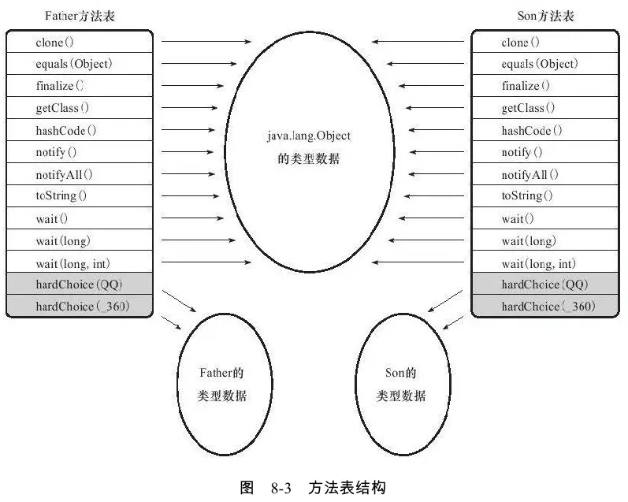

## 字节码执行引擎
JVM以方法作为最基本的执行单元。而方法的执行依赖于“栈帧”这个数据结构。每个线程都有一个栈帧，处于栈顶的栈帧对应的方法就是当前线程正在执行的方法。栈帧中存储了一个方法从开始调用到执行结束锁需要的所有信息。一个方法从开始调用到执行结束，对应了一个栈帧的入栈和出栈。因此，栈帧和方法的执行是息息相关的。
**栈帧中存放的信息**：局部变量表、操作数栈、动态连接、方法返回地址、以及一些额外的附加信息。在程序的编译阶段，需要多大的局部变量表以及多深的操作数栈，都已经确定下来了，放在方法表的Code属性当中。也就是说，一个栈帧需要多少内存，在程序的编译阶段就已经确定下来了。
接下来逐一讲解栈帧中存放的各个数据

### 局部变量表
局部变量表的基本单位是**变量槽**（根据实现不同，变量槽的大小可以设计成32位和64位）。在变量槽大小为32位时，会为64位数据分配连续的两个变量槽（任何情况下，都不能单独访问其中一个变量槽）。对这连续两个变量槽的读取不是原子操作，由于栈帧是线程私有，因此不会引起线程安全问题。
JVM通过索引定位方式使用局部变量表，索引N代表使用第N个变量槽（如果是64位变量，代表使用第N和第N+1个变量槽）。**对于实例方法，第0位索引用于存放this**。

变量槽可以重用，当PC的值已经超出了某个变量的作用域时，那么这个变量所占用的变量槽可以交给其它变量重用。

另外，局部变量不像类变量一样存在准备阶段。因此所有的局部变量在使用时都要保证已经赋过初值。

### 操作数栈
JVM执行字节码指令时，有些指令会将操作数存入操作数栈中，有些指令会从操作数栈中取操作数进行运算。在编译阶段以及类校验阶段的数据流分析中都会严格保证“操作数栈中的元素与字节码指令的序列严格匹配”。比如说，iadd命令是两个int型数据相加，那么此时栈顶一定有两个int型数据。
操作数栈一开始是空的，局部变量表栈一开始是满的。

另外两个栈帧之间，下层的操作数栈与上层的局部变量表中可能存在部分重叠，这样就无需进行额外的参数复制传递了。具体见P300图8-2。

### 动态连接
详细请看后面的方法调用

### 方法返回地址
放一个方法开始执行之后，只有两种可能会导致方法运行结束。
* 正常结束，根据方法的返回指令来确定方法的返回值与返回地址。
* 程序出现异常，且在本方法的异常表中没有匹配到异常处理器，就会导致方法退出，这时候不会有返回值。

### 附加信息
完全取决于虚拟机的具体实现

## 方法调用
**方法调用阶段唯一任务就是确定被调用方法的版本**。**方法调用与重载、重写的实现密切相关**。Java是一款动态链接的语言，Class文件的编译过程中不包含编译的连接步骤，一切方法调用在Class文件里面存储的都只是符号引用，而不是方法在实际运行时内存布局中的入口地址（或者说直接引用）。

### 解析调用
解析调用：能够在编译阶段确定类型的调用。
分派调用：不能在编译阶段确定类型的调用。
**在编译阶段能够确定调用目标的方法调用称为解析调用**。也就是说，这一类方法都可以在类加载的解析阶段，直接将符号引用转化为直接引用。

在Java语言中，满足编译期可知，运行期不可变这个要求的方法，主要有静态方法与私有方法两大类，前者与类型直接关联，后者在外部不可被访问，因此它们都适合在类加载阶段进行解析。

字节码指令集中设计了不同的指令用于调用不同类型的方法，在Java虚拟机中支持以下五种方法调用字节码指令，分别是：
* invokestatic：用于调用静态方法
* invokespecial：用于调用实例构造器\<init\>()方法、私有方法和父类中的方法。
* invokevirtual：用于调用所有的虚方法
* invokeinterface：用于调用接口方法，会在运行时再确定一个实现该接口的对象。
* invokedynamic：==待     补     充==

只要能被invokestatic和invokespecial指令调动的方法，都可以在解析阶段中确定一个唯一的调用版本，具体的，有以下几种方法：
* 静态方法
* 私有方法
* 实例构造器
* 父类方法
* 被final修饰的方法（由于历史原因，它被invokevirtual指令调用）

**总结**：**解析调用**（这是一个名词不是动词）是一个静态的过程，在编译期间就完全确定，在类加载的解析阶段就会吧设计的符号引用全部转变为明确的直接引用，不必延迟到运行期再去完成。而另一种形式的调用：**分派调用**则要更加复杂，它可能是静态的也可能是动态的。

### 分派调用

#### 静态分派--重载
`Human man = new Man()`
* 外观类型：也叫静态类型。特点是编译期可知的。比如上面的`Human`。
* 运行时类型：也叫实际类型。特点是编译期不可知，运行时可知的。比如上面的`Man`。

**所有依赖静态类型来决定方法执行版本的分派动作，都称为静态分派**。典型应用就是方法重载。方法重载的时候是根据静态类型确定最终被调用的方法。

静态方法在编译期确定、在类加载期就进行解析，重载也是在编译期间可知的，因此静态方法可以重载。而重写涉及到运行时类型，因此在编译期不可知，运行时可知，所以静态方法不支持重写。

#### 动态分派--重写
**虚方法**：Java里可以认为所有方法（除了final修饰的方法）都是虚方法，也就是说虚方法在子类与父类中有不同的实现方式。

动态分派主要依赖invokevirtual来实现，invokevirtual指令的运行时解析过程大致分为以下几步：
* 找到调用虚方法的**运行时类型**，记作C（实际上是取栈顶对象，然后查看栈顶对象的实际类型，在invokevirtual指令之前会有aload指令，将调用虚方法的那个对象压到操作数栈的栈顶）
* 如果在类型C中能够找到相应的方法，则进行访问权限校验，如果通过则直接返回这个方法的直接引用，如果不通过则返回`IllegalAccessError`异常
* 否则按照继承关系依次找C的各个父类，重复上一步的过程
* 如果一直没有找到合适的方法，则抛出`AbstractMethodError`异常

**在运行期根据实际类型确定方法执行版本的分派过程称为动态分派**。

#### 虚拟机动态分派的实现
常见的实现方式就是为类型在方法区中建立一个**虚方法表**（与此对应的还有接口方法表），虚方法表中存放各个方法的实际入口地址，如果某个方法在子类中没有重写，那么子类的虚方法表中的地址入口和父类相同方法的地址入口是一致的，都指向父类的实际入口。如果子类重写了某个方法，那么子类虚方法表中的地址也会被替换为指向子类实现版本的入口地址。
  

