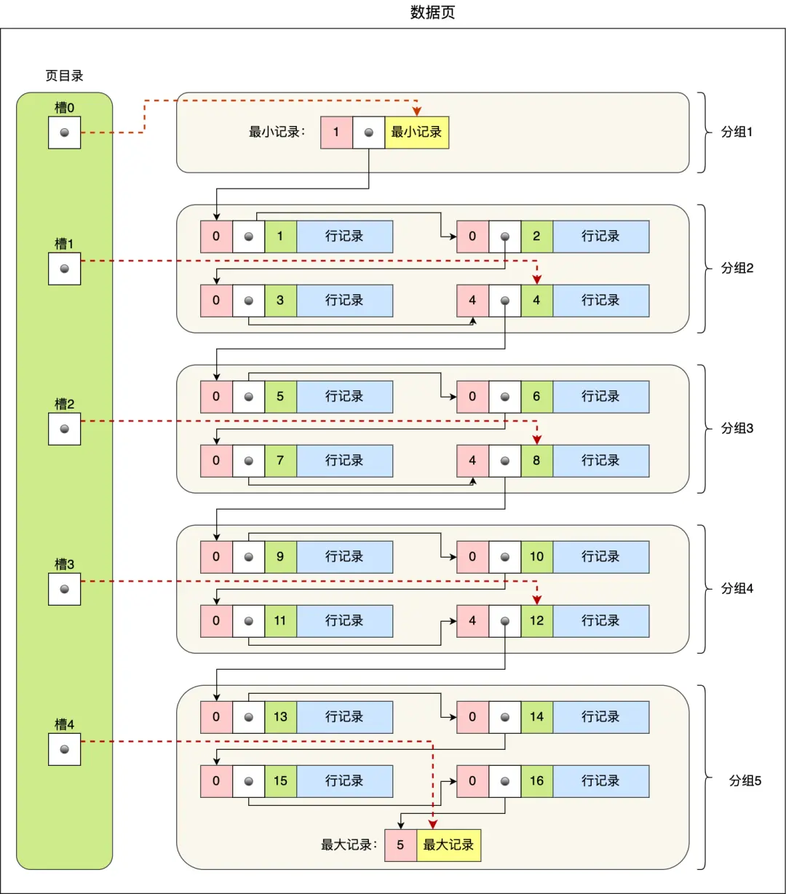
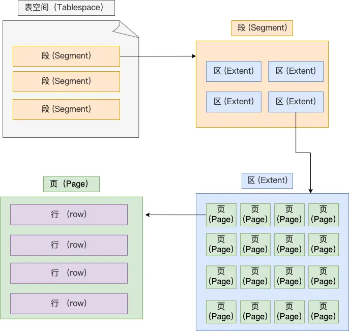

# InnoDB如何存储数据
InnoDB 的数据是按「数据页」为单位来读写的，默认大小是 16KB。
## 数据页格式
数据页包含七个部分数据：
* File Header（文件头）：存放页信息。里面有两个指针，分别指向下一个数据页与上一个数据页。
* Page Header（页头）：存放页信息
* Infimum+Supremum（**最大、最小记录**）：分别表示页中的最大与最小记录
* User Records（**用户记录**）：存储用户数据。数据页中的记录按照「主键」顺序组成单向链表
* Free Space（空闲空间）
* Page Directory（**页目录**）：对页内的记录起到索引作用
* File Tailer（文件尾）：校验页是否完整
  

## 页目录如何创建
可以将页目录想象成一个数组，每个数组下面链接着一个链表。想要查找到对应的数据就可以先用二分查找到数据对应的组，再在组中顺序查找到要找的数据。
1. 将所有的记录划分成若干个组。每个组的最后一条记录就是组内最大记录。
2. 页目录中的每个槽用于存储每组最后一条记录的地址偏移量。

## B+树是如何查询数据的
非叶子节点的User Records部分存放索引数据和下级页表的指针；叶子节点的User Records部分存放实际数据。

先找到根节点，利用根节点的页目录二分查找到数据所对应的槽，然后找到数据对应的下级节点的指针。将下级节点读入缓存中，然后重复上述的步骤，直至找到叶子节点，将叶子节点读入缓存，然后用对页目录做二分查找，找到数据对应的槽，然后再在所在的槽中找到真实数据。

# 表空间文件
表空间由段（segment）、区（extent）、页（page）、行（row）组成，InnoDB存储引擎的逻辑存储结构大致如下图：
  

## 段
段一般分为数据段、索引段、回滚段：
* 索引段：存放B+树非叶子节点的区的集合
* 数据段：存放B+树的叶子结点的区的集合
* 回滚段：存放回滚数据的区的集合

## 区
如果以也为单位分配磁盘空间，那么相邻两个页之间的物理位置可能不连续，因此在表中数据量大的时候，为某个索引分配空间的时候就不再按照页为单位分配了，而是按照区（extent）为单位分配。每个区的大小为 1MB，对于 16KB 的页来说，连续的 64 个页会被划为一个区，这样就使得链表中相邻的页的物理位置也相邻，就能使用顺序 I/O 了。

## 页
记录是按照行存储的，但是数据库不可能以行为单位从磁盘中交换数据，因为效率过低。InnoDB 的数据是按「页」为单位来读写的，默认每个页的大小为 16KB。页是 InnoDB 存储引擎磁盘管理的最小单元。
页的类型有很多，以下是常见页类型：
* 数据页（B-tree Node）
* undo页（undo Log Page）
* 系统页 （System Page）
* 事物数据页 （Transaction System Page）
* 插入缓冲位图页（Insert Buffer Bitmap）
* 插入缓冲空闲列表页（Insert Buffer Free List）
* 未压缩的二进制大对象页（Uncompressed BLOB Page）
* 压缩的二进制大对象页 （compressed BLOB Page）

## 行
数据库表中的记录都是按行（row）进行存放的，每行记录根据不同的行格式，有不同的存储结构。InnoDB提供四种行格式，分别是Redundant、Compact、Dynamic、Compressed
* Redundant：冗余格式，很少使用
* Compact：是一种紧凑的行格式。是MySQL 5.1版本之后默认的行格式。
* Dynamic：和Compact类似，在Compact的基础上进行了改进。MySQL 5.7 版本之后默认的行格式。
* COmpressed：和Compact类似，在Compact的基础上进行了改进。

### Compact行格式
  
* **变长字段列表**：记录该条记录中变长字段的长度。定长字段长度不会记录。如果表中不存在变长字段，那么这个部分可以去掉。
* **NULL值列表**：记录该条记录中NULL值。每个比特位代表一个字段是否是NULL。如果一个表中所有字段都不允许为NULL，那么这个部分可以去掉。NULL值列表的长度以字节为单位，如果字段个数不是8的倍数，则向上补齐。
* **记录头信息**：包含的内容很多。如：
    * **delete_mask**：标识该条记录是否被删除。在执行delete语句的时候并不会真正的删除记录，而是将这个记录的delete_mask标记为1。
    * **next_record**：下一条记录的位置。相当于链表指针。
    * **record_type**：当前记录的类型，0表示普通记录，1表示非叶子节点记录，2表示最小记录，3表示最大记录
* **记录的真实信息**：除了自定义的字段之外，还有三个隐藏字段
    * **row_id**：如果建表的时候没有指定主键或唯一约束，就会生成一个row_id作为主键。row_id是非必须的，占6字节
    * **trx_id**：事务id，表示该记录是由哪个事务产生的。trx_id是必须的，占用6个字节。
    * **roll_pointer**：这条记录上一个版本的指针。roll_pointer 是必需的，占用 7 个字节。

### 行溢出是怎么处理的
当一个页面存储不了一条行记录的时候，就会发生行溢出，多余的数据会存到另外的溢出页中。

Compact行格式发生会在原页面中存放部分数据，将多余数据存到溢出页中
Compressed和Dynamic在原页面中不存放任何数据，将所有数据都存放到溢出页中。