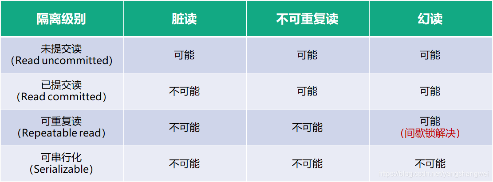

[TOC]
### 事务
事务是一组操作的集合，这些操作是一个不可分割的工作单位，这些操作要么全部成功要么全部失败。 
开启事务后，执行一批操作，如果全部成功则执行commit。否则执行rollback。
```sql
select @@autocommit; -- 0表示手动提交，1表示自动提交
set @@autocommit = 0;

sql1;
sql2;
sql3;

commit;
rollback;
```

```sql
start transaction -- 或者begin transation。用于开启事务

sql1;
sql2;
sql3;

commit;
rollback;
```

### 事务的四大特性
* Atomicity：事务的执行具有原子性。要么全部成功，要么全部失败
* Consistency：一致性。事务完成时，需要保证所有数据状态一致。（可以理解成完成事务时，数据的状态是预期的状态）
* Isolation：隔离性。多个并发事务不会相互影响，并发事务之间相互隔离。
* Durability：持久性。事务一旦被提交，它对数据库中数据的改变就是永久的，即使数据库发生故障也不会对其有任何影响。

### 并发事务产生的问题
[从0到1理解数据库事务（上）：并发问题与隔离级别](https://juejin.cn/post/6844903927536844808)
[从0到1理解数据库事务（下）：隔离级别实现——MVCC与锁](https://juejin.cn/post/6844903952165634061)
1、脏写（丢失更新）：最后的更新覆盖了其他事务之前的更新，而事务之间并不知道，发生更新丢失。**事务中不可能出现脏写**。

2、脏读：一个事务可以看到另一个事务未提交的更新数据，这种情况就叫脏读。

3、 不可重复读：在同一事务中，两次读取同一数据，得到内容不同，也就是有其他事务更改了这些数据；

4、幻读：一个事务按相同的查询条件重新读取以前检索过的数据，却发现其他事务插入了满足其查询条件的新数据，这种现象就称为“幻读”（Phantom Reads）。

幻读和不可重复读的区别在于：不可重复读面向的是“同一条记录”，而幻读面向的是“同一个范围”
