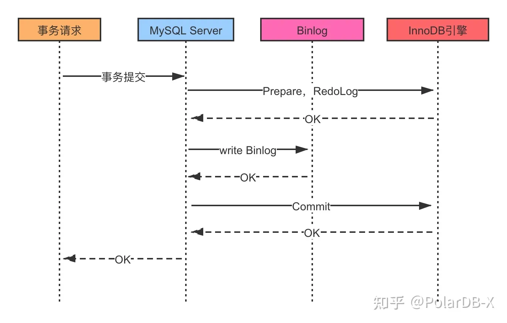

**undo log（回滚日志）**：是 Innodb 存储引擎层生成的日志，实现了事务中的**原子性**，主要用于**事务回滚**和 **MVCC**。
**redo log（重做日志）**：是 Innodb 存储引擎层生成的日志，实现了事务中的**持久性**，主要用于掉电等**故障恢复**；
**binlog （归档日志）**：是 Server 层生成的日志，主要用于**数据备份**和**主从复制**；

# Buffer Pool
MySQL的数据都是存储在磁盘中的，当要更新一条数据的时候就需要先从磁盘中将所在页读到内存中，然后在内存中修改该记录。如果修改完这条记录之后直接写回磁盘中，性能较低，可以先将数据缓存起来提高数据库的读写性能。**Buffer Pool就是InnoDB引擎设计的这样一个内存缓冲区。**
**写回策略**：如果数据存在Buffer Pool中，那直接修改Buffer Pool所在页，然后将该页设置成脏页。后续由后台进程选择一个合适的时机将脏页写入到磁盘。

**Buffer Pool缓存什么数据？**
  
**undo 页**：开启事务后，InnoDB 层更新记录前，首先要生成相应的 undo log（如果是更新操作，需要把被更新的列的旧值记下来，也就是要生成一条 undo log），undo log 会写入 Buffer Pool 中的 Undo 页面。

**系统崩溃了，脏页里的数据怎么办？**
脏页里的数据通过redo log缓存了起来。系统发生崩溃后，可以通过redo log将数据恢复。

# undo log
## undo log记录什么数据？
每对记录进行一次操作时，都需要将回滚时需要的信息记录到undo log中，如：
* 插入一条记录：需要将主键记录下来，这样回滚时只要删除主键对应的记录即可
* 删除一条记录：将被删除的所有数据都记录下来，这样回滚时只需要重新插入到表中即可
* 更新一条数据：将被更新列的旧值记录下来，这样回滚时只需要更改为旧值即可。

## undo log的数据组织形式
undo log的记录之间通过以下两个字段形成一条版本链：
**trx_id**：事务id。充当版本的作用。MySQL中的事务id是线性增长的。
**roll_pointer**：指针，指向上一个版本。

## undo log的作用
* **实现事务回滚**（保证原子性）：事务处理过程中，如果出现了错误或者用户执行ROLLBACK语句，可以利用undo log将数据恢复到事务开始之前的状态
* **用于实现MVCC**：InnoDB的MVCC是通过ReadView+undo log实现的。顺着undo log的版本链可以找到符合需求的历史数据，如果没有undo log版本链的话，就只能找到最新数据。

## InnoDB 是如何利用undo log实现MVCC的
[Read View 在 MVCC 里如何工作的？](https://xiaolincoding.com/mysql/transaction/mvcc.html#read-view-%E5%9C%A8-mvcc-%E9%87%8C%E5%A6%82%E4%BD%95%E5%B7%A5%E4%BD%9C%E7%9A%84)
InnoDB利用undo log和Read View实现MVCC。以下是版本链和Read View的概念：
* **undo log 版本链**：b+树的中的记录通过roll_pointer和trx_id形成一条版本链。trx_id是事务id，在MySQL中是自增的。roll_pointer按照版本的顺序形成一条记录的版本链。
* **Read View**：相当于快照，利用undo log找到符合版本条件的数据。依赖四个参数：
    * **creator_trx_id**：创建该Read View的事务的事务id
    * **m_ids**：创建Read View时，当前数据库中活跃且未提交的事务id列表
    * **min_trx_id**：m_ids最小的那个事务id
    * **max_trx_id**：创建Read View时，当前数据库中应该给下一个事务的事务id值（也就是当前数据库中的事务id最大值+1）

**版本链以及Read View的作用**：
* 通过版本链，可以找到某条记录的所有历史数据。
* 通过Read View，可以判断某条记录是否对当前事务可见。
    * 小于min_trx_id的一定**可见**
    * 大于max_trx_id的一定**不可见**
    * 介于两者之间的需要判断是否在m_ids列表里。如果存在说明还没提交则**不可见**，如果不存在说明已经提交则**可见**

**不同隔离级别下快照读的实现方式**：
* **RR隔离级别下的快照读**：只会在第一个快照读执行之前生成Read View。后续都只会使用第一次生成的Read View。
* **RC隔离级别下的快照读**：在每个快照读执行之前生成一个新的Read View。

# redo log
## redo log的作用
undo log是为了实现事务回滚以及MVCC。redo log是为了崩溃后的数据恢复。
redo log的作用：保证buffer pool中的数据即使在系统崩溃后，也能正常的写回到磁盘中。保证数据的一致性和持久性。
事务提交之前发生崩溃使用undo log实现事务回滚。事务提交之后发生崩溃使用redo log恢复数据。

WAL 技术指的是， MySQL 的写操作并不是立刻写到磁盘上，而是先写日志，然后在合适的时间再写到磁盘上。

## redo log的实现细节
### 什么时候记录redo log？
在**Buffer Pool更新之后**就记录redo log。即：在数据更新之后就生成数据更新对应的redo log，在undo页更新之后就记录undo页更新对应的redo log。

### 数据要写磁盘，redo log也要写磁盘，为什么多此一举？
因为redo log写磁盘的方式是追加写入（写入时顺序的）。顺序写入比随机写入要快很多。

### redo log是直接写入磁盘吗？
不是的，redo log也有自己的缓存----redo log buffer。每生成一条redo log记录时，都会先写入到redo log buffer中，然后再持久化到磁盘中。

### redo log buffer什么时候刷盘？
* MySQL正常关闭时
* redo log buffer中的记录的写入量大于redo log buffer内存空间的一半时
* InnoDB后台线程每秒刷盘一次。
* 由innodb_flush_log_at_trx_commit 参数控制
    * 0：每次事务提交时，啥也不做。等待InnoDB后台线程每秒自动将redo log buffer中的数据刷新到磁盘中。性能高，但是可能会丢失最多一秒数据
    * (default) 1：每次事务提交时，都会将缓存在redo log buffer中的redo log记录直接持久化到磁盘。性能较低，不会丢失数据。
    * 2：每次事务提交时，都会将数据写入到redo log文件。可以理解为将数据交给操作系统管理，操作系统崩溃或者系统断电才有可能丢失一秒数据，MySQL进程崩溃不会导致丢失数据。

### redo log文件写满了怎么办？
redo log设计的目的就是为了防止Buffer Pool中的脏页丢失而设计的，随着Buffer Pool中的脏页不断刷新到磁盘，redo log对应的记录也就没用了，这时就可以擦除这些旧记录，以腾出空间存放新纪录。
redo log采用循环写的方式进行记录。当文件被写满后MySQL就不能再执行新的更新操作。
  

# binlog
undo log和redo log都是InnoDB存储引擎生成的，binlog是MySQL的Server层生成的。主要作用就是记录所有数据库表结构变更和表数据修改的日志。

## redo log 和 binlog的区别
* 实现对象不同：binlog是MySQL的Server层实现的日志。redo log是InnoDB存储引擎实现的日志
* 写入方式不同：binlog是追加写，写满一个文件就创建一个新的继续写，不会覆盖以前的日志。redo log是循环写，日志空间大小固定。
* 用途不同：binlog用户数据备份、主从复制。redo log用于故障恢复，实现crash-safe

## binlog文件格式
* STATEMENT：只记录修改数据/表结构的SQL语句。存在的问题是，当使用了now、uuid等函数时，数据恢复（或者从库在执行这些SQL语句时）时可能导致数据不一样。因为这些函数每调用一次返回的结果都不一样。
* ROW：记录行数据最终被修改成什么样了。不会出现动态函数的问题，但是缺点是生成的binlog文件过大。比如批量update时，更新多少条行记录就会产生多少条binlog的记录。而在 STATEMENT 格式下只会记录一个 update 语句而已
* MIXED：包含了 STATEMENT 和 ROW 模式，它会根据不同的情况自动使用 ROW 模式和 STATEMENT 模式；

## binlog的刷盘时机
MySQL提供一个 sync_binlog 参数来控制数据库的 binlog 刷到磁盘上的频率：
* sync_binlog = 0 的时候，表示每次提交事务都只 write，不 fsync，后续交由操作系统决定何时将数据持久化到磁盘；
* (default) sync_binlog = 1 的时候，表示每次提交事务都会 write，然后马上执行 fsync；
* sync_binlog =N(N>1) 的时候，表示每次提交事务都 write，但累积 N 个事务后才 fsync。

上面的write代表：把日志写入到binlog文件，但是没有将数据持久化到磁盘，因为数据还缓存在内核的[page cache](https://www.xiaolincoding.com/os/6_file_system/pagecache.html#page-cache)中。
fsync代表：将page cache中的数据持久化到磁盘中。

## MySQL事务的两阶段提交
[无处不在的 MySQL XA 事务](https://zhuanlan.zhihu.com/p/372300181)
[两阶段提交的过程是怎样的？](https://xiaolincoding.com/mysql/log/how_update.html#%E4%B8%A4%E9%98%B6%E6%AE%B5%E6%8F%90%E4%BA%A4%E7%9A%84%E8%BF%87%E7%A8%8B%E6%98%AF%E6%80%8E%E6%A0%B7%E7%9A%84)

**为什么需要两阶段提交？**
事务提交后，redo log和binlog都需要持久化到磁盘中，但是持久化的过程是独立的，可能出现半成功的状态，这就导致了两份日志之间的逻辑不一致的情况。
* **redo log刷盘成功**后系统崩溃，**binlog刷盘不成功**：主从架构中，主库为新值，从库为旧值。
* **binlog刷盘成功**后系统崩溃，**redo log刷盘不成功**：主从架构中，主库为旧值，从库为新值。

**两阶段提交过程**：
两阶段提交是为了保证数据的安全性，因此通常sync_binlog和innodb_flush_log_at_trx_commit的值都会设置成1，也就是**每次事务提交时**都会写入到磁盘中。以下这两个参数默认都为1。

* **prepare阶段**：将XID写入redo log，将redo log状态置为prepare，redo log进行刷盘
* **commit阶段**：将XID写入binlog，将binlog进行刷盘，将redo log的状态置为commit（因为XID能够保证即使出现事务不一致也能进行恢复，所以不需要刷盘。即使将redo log更新为commit的数据丢失了，也会认为事务提交成功）。
  

**实现原理**
实际上是使用XID（分布式事务的ID号）来实现redo log和binlog数据的一致性。当系统崩溃后，MySQL重启或会按顺序扫描redo log文件，此时redo log的事务状态会出现commit和prepare两种情况。当redo log状态为commit时，不存在数据不一致的情况，因为将redo log状态设为commit是事务提交的最后一步。当redo log状态为prepare阶段时，存在两种情况：
* redo log刷盘成功，binlog刷盘失败：这种情况需要回滚事务。对应着redo log有XID而binlog没有XID。
* redo log刷盘成功，binlog刷盘也成功：这种情况说明只是redo log状态设为commit的时候系统崩溃了，但是事务实际上已经完成了。此时只要提交事务即可。对应着redo log有XID且binlog也有XID的情况。
  

# UPDATE语句执行流程
开启事务->生成undo log->将undo log写入到Buffer Pool中的Undo页面->记录对应的redo log->InnoDB层开始更新Buffer Pool中的数据页并标记成脏页->将记录写到redo log里->记录对应的binlog cache中->将binlog刷新到硬盘->事务提交

开启事务后第一件事就是记录undo log。然后才是更新Buffer Pool的数据页，然后是更新binlog，最后才是事务提交。

[update语句执行流程](https://www.xiaolincoding.com/mysql/log/how_update.html#%E6%80%BB%E7%BB%93)

`update user set name='zs' where id=1;`更新流程：
1. 将id=1这一行记录保存到buffer pool中，并返回记录给执行器。
2. 执行器判断更新前后数据是否一致，如果一致就不进行后续流程。如果不一致就将更新前后的记录都当做参数传给InnoDB层(本质上是调用一个接口，InnoDB实现了这个接口)。
3. 开启事务
4. 记录相对应的undo log（由于需要将undo log写入到buffer pool的undo页面，因此也需要记录对应的redo log）
5. InnoDB更新buffer pool（同理，需要记录对应的redo log）
6. 在更新完成之后，开始记录对应的binlog。（先保存到binlog cache，等到事务提交时才会刷盘）
7. 事务提交。
   * prepare阶段：将redo log对应的事务状态设置为prepare，然后将redo log刷新到硬盘
   * commit阶段：将binlog刷新到磁盘，然后调用引擎的提交事务接口，将redo log状态设置成commit

# 总结
* 两阶段提交是为了保证分布式事务的提交不会出错。保证分布式事务的一致性。
* redo log和binlog只会在事务提交（也就是两阶段提交）时才会进行刷盘。
* redo log的作用是用来保护buffer pool中的脏页能够正确写回到磁盘中。
* undo log和数据一样，都是需要依靠redo log实现持久性