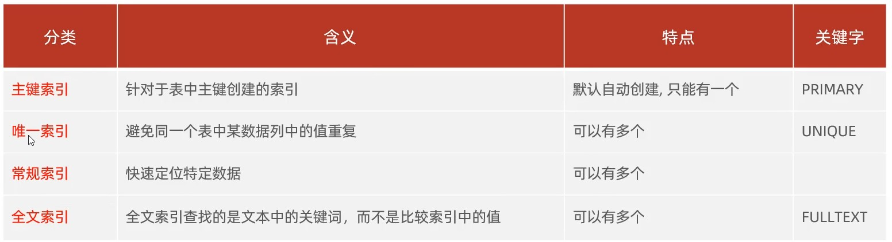

[TOC]
# 索引基础知识
### B+Tree
[数据结构可视化](https://www.cs.usfca.edu/~galles/visualization/Algorithms.html)

B+树节点分为叶子节点和索引节点。所有的数据都会在叶子节点上出现，且叶子节点之间形成链表，便于全表遍历操作。

### B-Tree索引
只是叫做`B-Tree`索引。实际上底层使用的是`B+Tree`数据结构。
`B-Tree`索引可以为多个列建立索引。如`(stu_id, cls_id, score)`，当`stu_id`重复时，按照`cls_id`和`score`进行排序，多个列建立索引时严格按照从左到右的顺序排序。
**索引对以下类型的查询有效**（详见p125）
* 精确值匹配
* 匹配最左前缀
* 匹配列前缀
* 匹配范围值
* 精确匹配某一列再范围匹配另一列
* 只访问索引的查询

**B-Tree索引的限制**，主要是使用多列作为索引时，只能使用最左边得那一列进行排序，如果最左边的列值相同，才根据后面的列的值进行排序。
* 如果不是从最左列开始查找，则无法使用索引
* 如果跳过索引中的列，则只能使用索引的一部分优化。比如`select * from student_class where stu_id = 1 and score = 0`没法使用索引对`score=0`进行优化，因为跳过了`cls_id`。
* 如果索引中有某个列的范围查询，则其右边的所有列都不能使用索引优化查找。

### 索引分类


### 语法
* 创建索引
```sql
create [unique|fulltext] index index_name on table_name (col_name, ...)
```
* 查看索引
```sql
show index from table_name
```
* 删除索引
```sql
drop index index_name on table_name
```

### 索引的使用法则
* 最左前缀法则：查询从索引的最左列开始，并且不跳过中间的列。
* 在索引列上使用运算操作，索引将失效
* 用or分隔开的条件，如果两边都有索引，索引才会生效。否则索引不会生效。
* 尽量使用覆盖索引，避免回表查询
* 对大字符串建立索引可以使用前缀索引
# 高性能索引策略
### 独立的列
独立的列指索引不能是表达式的一部分，也不能是函数的参数。否则无法使用索引。

### 前缀索引
如果要为一个很长的字符列建立索引，这会让索引变得又大又慢。可以选择前缀索引。前缀索引的意思是截取字符串的前几位来建立索引。（MySQL不直接支持后缀索引，详见P157）

索引的选择性：不重复的索引值/数据表的记录总数。索引的选择性用来衡量应该取多少位前缀建立索引。

### 聚簇索引
聚簇索引是一种数据存储方式，**聚簇索引的在索引的叶子页当中存放整个数据行**。“聚簇”表示数据行和相邻的键值紧凑地存储在一起。由于数据不能同时存放在两个不同的地方，因此一个表只能有一个聚簇索引。

InnoDB的聚簇索引，叶子页包含了行的全部数据，但是节点页只包含索引列。

**InnoDB的聚簇索引有且仅有一个**。默认通过主键建立聚簇索引，如果没有定义主键，则会选择一个满足唯一性的非空索引代替，如果没有这样的非空索引，InnoDB会隐式定义一个主键来建立聚簇索引。

**聚簇索引的优点**：
* 可以根据被索引列聚集数据。比如实现电子邮箱时，可以根据用户ID来聚集数据，这样只需要从磁盘读取少量数据页就能获取某个用户的全部邮件。
* 数据访问更快。聚簇索引包含整张表的全部数据，因此在聚簇索引中获取数据通常比在非聚簇索引中查找更快。
* ==使用覆盖索引扫描的查询可以直接使用叶节点中的主键值？？？这句话不明白==。

**聚簇索引的缺点**：
* 插入速度严重依赖于插入顺序。按照主键的顺序插入数据是最快的，如果是随机顺序插入数据，那么最好使用`optimize table`命令重新组织一下表。P168到P170对比了使用自增id和uuid做主键的性能对比。
* 更新聚簇索引列的代价很高。会强制InnoDB将每个被更新的行移动到新的位置。
* 可能存在“页分裂”问题。当需要将某个行插入到某个已满的页中时，存储引擎会将该也分裂成两个页面容纳该行。
* 全表扫描可能会很慢。因为叶子结点中存储了整行数据，因此全表扫描需要多次IO。当行比较稀疏或由于页分裂导致数据存储不连续的时候更是如此。
* 二级索引需要包含引用行的主键列
* 二级索引可能存在回表问题。
### 二级索引
二级索引又叫辅助索引。所有的非聚簇索引都是二级索引。二级索引的叶子节点包含了引用行的主键列。比如根据phone建立的索引，叶子节点中不仅存放phone，还要存放phone对应的那一行的主键。

回表查询：比如有一个索引`idx_phone`，那么`select id, phone from stu_info where phone = '123'`则只需要使用`idx_phone`这个索引就可以查询到所有需要的数据，因此只需要一次查询就够了。而如果是`select id, name, phone from stu_info where phone = '123'`。那么仅根据`idx_phone`这个索引不能获取所有需要的数据。因此需要通过主键在聚簇索引中查询额外的数据。这个过程叫做回表查询。

### 覆盖索引
如果一个索引包含所有需要查询的字段的值，就称之为覆盖索引。覆盖索引最大的好处就是不需要回表查询。
索引覆盖查询：一个查询被索引覆盖。也就是不需要回表查询，就称为索引覆盖查询。

### 使用索引做排序
只有当索引的列顺序和`order by`子句的顺序完全一致（满足最左前缀要求），并且所有列的排序方向完全一致时，MySQL才能使用索引对结果做排序。如果查询需要关联多张表，则只有当`order by`子句引用的字段全部是第一个表时，才能使用索引做排序。
前导列为常量时，也满足最左前缀要求，如：
```sql
-- 表rental有一个多列索引：(rental_date, inventory_id, customer_id)
-- rental的主键为rental_id
select rental_id, staff_id from rental
where rental_date = '2005-05-25'
order by inventory_id, customer_id
```
这条查询语句可以使用索引做排序。因为索引第一列是一个常量，而`order by`子句的顺序也满足条件，所以可以使用索引做排序。

### 重复索引、冗余索引
重复索引：在同一个列上创建了相同类型的索引
冗余索引：如果有索引(A, B)，再创建(A)就是冗余索引。冗余索引就是用已有索引的最左前缀再创建相同类型的索引。冗余索引存在的目的在于降低索引体积，加快某些操作的速度。

# 索引什么时候会失效