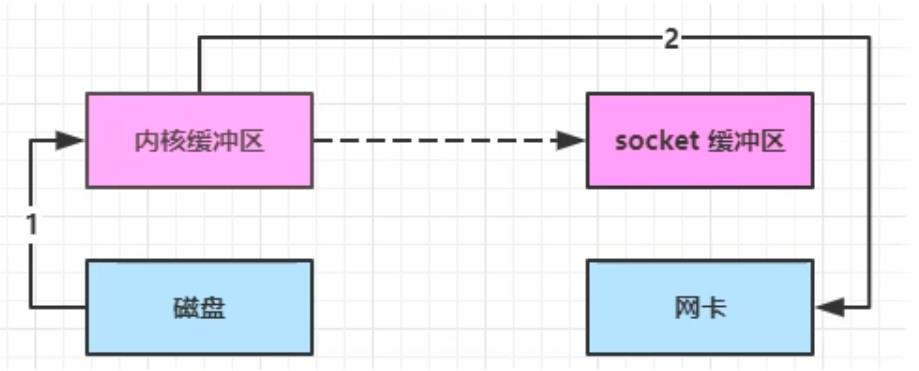

# NIO 基础

整体架构：Buffer是缓冲区，用来存储数据。Channel是一个管道，用来沟通Buffer和数据源。Selector是选择器，用来支持一个线程对应多个管道。

* 阻塞模式：在没有数据可读时，线程需要阻塞等待。
* 非阻塞模式：线程不需要阻塞。但是线程一直忙碌，相当于轮训。
* 多路复用：配合Selector使用时，当有事件发生时才会唤醒线程执行操作。其他时候线程阻塞。

## IO模型
**阻塞**：线程在干这件事的时候，就必须等这件事干完才能干下一件事。比如说线程在等待客户端连接，必须等到有客户端连接进来了才能干别的事情。即使这段时间内有别的客户端发送了数据，这个线程也无法处理。
**非阻塞**：线程在干某件事的时候，如果条件不满足就立马干下一件事，相当于是轮训。比如说线程等待客户端写入数据，如果此时没有客户端写入数据，那么线程不进行等待，而是立马结束去干别的事情。
**多路复用**：配合selector，线程不再只能监听一个Channel了，而是可以监听多个Channel。将请求抽象成事件（比如连接事件、可读可写事件等），等有事件进来的时候再将该线程唤醒去处理事件，没有事件的时候继续阻塞。
**同步**：线程自己去获取结果（一个线程）。
**异步**：线程自己不去获取结果，而是委托其它线程送结果（一共至少两个线程）。因此异步一定不会阻塞。

以上几种模式进行组合，可以有以下几种IO模型
同步阻塞、同步非阻塞、同步多路复用、异步非阻塞。

# Channel
Channel类似于stream，它是读写数据的双向通道。可以从Channel将数据读到Buffer中，也可以将数据从Buffer写入Channel。

FileChannel
DatagramChannel：UDP常用
SocketChannel：
ServerSocketChannel：TCP连接，常用于服务器端。

# Buffer
Buffer用来缓冲读写数据。

## Buffer如何读写
1. **四个重要变量**

```java
// Invariants: mark <= position <= limit <= capacity
private int mark = -1;
private int position = 0;
private int limit;
private int capacity;
```
* position: The next location in the buffer that will be read from or written to.
* capacity: The maximum number of elements the buffer can hold. Once set cannot be changed.
* limit: The end of accessible data in the buffer. You cannot write or read at or past this point without changing the limit, even if the buffer has more capacity.
* mark: A client-specified index in the buffer. Invoke mark() to mark a position. Invoke reset() to set position to marked position.

2. **修改读写模式**
实际上就是修改上面四个变量的值
flip()切换成读模式
```java
    public Buffer flip() {
        limit = position;
        position = 0;
        mark = -1;
        return this;
    }
```
clear()或compact()切换成写模式

# Selector
通过选择器可以使得一个线程对应多个channel


## Selector内部
内部存在两个集合，一个是注册的SelectionKey集合，一个是SelectedKeys集合（存放满足事件的SelectionKey集合）。
SelectionKey集合：Channel一旦注册就会将对应的SelectionKey加入这个集合中。
SelectedKeys集合：事件一旦满足就加入到这个集合中，而在这个集合中的SelectionKey只能通过手动移除的方式进行移除。（事件被处理后会标志成已处理，但是不会主动移除出这个集合）

## SelectionKey
SelectionKey标识了Selector与Channel的注册关系。这个对象持有Selector与Channel，以及监听的事件。

### 事件类型
* 可读事件：public static final int OP_READ = 1 << 0;
* 可写事件：public static final int OP_WRITE = 1 << 2;
* 客户端，建立连接后触发：public static final int OP_CONNECT = 1 << 3;
* 服务端，有连接请求时触发：public static final int OP_ACCEPT = 1 << 4;

# ByteBuffer

## HeapByteBuffer 和 DirectByteBuffer
* HeapByteBuffer 放在堆内存中。由于工作在java堆内存中，操作系统无法直接操作这块区域，因此需要经过从物理内存到堆内存的拷贝。会受到垃圾回收的影响。
* DirectByteBuffer 放在物理内存中。操作系统和JVM都可以直接操作这块内存区域，不需要经过拷贝。分配的效率低。
```java
ByteBuffer buffer = ByteBuffer.allocate(16);
ByteBuffer dirBuffer = ByteBuffer.allocateDirect(16);
```

## 读写
写：buffer自己的put方法、Channel的read方法
读：buffer自己的get方法、Channel的write方法

## ByteBuffer与字符串相互转化
```java
public class TestByteBufferString {
    public static void main(String[] args) {
        // 字符串转ByteBuffer，不会自动改成读模式
        ByteBuffer buffer1 = ByteBuffer.allocate(16);
        buffer1.put("hello".getBytes(StandardCharsets.UTF_8));

        // wrap，会改成读模式
        ByteBuffer buffer2 = ByteBuffer.wrap("hello".getBytes(StandardCharsets.UTF_8));

        // Charset，会改成读模式
        ByteBuffer buffer3 = StandardCharsets.UTF_8.encode("hello");
        
        buffer1.flip();  // 需要先改成读模式
        String str1 = StandardCharsets.UTF_8.decode(buffer1).toString();
        String str2 = StandardCharsets.UTF_8.decode(buffer2).toString(); // 不用改成读模式
    }
}
```

# 零拷贝
零拷贝不是真正的零拷贝，而是不会进行重复的数据拷贝。零拷贝的优势如下：
①更少的用户态与内核态切换
②拷贝是不利用CPU，减少CPU缓存伪共享
③零拷贝适合小文件传输

考虑这样一种场景：服务器端需要将一个文件从磁盘中经过网络发送给客户端。下面介绍各种拷贝方案是怎样处理这种需求的。
## 传统IO

传统IO在传输数据时会发生以下几个步骤，一共四次拷贝，三次用户态与内核态的切换。
1. 用户态切换到内核态
2. 磁盘到内核缓冲区：利用DMA进行拷贝无需CPU参与，用户线程阻塞。
3. 内核态切换到用户态
4. 内核缓冲区到java堆缓冲区：CPU参与拷贝
5. java堆缓冲区到socket缓冲区：CPU参与拷贝
6. 用户态切换到内核态
7. socket缓冲区到网卡：利用DMA进行拷贝无需CPU参与

## NIO 优化

使用DirectByteBuffer，这样就节省了一次内核缓冲区到用户缓冲区的复制。其它步骤和传统IO类似。一共三次拷贝，三次用户态与内核态的切换。

## transferTo/transferFrom方法
linux2.1后提供了sendFile方法，java中对应的是FileChannel中的transferTo/transferFrom。

使用这个方法需要经过三次复制，一次用户态与内核态的切换。
1. java调用transferTo方法后，需要从用户态切换到内核态
2. 磁盘到内核缓冲区：利用DMA进行拷贝
3. 内核缓冲区到socket缓冲区：CPU参与拷贝
4. socket缓冲区到网卡：利用DMA进行拷贝无需CPU参与

## 进一步优化
linux2.4后sendFile方法变成了下面这个样子。现在只需要将offset和length等信息拷贝到socket缓冲区即可，几乎无消耗。

# 代码案例
## 非阻塞模式案例
缺陷是线程会一直运行。
```java
public class Server {
    public static void main(String[] args) throws IOException {
        ServerSocketChannel ssc = ServerSocketChannel.open();
        ssc.configureBlocking(false);
        ssc.bind(new InetSocketAddress(8080));

        ByteBuffer buffer = ByteBuffer.allocate(16);
        List<SocketChannel> channels = new ArrayList<>();  // 连接集合
        // 非阻塞模式下accept与read都不会导致线程阻塞
        while (true) {
            SocketChannel sc = ssc.accept();
            if (sc != null) {
                sc.configureBlocking(false);
                channels.add(sc);
            }
            for (SocketChannel channel : channels) {
                if (channel.read(buffer) > 0) {
                    buffer.flip();
                    String s = Charset.defaultCharset().decode(buffer).toString();
                    System.out.println(s);  // 打印客户端输出结果
                    buffer.clear();
                }
            }
        }
    }
}
public class Client {
    public static void main(String[] args) throws IOException {
        for (int i = 0; i < 3; i++) {  // 模拟三个客户端
            SocketChannel sc = SocketChannel.open();
            sc.connect(new InetSocketAddress("localhost", 8080));
            sc.write(Charset.defaultCharset().encode("asdf"+i));
            sc.close();
        }
    }
}
```

## Selector模式案例
```java
public class Server {
    public static void main(String[] args) throws IOException {
        // 1. 准备selector
        Selector selector = Selector.open();
        // 2. 准备ssc，用于处理连接
        ServerSocketChannel ssc = ServerSocketChannel.open();
        ssc.configureBlocking(false);
        ssc.bind(new InetSocketAddress(8080));
        // 3. 将ssc与selector绑定
        SelectionKey sscKey = ssc.register(selector, 0, null);
        // 4. 为ssc设置监听事件
        sscKey.interestOps(SelectionKey.OP_ACCEPT);

        while (true) {
            // 5. 阻塞等待事件进来
            selector.select();
            // 6. 拿到所有准备好的事件并依次进行处理
            Iterator<SelectionKey> iter = selector.selectedKeys().iterator();
            while (iter.hasNext()) {
                SelectionKey key = iter.next();
                iter.remove();  // 必须进行手动移除。参考【Selector内部】那一节
                if (key.isAcceptable()) {
                    // 对连接请求进行处理。同时将当前连接注册到selector上并监听写事件
                    ServerSocketChannel channel = (ServerSocketChannel) key.channel();
                    SocketChannel sc = channel.accept();
                    sc.configureBlocking(false);
                    SelectionKey scKey = sc.register(selector, 0, null);
                    scKey.interestOps(SelectionKey.OP_READ);
                } else if (key.isReadable()) {
                    // 对写事件进行处理。注意客户端断开连接的时候会触发一次写事件。
                    try {
                        SocketChannel channel = (SocketChannel) key.channel();
                        ByteBuffer buffer = ByteBuffer.allocate(16);
                        if (channel.read(buffer) == -1) {  // 客户端正常断开会触发一次读事件
                            key.cancel();
                            System.out.println("断开");
                            continue;
                        }
                        buffer.flip();
                        System.out.println(Charset.defaultCharset().decode(buffer));
                    } catch (Exception e) {
                        e.printStackTrace();
                        key.cancel();  // 客户端异常断开
                    }
                }
            }
        }
    }
}
public class Client {
    public static void main(String[] args) throws IOException {
        for (int i = 0; i < 3; i++) {  // 模拟三个客户端
            SocketChannel sc = SocketChannel.open();
            sc.connect(new InetSocketAddress("localhost", 8080));
            sc.write(Charset.defaultCharset().encode("asdf"+i));
            sc.close();
        }
    }
}
```

## 可写事件案例
```java
public class Server {
    public static void main(String[] args) throws IOException {
        Selector selector = Selector.open();
        ServerSocketChannel ssc = ServerSocketChannel.open();
        ssc.configureBlocking(false);
        ssc.bind(new InetSocketAddress(8080));
        SelectionKey sscKey = ssc.register(selector, 0, null);
        sscKey.interestOps(SelectionKey.OP_ACCEPT);

        while (true) {
            selector.select();
            Iterator<SelectionKey> iter = selector.selectedKeys().iterator();
            while (iter.hasNext()) {
                SelectionKey key = iter.next();
                iter.remove();
                if (key.isAcceptable()) {
                    ServerSocketChannel channel = (ServerSocketChannel) key.channel();
                    SocketChannel sc = channel.accept();
                    sc.configureBlocking(false);
                    SelectionKey scKey = sc.register(selector, 0, null);
                    scKey.interestOps(SelectionKey.OP_READ);

                    // 一次性发送大量数据时不一定能一次性写完
                    StringBuilder sb = new StringBuilder();
                    for (int i = 0; i < 30000000; i++) {
                        sb.append('a');
                    }
                    ByteBuffer buffer = Charset.defaultCharset().encode(sb.toString());
                    int write = sc.write(buffer);  // 向管道发送大量数据
                    System.out.println(write); // 一次不一定能写完
                    if (buffer.hasRemaining()) {  // 如果没写完则额外监听可写事件
                        scKey.interestOps(scKey.interestOps() | SelectionKey.OP_WRITE);
                        scKey.attach(buffer);  // 将buffer attach到scKey上。方便下次向管道中写
                    }
                } else if (key.isWritable()) {  // 监听到可写事件（管道空了，可以继续写了）
                    SocketChannel channel = (SocketChannel) key.channel();
                    ByteBuffer buffer = (ByteBuffer) key.attachment();
                    System.out.println(channel.write(buffer));
                    if (!buffer.hasRemaining()) {
                        key.interestOps(key.interestOps() - SelectionKey.OP_WRITE);
                        key.attach(null);
                    }
                }
            }
        }
    }
}
public class Client {
    public static void main(String[] args) throws IOException {
        SocketChannel sc = SocketChannel.open();
        sc.connect(new InetSocketAddress("localhost", 8080));

        int cnt = 0;
        while (true) {
            ByteBuffer buffer = ByteBuffer.allocate(1024 * 1024);
            cnt += sc.read(buffer);
            System.out.println(cnt);
            buffer.clear();
        }
    }
}
```