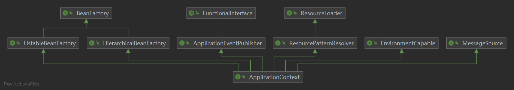

alt+ctrl+u  打开类图
https://docs.spring.io/spring-framework/docs/6.0.0/reference/html/index.html

## 1. 架构


## 2. IoC容器
### 2.1 术语
IoC：控制反转。A需要使用对象B，如果在A中主动new B()，就会造成A与B之间的高耦合。如果由外部提供B，就称为控制反转，将A与B解耦。**将对象创建的控制权转移到程序外部**进行解耦的这种思想称作控制反转。
DI：依赖注入。IoC的一种实现方式。通过传参的方式从外部将B对象传给A。
Bean：Spring中管理的对象称作Bean，所有的Bean都在Spring容器中进行管理。

### 2.2 Bean
#### 实例化bean的三种方法
* 构造方法：使用无参构造进行实例化。如果无参构造不存在，那么将抛出BeanCreationException
```xml
<bean id='bean' class='AAA'/>
```
* 使用静态工厂：
```xml
<bean id='bean' class='AAAFactory' factory-method='getAAA'/>
```
* 使用实例工厂：
```xml
<bean id='aaaFactory' class='AAAFactory'/>
<bean id='bean' factory-method='getAAA' factory-bean='aaaFactory'/>
```
* 使用FactoryBean 自定义实例化逻辑：实例工厂的一种改进。很多框架都用了这种方法创建Bean
```java
public class AAAFactoryBean implements FactoryBean<AAA> {
    public AAA getObject() throws Exception {  // 代替原有的工厂方法即可。
        return new AAA();
    }

    public Class<?> getObjectType() {
        return AAA.class;
    }

    public boolean isSingleton() {
        return false;
    }
}
```
```xml
<bean id='bean' class='AAAFactoryBean'/>
```

#### Bean的生命周期
* 关闭容器操作：
手动关闭：调用context.close()方法。
自动关闭：调用context.registerShutdownHook()方法。在虚拟机关闭之前自动执行关闭操作。
* bean生命周期控制
使用xml配置：配置init-method、destroy-method
使用接口：实现InitializingBean、DisposableBean

### 2.3 依赖注入
#### 基于构造器的依赖注入
**引用类型的注入**
```xml
<beans>
    <bean id="beanOne" class="x.y.ThingOne">
        <constructor-arg ref="beanTwo"/>
        <constructor-arg ref="beanThree"/>
    </bean>

    <bean id="beanTwo" class="x.y.ThingTwo"/>

    <bean id="beanThree" class="x.y.ThingThree"/>
</beans>
```

**值类型的注入**
* 使用类型匹配
```xml
<bean id="exampleBean" class="examples.ExampleBean">
    <constructor-arg type="int" value="7500000"/>
    <constructor-arg type="java.lang.String" value="42"/>
</bean>
```
* 使用index匹配。index从0开始
```xml
<bean id="exampleBean" class="examples.ExampleBean">
    <constructor-arg index="0" value="7500000"/>
    <constructor-arg index="1" value="42"/>
</bean>
```
* 使用变量名匹配。需要搭配`@ConstructorProperties`注解一起使用
```java
package examples;
public class ExampleBean {
    // Fields omitted
    @ConstructorProperties({"years", "ultimateAnswer"})
    public ExampleBean(int years, String ultimateAnswer) {
        this.years = years;
        this.ultimateAnswer = ultimateAnswer;
    }
}
```
```xml
<bean id="exampleBean" class="examples.ExampleBean">
    <constructor-arg name="years" value="7500000"/>
    <constructor-arg name="ultimateAnswer" value="42"/>
</bean>
```

#### 基于setter的DI
```xml
   <!-- Definition for textEditor bean -->
   <bean id = "textEditor" class = "com.iowiki.TextEditor">
      <property name = "spellChecker" ref = "spellChecker"/>
   </bean>
   <!-- Definition for spellChecker bean -->
   <bean id = "spellChecker" class = "com.iowiki.SpellChecker"></bean>
```

**两种依赖方式如何选择**
强制依赖使用构造器注入
可选依赖使用setter注入

Spring团队通常推荐构造器注入。因为构造器注入的对象不可变且是非空的。

> Since you can mix constructor-based and setter-based DI, it is a good rule of thumb to use constructors for mandatory dependencies and setter methods or configuration methods for optional dependencies. Note that use of the @Autowired annotation on a setter method can be used to make the property be a required dependency; however, constructor injection with programmatic validation of arguments is preferable.
> 
> The Spring team generally advocates constructor injection, as it lets you implement application components as immutable objects and ensures that required dependencies are not null. Furthermore, constructor-injected components are always returned to the client (calling) code in a fully initialized state. As a side note, a large number of constructor arguments is a bad code smell, implying that the class likely has too many responsibilities and should be refactored to better address proper separation of concerns.
> 
> Setter injection should primarily only be used for optional dependencies that can be assigned reasonable default values within the class. Otherwise, not-null checks must be performed everywhere the code uses the dependency. One benefit of setter injection is that setter methods make objects of that class amenable to reconfiguration or re-injection later. Management through JMX MBeans is therefore a compelling use case for setter injection.
> 
> Use the DI style that makes the most sense for a particular class. Sometimes, when dealing with third-party classes for which you do not have the source, the choice is made for you. For example, if a third-party class does not expose any setter methods, then constructor injection may be the only available form of DI.

#### Dependency Resolution Process
* The `ApplicationContext` is created and initialized with configuration metadata that describes all the beans. Configuration metadata can be specified by XML, Java code, or annotations.

* For each bean, its dependencies are expressed in the form of properties, constructor arguments, or arguments to the static-factory method (if you use that instead of a normal constructor). These dependencies are provided to the bean, when the bean is actually created.

* Each property or constructor argument is an actual definition of the value to set, or a reference to another bean in the container.

* Each property or constructor argument that is a value is converted from its specified format to the actual type of that property or constructor argument. By default, Spring can convert a value supplied in string format to all built-in types, such as `int`, `long`, `String`, `boolean`, and so forth.

被设置为pre-instantiated的单例bean在创建容器时就被创建，其它的bean都是实际使用到的时候才会被创建。

**循环依赖问题**：classA需要构造器注入classB，classB也要构造器注入classA时，会报`BeanCurrentlyInCreationException`。解决办法是使用setter注入

spring默认 预初始化（pre-instantiate，与之相对的是懒初始化）单例bean。这样可以将问题提前暴露出来。

#### 使用depends-on
有时候两个bean之间的依赖是不直接的，这时候可以使用depends-on控制两个bean之间的初始化顺序。depends-on还能影响两个bean（只能是单例bean）之间的销毁顺序。如下面的例子中，manager先于beanOne创建，后于beanOne销毁。
```xml
<bean id="beanOne" class="ExampleBean" depends-on="manager"/>
<bean id="manager" class="ManagerBean" />
```

### 2.4 自动装配
#### 自动装配的四种模式
* no(default)：不自动装配
* byName：按变量名称自动装配。在容器中寻找和当前变量名称相同的bean进行装配。
* byType：按类型自动装配。在容器中寻找和当前变量类型相同的bean进行装配。
* constructor：和byType类似，但是用在构造器上。如果没有匹配的bean，那么就raise a fatal error。

byType和constructor可以装配数组和集合类型。

#### 自动装配的限制
* 构造器注入或setter注入，将会覆盖自动装配的依赖关系
* 不能装配基本数据类型、String和Classes
* 自动装配没有显式指定依赖关系精确。

#### 将bean排除出自动装配候选项
* 排除单个bean：只能影响byType模式的自动装配。
> set the autowire-candidate attribute of the \<bean/> element to false.
* 排除多个bean：多个pattern用逗号分隔。
> The top-level \<beans/> element accepts one or more patterns within its default-autowire-candidates attribute.

比如排除所有Repository结尾的bean，就加上*Repository即可。

#### Method Injection
单例Bean A依赖多例Bean B，由于容器只创建一次A实例，因此A里面的B无法也只会注入一次，就无法实现单例依赖多例了。
主要思想就是通过动态生成子类来注入方法。
[Spring方法注入的使用与实现原理](https://www.cnblogs.com/tuyang1129/p/12882500.html)
Lookup方法是通过CGLIB动态生成子类并重写方法来实现。因此方法和类都不能被final修饰。
lookup method不能和工厂方法一起工作，特别是不能与配置类中的@Bean方法一起工作。因为这种情况下 对象实例不是由容器创建，也就不能动态生成子类。
> * For this dynamic subclassing to work, the class that the Spring bean container subclasses cannot be `final`, and the method to be overridden cannot be `final`, either.
> * A further key limitation is that lookup methods do not work with factory methods and in particular not with `@Bean` methods in configuration classes, since, in that case, the container is not in charge of creating the instance and therefore cannot create a runtime-generated subclass on the fly.


### 2.5 Bean Scopes
* singleton: (Default)每个容器仅有一个实例
* prototype: 每个容器可以有多个实例
* request: 每个HTTP请求拥有自己的bean实例，这个实例在单例bean之后创建。
* session: 每个HTTP Session的生命周期拥有一个实例。
* application: 每个ServletContext的生命周期拥有一个实例。
* websocket: 每个WebSocket的生命周期拥有一个实例。

#### The Singleton Scope
这里的singleton和设计模式中的不太一样。设计模式中的单例通过硬编码来保证一个ClassLoader中只有一个实例。Spring中的singleton是基于容器的，保证一个容器中只有一个实例。


#### The Prototype Scope
每次向容器请求（调用getBean()或注入到其它bean）prototype bean都创建一个新的实例。

无状态的bean使用Singleton。有状态的bean使用Prototype。

**注意：** Spring容器不管理完整的prototype bean的生命周期。容器只负责创建，不负责销毁，容器也不缓存prototype bean的实例。因此initialization lifecycle callback methods可以正常执行，destruction lifecycle callbacks不执行。

**单例bean依赖多例bean：** 假设beanA是singleton bean，beanB是prototype bean，beanA依赖beanB。容器在创建beanA时将beanB注入给beanA，这样之后每次beanA在使用beanB的时候都用的是同一个beanB。解决办法是使用Method Injection

#### Scoped Beans as Dependencies
[Scoped Beans as Dependencies](https://docs.spring.io/spring-framework/docs/current/reference/html/core.html#beans-factory-scopes-other-injection)
[aop:scoped-proxy](https://cloud.tencent.com/developer/article/1888666)
将shorter-lived scoped bean注入到longer-lived scoped bean中时，由于只在bean创建时才会进行依赖注入，那么每次在longer bean中使用shorter bean时使用的都是同一个bean，不满足我们的需求。这时使用`<aop:scoped-proxy/>`可以满足需要，使用`<aop:scoped-proxy/>`修饰的shorter bean会生成一个代理，longer bean使用的实际上是这个代理。这个代理拥有和shorter bean相同的scope，而且可以根据scope机制更换实例。

比如需要将scope=session的userPreferences注入到scope=singleton的userManager中时。由于只在userManager实例化时才会进行依赖注入，那么每次在userManager中使用userPreferences时都是同一个实例，不满足需求。这时使用`<aop:scoped-proxy/>`可以保证，在同一个HTTP Session中使用同一个实例，在Session更新的时候使用新的实例。

**method injection 和 scoped proxy：** 
[Spring lookup-method and scoped proxy usage](https://stackoverflow.com/questions/50057371/spring-lookup-method-and-scoped-proxy-usage)
单例beanA需要多例beanB时，希望每次使用beanB都是新的实例，那么就用lookup。
单例beanA需要session beanB时，希望相同的session使用相同的实例，不同的session使用不同的实例，那么就用`<aop:scoped-proxy/>`

#### Custom Scopes
可以实现自己的scope也可以重新定义现有的scope（除了singleton和prototype）
**创建自定义scope**
需要实现`org.springframework.beans.factory.config.Scope`接口。具体使用参考[Scope](https://docs.spring.io/spring-framework/docs/6.0.0/javadoc-api/org/springframework/beans/factory/config/Scope.html)
**注册**
需要调用`ConfigurableBeanFactory`接口中定义的`registerScope`方法。
```java
public class Main {
    public static void main(String[] args) {
        ClassPathXmlApplicationContext context = new ClassPathXmlApplicationContext("Beans.xml");
        // 这里的SimpleThreadScope是Spring框架提供的实现，但是没有注册到框架中，需要手动注册。
        context.getBeanFactory().registerScope("threadScope", new SimpleThreadScope());
    }
}
```
**使用**
```xml
<bean id="..." class="..." scope="threadScope">
```

### 2.6 Customizing the Nature of a Bean
#### Lifecycle Callbacks
**Initialization Callbacks**
* 使用@PostConstruct注解
* 实现InitializingBean接口（不推荐，因为和spring框架进行了耦合）
* 在bean标签中使用init-method

**Destruction Callbacks**
* 使用@PreDestroy注解
* 实现DisposableBean接口（不推荐，因为和spring框架进行了耦合）
* 在bean标签中使用destroy-method

如果配置了多个且方法不同，那么就按上面列出来的顺序排序。如果配置了多个且方法相同，只执行一次。

Default Initialization and Destroy Methods
可以在beans标签中使用default-init-method="init"标签来默认

**Startup and Shutdown Callbacks**
所有spring管理的对象都可以实现Lifecycle接口。这样当ApplicationContext自身收到start或stop信号时，就会级联调用所有实现Lifecycle接口的bean的相应方法。
```java
public interface Lifecycle {
    void start();
    void stop();
    boolean isRunning();
}

public interface LifecycleProcessor extends Lifecycle {
    void onRefresh();
    void onClose();
}
```
如果需要指定startup和shutdown的调用顺序，可以使用Phased接口。实现Lifecycle的对象phase值为0，phase值越小就越先调用startup，越后调用shutdown，反之亦然。

**非Web application下优雅关闭IoC容器**
调用ConfigurableApplicationContext 接口下的 registerShutdownHook()方法即可。
```java
public final class Boot {
    public static void main(final String[] args) throws Exception {
        ConfigurableApplicationContext ctx = new ClassPathXmlApplicationContext("beans.xml");
        // add a shutdown hook for the above context...
        ctx.registerShutdownHook();
        // app runs here...
        // main method exits, hook is called prior to the app shutting down...
    }
}
```

#### aware机制
Aware机制使得被容器管理的bean能够感知到容器的存在。通常不推荐使用（除非是和spring容器由交互的底层对象），因为这样使得业务代码和spring框架耦合度较高。比如`ApplicationContextAware`接口定义如下，对象实现这个接口就能接收到ApplicationContext对象。一种替代方法是使用@Autowire注解进行自动装配。
```java
public interface ApplicationContextAware {
    void setApplicationContext(ApplicationContext applicationContext) throws BeansException;
}
```
spring 提供的Aware接口请参考[Other Aware Interfaces](https://docs.spring.io/spring-framework/docs/current/reference/html/core.html#aware-list)

### 2.7 Container Extension Points
#### 使用BeanPostProcessor自定义bean
某些spring AOP的自动代理生成子类就是用BeanPostProcessor实现的

BeanPostProcessor 接口定义了回调函数，实现这些回调函数可以实现自己的初始化逻辑、销毁逻辑等。这些BeanPostProcessor 之间可以通过Ordered接口实现排序。BeanPostProcessor 的作用范围为容器，在一个容器中定义的BeanPostProcessor 不能在其它容器中生效。一些Spring AOP中的类被实现为bean post-processors。ApplicationContext 自动检测实现了BeanPostProcessor 接口的bean，并将这些bean注册成post-processors。
在ApplicationContext的启动阶段，会首先实例化所有的 实现了BeanPostProcessor的bean。然后所有的BeanPostProcessor 实例都按顺序注册。由于AOP auto-proxying通过BeanPostProcessor实现，所以无论是BeanPostProcessor实例还是它们直接引用的bean都不适合进行自动代理。因此，do not have aspects woven into them.
```java
@Component
public class InstantiationTracingBeanPostProcessor implements BeanPostProcessor {
    // simply return the instantiated bean as-is
    public Object postProcessBeforeInitialization(Object bean, String beanName) {
        return bean; // we could potentially return any object reference here...
    }
    // 这样所有的bean在实例化后都会打印下面那句话。
    public Object postProcessAfterInitialization(Object bean, String beanName) {
        System.out.println("Bean '" + beanName + "' created : " + bean.toString());
        return bean;
    }
}
```
#### 使用BeanFactoryPostProcessor自定义配置元数据
BeanFactoryPostProcessor 和 BeanPostProcessor 类似，只不过BeanFactoryPostProcessor 用于控制bean的配置元数据。也就是说IoC容器允许BeanFactoryPostProcessor 读取并更改配置元数据，并在其它非BeanFactoryPostProcessor实例实例化之前生效。其它的都和BeanPostProcessor类似。
如果希望更改bean实例，还是推荐使用BeanPostProcessor（即使BeanFactoryPostProcessor也可以实现），因为如果使用BeanFactoryPostProcessor来更改bean实例的话，会提前bean实例的生成。这可能会产生副作用，如绕过一些bean post processing。

BeanFactoryPostProcessor 和 BeanPostProcessor 不允许配置成懒加载，即使配置了也不生效。

spring框架内部实现了一些bean factory post-processors。such as [PropertySourcesPlaceholderConfigurer](https://docs.spring.io/spring-framework/docs/current/reference/html/core.html#beans-factory-placeholderconfigurer) and [PropertyOverrideConfigurer](https://docs.spring.io/spring-framework/docs/current/reference/html/core.html#beans-factory-overrideconfigurer).

#### 使用FactoryBean自定义bean的实例化逻辑
如果有些bean的实例化逻辑很复杂，需要用java代码实现实例化而不是xml配置来实现。可以通过实现FactoryBean接口来在java代码中实例化bean。
```java
public interface FactoryBean<T> {
    String OBJECT_TYPE_ATTRIBUTE = "factoryBeanObjectType";

    @Nullable
    T getObject() throws Exception;

    @Nullable
    Class<?> getObjectType();

    default boolean isSingleton() {
        return true;
    }
}
```
* T getObject(): 返回当前FactoryBean希望创建的对象实例。
* boolean isSingleton(): 
* Class<?> getObjectType(): 返回对象类型。

getBean("&myBean")：返回FactoryBean实例本身
getBean("myBean")：返回FactoryBean负责创建的对象实例。

### 2.8 Environment
在 Spring 中，Environment 接口主要管理应用程序两个方面的内容：profile 和 properties。

profile 可以简单的等同于环境，比如说平时项目中常见的环境有开发（dev）、测试（stg）和生产（prod），Spring 启动的时候可以设置激活具体的环境。当然，这个 profile 我们还可以为其赋予很多含义，这个主要看你的业务。比如说，你开发的软件会交付给客户A，也会交付给客户B，那么这个 profile 也可以定义成客户的含义。

properties 是配置，配置的来源有很多，可以是配置文件、JVM 的参数、系统的环境变量、JNDI、Sevlet Contxet 参数以及 Map 对象等，使用 Environment 接口，可以方便的获取这些配置。

#### Profile
@Profile注解可以控制当前bean在什么环境下生效。如下面这个例子中，可以在不同的环境中配置不同的DataSource。
```java
@Configuration
@Profile("development")
public class StandaloneDataConfig {

    @Bean
    public DataSource dataSource() {
        return new EmbeddedDatabaseBuilder()
            .setType(EmbeddedDatabaseType.HSQL)
            .addScript("classpath:com/bank/config/sql/schema.sql")
            .addScript("classpath:com/bank/config/sql/test-data.sql")
            .build();
    }
}

@Configuration
@Profile("production")
public class JndiDataConfig {

    @Bean(destroyMethod="")
    public DataSource dataSource() throws Exception {
        Context ctx = new InitialContext();
        return (DataSource) ctx.lookup("java:comp/env/jdbc/datasource");
    }
}
```
@Profile注解也可以在方法上使用，如下所示
```java
@Configuration
public class AppConfig {

    @Bean("dataSource")
    @Profile("development") 
    public DataSource standaloneDataSource() {
        return new EmbeddedDatabaseBuilder()
            .setType(EmbeddedDatabaseType.HSQL)
            .addScript("classpath:com/bank/config/sql/schema.sql")
            .addScript("classpath:com/bank/config/sql/test-data.sql")
            .build();
    }

    @Bean("dataSource")
    @Profile("production") 
    public DataSource jndiDataSource() throws Exception {
        Context ctx = new InitialContext();
        return (DataSource) ctx.lookup("java:comp/env/jdbc/datasource");
    }
}
```

@Profile 注解后面的表达式可以是一个简单的字符串，也可以是一个逻辑运算符。@Profile 支持如下的逻辑运算符。

* !: A logical “not” of the profile
* &: A logical “and” of the profiles
* |: A logical “or” of the profiles

也可以用@Profile注解组装用户自定义注解。如下面这个例子中，定义了@Production注解后就可以使用@Production注解替换@Profile("production")
```java
@Target(ElementType.TYPE)
@Retention(RetentionPolicy.RUNTIME)
@Profile("production")
public @interface Production {
}
```

> If a `@Configuration` class is marked with `@Profile`, all of the `@Bean` methods and `@Import` annotations associated with that class are bypassed unless one or more of the specified profiles are active. If a `@Component` or `@Configuration` class is marked with `@Profile({"p1", "p2"})`, that class is not registered or processed unless profiles 'p1' or 'p2' have been activated. If a given profile is prefixed with the NOT operator (!), the annotated element is registered only if the profile is not active. For example, given `@Profile({"p1", "!p2"})`, registration will occur if profile 'p1' is active or if profile 'p2' is not active.

**激活Prifile**
告诉spring哪一个profile需要被激活。
* 使用编程方式
```java
AnnotationConfigApplicationContext ctx = new AnnotationConfigApplicationContext();
ctx.getEnvironment().setActiveProfiles("development");
ctx.register(SomeConfig.class, StandaloneDataConfig.class, JndiDataConfig.class);
ctx.refresh();
```
* 使用配置方式
```txt
spring.profiles.active="profile1,profile2"
```

可以一次性激活多个环境
```java
ctx.getEnvironment().setActiveProfiles("profile1", "profile2");
```
```txt
-Dspring.profiles.active="profile1,profile2"
```

**默认Profile**
@Profile("default")。如果没有profile被激活，那么就激活default，如果有，就不激活。

#### Property
[Spring高级之注解@PropertySource详解（超详细）](https://blog.csdn.net/qq_40837310/article/details/106587158)
```java
@Configuration
@PropertySource("classpath:/com/myco/app.properties")
public class AppConfig {

    @Autowired
    Environment env;

    @Bean
    public TestBean testBean() {
        TestBean testBean = new TestBean();
        testBean.setName(env.getProperty("testbean.name"));
        return testBean;
    }
}
```

### ApplicationContext增加的功能

#### 国际化
ApplicationContext集成了MessageSource接口，提供了国际化功能。

#### 事件
通过ApplicationEvent类和ApplicationListener接口实现事件的发布订阅。如果bean实现了ApplicationListener接口，那么每次发布ApplicationEvent事件后，这个bean都被通知。

**标准事件**
* ContextRefreshedEvent: 容器刷新时，或容器实例化完成后发布
* ContextStartedEvent: 容器使用start()方法后发布
* ContextStoppedEvent: 容器调用stop()方法后发布
* ContextClosedEvent: 容器调用close()方法后发布
* RequestHandledEvent: 当一个http请求完成后发布
* ServletRequestHandledEvent: A subclass of RequestHandledEvent that adds Servlet-specific context information.

**定义用户自定义事件**
通过继承ApplicationEvent实现用户自定义事件
```java
public class BlockedListEvent extends ApplicationEvent {

    private final String address;
    private final String content;

    public BlockedListEvent(Object source, String address, String content) {
        super(source);
        this.address = address;
        this.content = content;
    }

    // accessor and other methods...
}
```
**发布用户自定义事件**
调用ApplicationEventPublisher的publishEvent()方法实现事件的发布。可以使用ApplicationEventPublisherAware获得ApplicationEventPublisher对象
```java
public class EmailService implements ApplicationEventPublisherAware {

    private List<String> blockedList;
    private ApplicationEventPublisher publisher;

    public void setBlockedList(List<String> blockedList) {
        this.blockedList = blockedList;
    }

    // automatically calls setApplicationEventPublisher
    // 这里的publisher实际上就是容器本身。容器继承了ApplicationEventPublisher接口
    public void setApplicationEventPublisher(ApplicationEventPublisher publisher) {
        this.publisher = publisher;
    }

    public void sendEmail(String address, String content) {
        if (blockedList.contains(address)) {
            publisher.publishEvent(new BlockedListEvent(this, address, content));
            return;
        }
        // send email...
    }
}
```

**接收事件**
方法一：实现ApplicationListener接口
```java
public class BlockedListNotifier implements ApplicationListener<BlockedListEvent> {

    private String notificationAddress;

    public void setNotificationAddress(String notificationAddress) {
        this.notificationAddress = notificationAddress;
    }

    public void onApplicationEvent(BlockedListEvent event) {
        // notify appropriate parties via notificationAddress...
    }
}
```

方法二：使用@EventListener注解
```java
public class BlockedListNotifier {

    private String notificationAddress;

    public void setNotificationAddress(String notificationAddress) {
        this.notificationAddress = notificationAddress;
    }

    @EventListener
    public void processBlockedListEvent(BlockedListEvent event) {
        // notify appropriate parties via notificationAddress...
    }
}
```
如果不想接收参数或希望监听多个事件
```java
@EventListener({ContextStartedEvent.class, ContextRefreshedEvent.class})
public void handleContextStart() {
    // ...
}
```
可以使用SpELl表达式实现条件过滤
```java
@EventListener(condition = "#blEvent.content == 'my-event'")
public void processBlockedListEvent(BlockedListEvent blEvent) {
    // notify appropriate parties via notificationAddress...
}
```
如果希望发布一个事件，作为处理其它事件的结果，可以将返回值改成希望发布的事件。异步监听无法继续发布其它事件。
```java
@EventListener
public ListUpdateEvent handleBlockedListEvent(BlockedListEvent event) {
    // notify appropriate parties via notificationAddress and
    // then publish a ListUpdateEvent...
}
```

**异步监听器**
事件监听器默认时同步接受事件。也就意味着publishEvent()方法会阻塞等待，直到所有监听器处理完事件。
如果希望实现异步监听，可以在处理监听的方法上添加@Async注解。
```java
@EventListener
@Async
public void processBlockedListEvent(BlockedListEvent event) {
    // BlockedListEvent is processed in a separate thread
}
```
异步监听的限制：
* 如果方法抛出异常，不会被调用者接收。详情参考[AsyncUncaughtExceptionHandler](https://docs.spring.io/spring-framework/docs/6.0.0/javadoc-api/org/springframework/aop/interceptor/AsyncUncaughtExceptionHandler.html)
* 不能使用返回值的方式发布其它事件

**顺序监听器**
如果希望监听器按顺序调用，可以使用@Order注解
```java
@EventListener
@Order(42)
public void processBlockedListEvent(BlockedListEvent event) {
    // notify appropriate parties via notificationAddress...
}
```
**泛型事件**
```java
@EventListener
public void onPersonCreated(EntityCreatedEvent<Person> event) {
    // ...
}
```

#### 能够方便地获取底层资源
ApplicationContext继承了ResourceLoader接口。可以用ResourceLoader来获得Resource对象。

#### 应用程序启动追踪
AbstractApplicationContext 使用 ApplicationStartup 收集启动信息。

