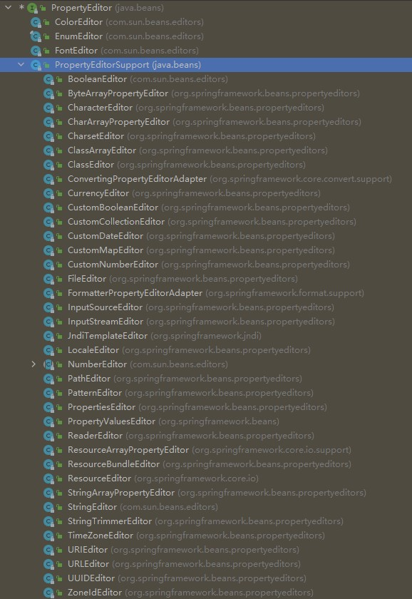

[TOC]

## 使用Spring的Validator接口
validation不应与Web层绑定，应该易于本地化，并且应该可以插入任何可用的validator。考虑到这些问题，Spring提供了一个Validator 接口，可以在应用程序的每一层中使用。

Validator接口定义如下
```java
public interface Validator {
    boolean supports(Class<?> clazz);  // Validator是否支持给定的clazz

    void validate(Object target, Errors errors);  // 校验给定的对象。并且如果不通过校验，就将错误注册到errors中
}
```
基本使用方法如下
```java
public class Person {

    private String name;
    private int age;

    // the usual getters and setters...
}

public class PersonValidator implements Validator {

    /**
     * This Validator validates only Person instances
     */
    public boolean supports(Class clazz) {
        return Person.class.equals(clazz);
    }

    public void validate(Object obj, Errors e) {
        ValidationUtils.rejectIfEmpty(e, "name", "name.empty");
        Person p = (Person) obj;
        if (p.getAge() < 0) {
            e.rejectValue("age", "negativevalue");
        } else if (p.getAge() > 110) {
            e.rejectValue("age", "too.darn.old");
        }
    }
}
```

## Bean Manipulation and the BeanWrapper
BeanWrapper：是一个bean的包装器，包装bean的目的是为了操作这个bean，比如设置和检索这个bean的属性。
如何使用不重要。

### 内置的PropertyEditor实现
简单点说，PropertyEditor是Spring用来将String转化成Object的接口。Spring内嵌了很多PropertyEditor实现。PropertyEditor是java.beans下的接口。如下图是PropertyEditor的所有实现类。

Spring使用java.beans.PropertyEditorManager属性编辑器设置搜索路径。

### 注册用户自定义的PropertyEditor实现
具体做法参考[Registering Additional Custom PropertyEditor Implementations](https://docs.spring.io/spring-framework/docs/current/reference/html/core.html#beans-beans-conversion-customeditor-registration)
不过类型转换通常不使用PropertyEditor，因为只能String转Object，后面会有更通用的方法。

## Spring类型转换
Spring3引入了core.convert包，提供更通用的类型转换系统。这套系统定义了一套SPI来实现类型转换逻辑，以及一套API来执行类型转换。这套系统类型转换系统可以用来代替PropertyEditor。

### Convert SPI
这套SPI用于实现类型转换逻辑，接口定义如下。S是源类型，T是希望转换成的目标类型。
```java
package org.springframework.core.convert.converter;

public interface Converter<S, T> {
    T convert(S source);
}
```
下面是这套接口的一个内置实现，用于将String转换成字符。
```java
final class StringToCharacterConverter implements Converter<String, Character> {
    StringToCharacterConverter() {
    }

    @Nullable
    public Character convert(String source) {
        if (source.isEmpty()) {
            return null;
        } else if (source.length() > 1) {
            throw new IllegalArgumentException("Can only convert a [String] with length of 1 to a [Character]; string value '" + source + "'  has length of " + source.length());
        } else {
            return source.charAt(0);
        }
    }
}
```

### 使用 ConverterFactory
当需要为具有层次结构的类提供转换器时，可以使用ConverterFactory。接口定义如下。其中R是基类，T是目标类。
```java
package org.springframework.core.convert.converter;

public interface ConverterFactory<S, R> {

    <T extends R> Converter<S, T> getConverter(Class<T> targetType);
}
```
下面是String转Enum的内置实现。
```java
package org.springframework.core.convert.support;

final class StringToEnumConverterFactory implements ConverterFactory<String, Enum> {

    public <T extends Enum> Converter<String, T> getConverter(Class<T> targetType) {
        return new StringToEnumConverter(targetType);
    }

    private final class StringToEnumConverter<T extends Enum> implements Converter<String, T> {

        private Class<T> enumType;

        public StringToEnumConverter(Class<T> enumType) {
            this.enumType = enumType;
        }

        public T convert(String source) {
            return (T) Enum.valueOf(this.enumType, source.trim());
        }
    }
}
```

### 使用GenericConverter
这个接口较为复杂，且用的不多。通常使用Converter 或者 ConverterFactory就能满足需求了。接口定义如下
```java
package org.springframework.core.convert.converter;

public interface GenericConverter {

    public Set<ConvertiblePair> getConvertibleTypes();

    Object convert(Object source, TypeDescriptor sourceType, TypeDescriptor targetType);
}
```

### 使用ConditionalGenericConverter
有时希望在满足某个条件时才进行转换。比如只有遇到某个特定注解才进行转换，这是就需要使用条件转换器。接口定义如下
```java
public interface ConditionalConverter {

    boolean matches(TypeDescriptor sourceType, TypeDescriptor targetType);
}

public interface ConditionalGenericConverter extends GenericConverter, ConditionalConverter {
}
```

### The ConversionService API
ConversionService定义了一套API，在运行时执行类型转换逻辑。接口定义如下
```java
package org.springframework.core.convert;

public interface ConversionService {

    boolean canConvert(Class<?> sourceType, Class<?> targetType);

    <T> T convert(Object source, Class<T> targetType);

    boolean canConvert(TypeDescriptor sourceType, TypeDescriptor targetType);

    Object convert(Object source, TypeDescriptor sourceType, TypeDescriptor targetType);
}
```
大多数ConversionService的实现类，同时也实现了ConverterRegistry接口。ConverterRegistry接口提供了一套SPI用来注册converter。在内部，一个ConveronService实现将执行类型转换的任务委托给它注册的converter来实现类型转换逻辑。

GenericConversionService 和 ConversionServiceFactory 是两个常见实现类。

### 将ConversionService配置给容器
ConversionService 是状态无关的类。通常将ConversionService 实例配置给Spring容器进行管理。Spring 会在需要使用类型转换时使用ConversionService。如果没有将ConversionService 注册给Spring容器，那么Spring容器将使用传统的基于PropertyEditor进行类型转换。

可以通过以下方式进行配置
```xml
<bean id="conversionService"
    class="org.springframework.context.support.ConversionServiceFactoryBean"/>
```

### 在编程中使用ConversionService 
```java
@Service
public class MyService {

    public MyService(ConversionService conversionService) {
        this.conversionService = conversionService;
    }

    public void doIt() {
        this.conversionService.convert(...)
    }
}
```

## Spring 字段格式化
当需要将字段进行格式化时，上面的那套Converter没法直接解决这个需求。因此设计了一套Formatter系统。

### Formatter SPI
这套SPI用于实现字段格式化逻辑，接口定义如下。T是希望格式化的类型
```java
public interface Parser<T> {

    T parse(String clientValue, Locale locale) throws ParseException;
}
public interface Printer<T> {

    String print(T fieldValue, Locale locale);
}
```
```java
package org.springframework.format;

public interface Formatter<T> extends Printer<T>, Parser<T> {
}
```

### 基于注解的Formatting
可以通过字段类型或者注解来配置字段格式化。实现AnnotationFormatterFactory接口将注解绑定到Formatter。接口定义如下
```java
package org.springframework.format;

public interface AnnotationFormatterFactory<A extends Annotation> {

    Set<Class<?>> getFieldTypes();

    Printer<?> getPrinter(A annotation, Class<?> fieldType);

    Parser<?> getParser(A annotation, Class<?> fieldType);
}
```
* A是一个注解，如org.springframework.format.annotation.DateTimeFormat
* getFieldTypes()，返回一组Class，表示这些类型的字段可以使用A注解
* getPrinter()，返回一个Printer
* getParser()，返回一个Parser，用来将clientValue转换成字段值

下面是实现案例
```java
@Documented
@Retention(RetentionPolicy.RUNTIME)
@Target({ElementType.METHOD, ElementType.FIELD, ElementType.PARAMETER, ElementType.ANNOTATION_TYPE})
public @interface NumberFormat {
    NumberFormat.Style style() default NumberFormat.Style.DEFAULT;

    String pattern() default "";

    public static enum Style {
        DEFAULT,
        NUMBER,
        PERCENT,
        CURRENCY;

        private Style() {
        }
    }
}
```
```java
public final class NumberFormatAnnotationFormatterFactory
        implements AnnotationFormatterFactory<NumberFormat> {

    public Set<Class<?>> getFieldTypes() {
        return new HashSet<Class<?>>(asList(new Class<?>[] {
            Short.class, Integer.class, Long.class, Float.class,
            Double.class, BigDecimal.class, BigInteger.class }));
    }

    public Printer<Number> getPrinter(NumberFormat annotation, Class<?> fieldType) {
        return configureFormatterFrom(annotation, fieldType);
    }

    public Parser<Number> getParser(NumberFormat annotation, Class<?> fieldType) {
        return configureFormatterFrom(annotation, fieldType);
    }

    private Formatter<Number> configureFormatterFrom(NumberFormat annotation, Class<?> fieldType) {
        if (!annotation.pattern().isEmpty()) {
            return new NumberStyleFormatter(annotation.pattern());
        } else {
            Style style = annotation.style();
            if (style == Style.PERCENT) {
                return new PercentStyleFormatter();
            } else if (style == Style.CURRENCY) {
                return new CurrencyStyleFormatter();
            } else {
                return new NumberStyleFormatter();
            }
        }
    }
}
```
```java
public class MyModel {

    @DateTimeFormat(iso=ISO.DATE)
    private Date date;
}
```

### The FormatterRegistry SPI
FormatterRegistry 是用来注册formatters和converters的SPI。FormattingConversionService是一个适用于多种环境的实现。
FormatterRegistry 可以集中配置转换规则，而不是在控制器之间复制这样的配置。

## 配置全局Data和Time格式
Data和Time默认使用DateFormat.SHORT风格。可以定义自己的全局格式来更改这一设置。
具体操作参考[Configuring a Global Date and Time Format](https://docs.spring.io/spring-framework/docs/current/reference/html/core.html#format-configuring-formatting-globaldatetimeformat)


## Java Bean Validation
Bean Validation详细请参考[这里](https://jakarta.ee/specifications/bean-validation/3.0/jakarta-bean-validation-spec-3.0.html)

### 配置Bean Validation Provider
Spring全面支持Bean Validation API。可以使用LocalValidatorFactoryBean 将默认的Validator配置为Spring bean。如下
```java
@Configuration
public class AppConfig {

    @Bean
    public LocalValidatorFactoryBean validator() {
        return new LocalValidatorFactoryBean();
    }
}
```
**注入一个Validator**
LocalValidatorFactoryBean 既实现了jakarta.validation.ValidatorFactory又实现了jakarta.validation.Validator，还实现了org.springframework.validation.Validator。可以根据需要进行注入。


<br><br><br><br><br><br>


==TODO list==
**配置用户自定义约束**

**Spring驱动的方法校验**

**其它配置项**

**配置DataBinder**