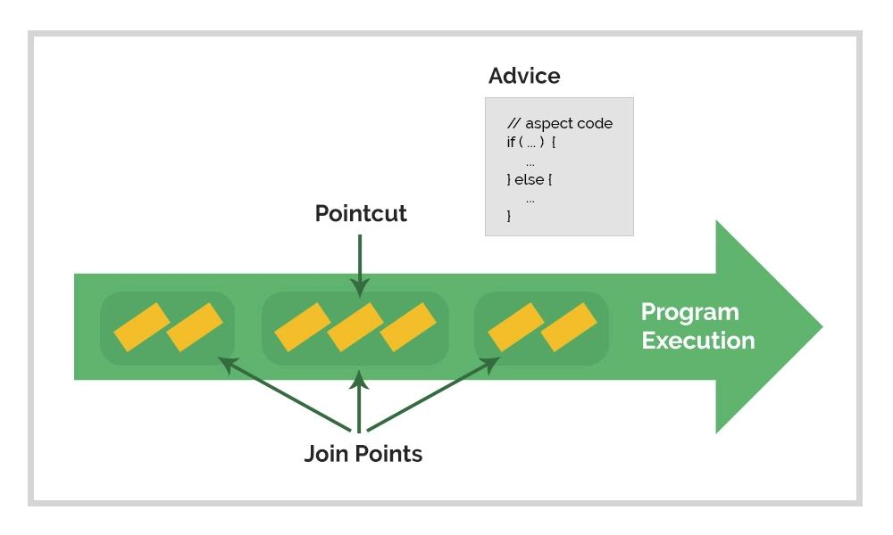

AOP是OOP的补充。OOP的主要模块是class，AOP的主要模块是aspect。

[TOC]

# AOP概念和术语

* Aspect：切面。跨越了多个类的横切关注点。在Spring中用一个被 @Aspect 注解修饰的类来实现。
* Join point：连接点。程序执行时的一个点。在Spring AOP中，join point总是代表一个 method execution。
* Advice：通知。切面在特定连接点上执行的动作。在Spring AOP中有五类通知。很多框架（包括Spring）都将通知设计成拦截器，通过维护一系列的拦截器实现对连接点的拦截。
* Pointcut：切入点。是用来匹配连接点的谓词。Advice总是和pointcut expression配合使用。使用pointcut expression来匹配join point，然后将 Advice 在匹配到的join point上执行。Spring 默认使用 AspectJ pointcut expression language
* Introduction：引入。对应@DeclareParents注解。可以为任何 被通知的对象 引入新的接口。
* Target object：目标对象。Spring AOP使用动态代理。因此目标对象永远是被代理的对象。
* AOP proxy：AOP代理。可能是JDK动态代理或CGLIB代理
* Weaving：织入。将增强添加到目标的具体连接点上的过程。Spring AOP使用运行时织入的方式。

## AOP通知类型
|Advice         |	说明
|:---|:---:|
|@Before        |	在原方法执行前执行。
|@After	        |   在原方法执行后执行。不管原方法有没有抛出异常，都会执行增强方法
|@AfterReturning| 	在原方法正常执行后执行。正常执行指原方法没有抛出异常
|@AfterThrowing	|  在原方法异常执行后执行。
|@Around        |	在增强方法内部执行原方法。增强方法可以根据内部逻辑决定是否执行原方法。

# @Aspect 支持
## 开启支持
```java
@Configuration
@EnableAspectJAutoProxy
public class AppConfig {

}
```

## 声明 Aspect
使用@Aspect注解
```java
package org.xyz;

@Aspect
public class NotVeryUsefulAspect {

}
```
## 声明Pointcut
Spring AOP只支持method execution join points。所以可以将pointcut看成匹配bean的method。Spring 的pointcut声明由两个部分组成：一个签名和一个切入点表达式。下面这个例子用于 匹配所有名字为transfer的方法作为切入点。
```java
@Pointcut("execution(* transfer(..))") // the pointcut expression
private void anyOldTransfer() {} // the pointcut signature
```

更多案例参考[Examples](https://docs.spring.io/spring-framework/docs/6.0.0/reference/html/core.html#aop-common-pointcuts)

## 声明Advice
Advice和pointcut配合所用。可以先声明pointcut，然后再声明advice，也可以直接在advice中使用内嵌的切入点表达式。
### before advice
下面是一个声明before类型advice的案例。
```java
@Aspect
public class BeforeExample {

    @Before("com.xyz.myapp.CommonPointcuts.dataAccessOperation()")
    public void doAccessCheck() {
        // ...
    }

    @Before("execution(* com.xyz.myapp.dao.*.*(..))")
    public void doAccessCheckInplace() {
        // ...
    }
}
```

### after returning advice
如果需要在advice中使用返回值，可以这样做
```java
@Aspect
public class AfterReturningExample {

    @AfterReturning(
        pointcut="com.xyz.myapp.CommonPointcuts.dataAccessOperation()",
        returning="retVal")
    public void doAccessCheck(Object retVal) {
        // ...
    }
}
```
可以通过返回值类型来限定method executions。这里是Object代表不做任何限制，如果是String 那么就限定到返回值为String的那些method executions。

### after throwing advice
如果需要获得异常信息，可以这样做
```java
@Aspect
public class AfterThrowingExample {

    @AfterThrowing(
        pointcut="com.xyz.myapp.CommonPointcuts.dataAccessOperation()",
        throwing="ex")
    public void doRecoveryActions(DataAccessException ex) {
        // ...
    }
}
```
同上，可以使用异常类型来进行限定。

### After advice
当匹配的method execution执行结束时进行advice。和AfterReturning的区别是，after无论成功还是失败都会进行advice，afterreturning只在成功时执行。

### Around Advice
Around advice在功能上可以代替其它很多类型的advice。但是建议只在需要使用的时候才使用around advice。通常在需要在方法执行前后以线程安全的模式共享状态时使用around advice。比如开启和关闭一个定时器的时候使用。


返回值必须为Object，第一个参数必须为ProceedingsJoinPoint。方法体内必须调用ProceedingsJoinPoint的proceed方法。
```java
@Aspect
public class AroundExample {

    @Around("com.xyz.myapp.CommonPointcuts.businessService()")
    public Object doBasicProfiling(ProceedingJoinPoint pjp) throws Throwable {
        // start stopwatch
        Object retVal = pjp.proceed();
        // stop stopwatch
        return retVal;
    }
}
```

### advice parameters
**JoinPoint**
advice可以将第一个参数定义为org.aspectj.lang.JoinPoint类型。JoinPoint接口提供了一些有用的方法
* getArgs(): Returns the method arguments.
* getThis(): Returns the proxy object.
* getTarget(): Returns the target object.
* getSignature(): Returns a description of the method that is being advised.
* toString(): Prints a useful description of the method being advised.

以下内容参考官方文档。
**给advice传递参数**
**参数与泛型**
**形参名**

### advice ordering
当多个通知想要在同一个连接点上执行时，SpringAOP使用优先级来控制advice的执行顺序。The highest precedence advice runs first "on the way in"."On the way out" from a join point, the highest precedence advice runs last.

当定义在不同@Aspect类中的多个通知想要在同一个连接点上执行时，可以使用@Order注解来控制通知的执行顺序。Ordered.getOrder()的值越大，优先级越高。除了@Order注解外也可以让切面类实现org.springframework.core.Ordered接口。

从5.2.7开始，在同一个@Aspect类中运行在同一个连接点上的advice按照advice的类型的不同分配不同的优先级，优先级从高到低分别是：@Around, @Before, @After, @AfterReturning, @AfterThrowing。但是@After实际上在@AfterReturning, @AfterThrowing后执行。

如果同一个@Aspect类中相同类型的advice，需要运行在相同的连接点上，那么执行顺序未知。可以考虑拆成两个@Aspect类或将两个advice合并成一个advice。


从概念上来说，这些通知都是作用在连接点上的。因此@AfterThrowing类型的通知不支持获得@After/@AfterReturning方法的异常。


## Introductions
Introduction使得能够为现有对象在不改变源码的情况下实现给定的接口。通过@DeclareParents注解可以指定哪些类需要被引入，以及指定默认实现。
下面这个案例中，UsageTracked是一个接口，DefaultUsageTracked是默认实现类。为所有service包下的类引入UsageTracked接口，并提供默认实现类为DefaultUsageTracked。
```java
@Aspect
public class UsageTracking {

    @DeclareParents(value="com.xzy.myapp.service.*+", defaultImpl=DefaultUsageTracked.class)
    public static UsageTracked mixin;
}
```


# AOP例子
## 应用场景
记录日志、监控方法运行时间
权限控制：使用环绕通知，将没有权限的操作吞掉
缓存优化：查询前先在缓存中查找。找不到则在数据库中查找。
事务管理：调用方法前开启事务，调用方法后提交关闭事务

## AOP的使用
### 入门案例
```java
@Configuration
@ComponentScan({"Dao","Aspect"})
@EnableAspectJAutoProxy  // 1. 开启代理支持
public class SpringConfiguration {}
```
```java
@Component  // 让Spring能够拿到bean
@Aspect     // 标识这是一个切面
public class DaoAspect {
    @Pointcut("execution(* *..*(..))")  // 2. 编写切入点
    private void pt(){}

    @Around("pt()")  // 3. 编写通知，并将切入点与通知绑定。
    public Object processTime(ProceedingJoinPoint pjp) throws Throwable {
        System.out.println("before...");
        Object ret = pjp.proceed();
        System.out.println("after...");
        return ret;
    }
}
```
```java
public class Test {
    public static void main(String[] args) {
        ApplicationContext context = new AnnotationConfigApplicationContext(SpringConfiguration.class);
        UserDao userDaoImpl = context.getBean(UserDao.class);
        userDaoImpl.select();
        System.out.println(userDaoImpl);  // 这里输出的是Dao.UserDaoImpl@7098b907。因为spring重写了Proxy的toString方法
        System.out.println(userDaoImpl.getClass());  // 实际类型是class jdk.proxy2.$Proxy19
        System.out.println(userDaoImpl.getClass().getSuperclass());
        System.out.println(userDaoImpl.getClass().getSuperclass().getSuperclass());
    }
}
```
### AOP 在 advice 中获取数据
* 获取pointcut基本信息
```java
    @Before("pt()")
    public void before(JoinPoint jp) {
        Object[] args = jp.getArgs();// 获取参数。也就是pointcut所用到的参数。
        Signature signature = jp.getSignature();  // 获取签名
        String methodName = signature.getName();  // 方法名，也就是pointcut
        Class clazz = signature.getDeclaringType();  // 类名，也就是pointcut所在的类
    }
```
* 在AfterReturning中获取返回值
```java
    @AfterReturning(value = "pt()", returning = "ret")
    public void afterReturning(JoinPoint jp, int ret) {
        System.out.println(ret); // ret代表pointcut的返回值。通过这种方式拿到返回值
    }
```
* 在AfterThrowing中获取错误信息
```java
    @AfterThrowing(value = "pt()", throwing = "error")
    public void afterThrowing(JoinPoint jp, Throwable error) {
        error.printStackTrace(); // 抛出的错误信息
    }
```
* around的使用
1、在内部如果没有执行pjp.proceed()那么Pointcut就不会执行。
2、如果原函数有返回值，那么Advice需要返回Object。
3、如果原函数没有返回值，那么pjp.proceed()的返回值为null。

## AOP工作流程
1、Spring容器启动
2、读取所有切面配置中的切入点
3、初始化bean，板顶bean对应的类中的方法是否匹配到任意切入点
* 匹配失败：直接创建对象
* 匹配成功：创建原始对象的代理对象

4、获取bean执行相应方法

## AOP切入点表达式
```java
@Pointcut("execution(public User com.service.UserService.findById(int))")
// 按照顺序分成以下几个部分
// 动作关键字：execution
// 访问修饰符：public/private等，可以省略
// 返回值
// 包名：com.service
// 类/接口名：UserService
// 方法名：findById
// 参数：int
// 异常名：方法定义中抛出指定异常。通常不写
```
### 通配符
* *：单个独立的任意符号。放在什么位置就代表什么含义。如`@Pointcut("execution(public User com.service.UserService.findById(*))")`就代表findById方法仅包含一个参数
* ..：任意个连续符号。放在什么位置就代表什么含义。如`@Pointcut("execution(public User com.service.UserService.findById(..))")`就代表findById方法可以包含任意多个参数，可以不包含参数。
* +：专门用于匹配子类类型。如`@Pointcut("execution(public User com.service.*Service+.findById(..))")`就代表匹配所有service包下的以Service结尾的类的子类的所有findById方法。


# 代理机制
Spring 使用JDK动态代理或者CGLIB来创建代理对象。JDK动态代理集成在JDK中，CGLIB动态代理被打包在spring-core中。

如果目标对象实现了至少一个接口，那么就使用JDK动态代理。否则就使用CGLIB动态代理。

CGLIB代理的缺陷：
* final方法不能被advised，因为无法被子类重写。
* 从Spring4.0开始，代理对象的构造方法不会被调用两次了，因为CGLIB代理通过Objenesis创建实例。但是如果JVM不支持绕过构造函数时，此时可能会看到两次调用构造函数，同样的也会看到两次debug log。

可以使用以下方法强制使用CGLIB代理
```xml
<aop:aspectj-autoproxy proxy-target-class="true"/>
```

## AOP代理中的this关键字
在下面这个案例中，Target是希望被代理的目标，里面有两个方法，其中method1通过this调用了method2。
```java
@Component
public class Target {
    void method1() {
        System.out.println(this.getClass());  // 输出 class com.Target
        this.method2();  // 不走代理
    }
    void method2() {
        System.out.println("method2 in Target");
    }
}

@Aspect
@Component
public class AspectTest {
    @Pointcut("execution(void com.Target.method*())")
    private void pt(){}

    @Before("pt()")
    public void before() {
        System.out.println("before...");
    }
}
```
```java
@Configuration
@ComponentScan
@EnableAspectJAutoProxy
public class Main {
    public static void main(String[] args) {
        ApplicationContext context = new AnnotationConfigApplicationContext(Main.class);
        Target target = (Target) context.getBean("target");
        target.method1();
        System.out.println(target.getClass());  // 输出 class com.Target$$EnhancerBySpringCGLIB$$b986a594
    }
}
```
上面的案例显示被代理的类如果使用了this关键字调用了自己的其它方法将不走代理，因为this关键字代表的是target本身，而不是代理增强后的对象。

如果不希望出现这种情况，那么需要重构代码避免使用this关键字。或者使用下面的方法。下面的方法和Spring框架耦合度过高，而且被代理的类能够感知到自己正在AOP上下文中被使用，因此Spring还是推荐进行代码重构。
```java
@Component
public class Target {
    void method1() {
        System.out.println(this.getClass());  // 输出 class com.Target
        ((Target)AopContext.currentProxy()).method2();  // 拿到代理类进行调用
    }
    void method2() {
        System.out.println("method2 in Target");
    }
}

@Configuration
@ComponentScan
@EnableAspectJAutoProxy(exposeProxy = true)  // 使用threadlocal保存proxy。
public class Main {
    ...
}
```