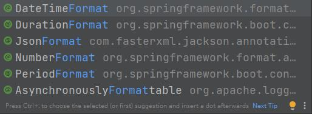

SpringMVC 是一种基于Java实现的MVC模型的轻量级Web框架。用来做表现层开发。相比Servlet，使用简单，开发便捷。灵活性强。

1、导坐标
javax.servlet  javax.servlet-api
org.springframework   spring-webmvc

2、创建控制器
```java
@CrossOrigin
@Controller
public class PapersController {
    @PostMapping("/api/getOtherStudentPapers")
    @ResponseBody
    public List<Paper> getOtherStudentPapers(int id) {
        ...
        return list;
    }
}
```

3、初始化SpringMVC环境
```java
@Configuration
@ComponentScan("controller")
public class SpringMVCConfiguration {}
```

4、初始化Servlet容器。加载SpringMVC环境，并设置SpringMVC技术处理的请求
```java
public class ServletContainersInitConfig extends AbstractDispatcherServletInitializer {
    @Override
    protected WebApplicationContext createServletApplicationContext() {
        return null;
    }

    @Override
    protected String[] getServletMappings() {
        return new String[0];
    }

    @Override
    protected WebApplicationContext createRootApplicationContext() {
        return null;
    }
}
```

### 常用注解
##### @Controller
注解一个类表示控制器,Spring MVC 会自动扫描标注了这个注解的类。

##### @PathVariable
用于将请求URL中的模板变量映射到功能处理方法的参数上，即取出uri模板中的变量作为参数。
```java
@Controller  
public class TestController {  
     @RequestMapping(value="/product/{productId}",method = RequestMethod.GET)  
     public String getProduct(@PathVariable("productId") String productId){  
           System.out.println("Product Id : " + productId);  
           return "hello";  
     }  
}
```
##### @RequestParam
用于从前端接收数据时使用。当前后端传递的参数名不能匹配时，可以使用这个注解进行匹配。
```java
@Controller
@RequestMapping("/anno")
public class AnnoController {
    @RequestMapping("/testRequestParam")
    public String testRequestParam(@RequestParam(value="name") String username) {
        System.out.println(username);
        return "success";
    }
}
```
##### @ResponseBody
放在方法上，表示该方法的返回值需要通过springmvc提供的HttpMessageConverter接口转换为指定格式的数据如：json,xml等，通过Response响应给客户端。而不是html页面的形式返回给客户端。

##### @RequestBody
@RequestBody可以接收POST请求Body里的数据。

##### @RequestMapping
请求路径映射，可以标注类，也可以标注方法，可以指定请求类型（post、get、put、delete、patch...）默认不指定为全部接收。
衍生的注解还有 @PostMapping @GetMapping等
    
##### 格式转换
以下这些注解都是与格式有关的注解

下面这个例子中从前端传入的Data类型数据格式不同，可以用@DateTimeFormat注解进行接收
```java
    @PostMapping("/testDataTimeFormat")
    @ResponseBody
    public String dataParam(@DateTimeFormat(pattern = "yyyy-MM-dd") Data data1, 
                            @DateTimeFormat(pattern = "yyyy/MM/dd HH:mm:ss") Data data2) {
        System.out.println("接收yyyy-MM-dd格式日期：" + data1);
        System.out.println("接收yyyy/MM/dd HH:mm:ss格式日期：" + data2);
        return "";
    }
```

### REST风格
##### REST 简介
REST(Representational State Transfer)
* 传统风格资源描述形式：
```text
http://localhost/user/getById?id=1
http://localhost/user/saveUser
```
* REST风格描述形式：
```text
http://localhost/user/1
http://localhost/user
```
优点是隐藏资源的访问行为，无法通过地址的值对资源的操作
缺点是可读性差

##### 如何区分对资源进行何种操作
使用访问方式对 对资源的动作 进行区分。以下是一些例子
```text
http://localhost/users       GET      查询全部用户
http://localhost/users/1     GET      根据id查询指定用户
http://localhost/users       POST     添加用户
http://localhost/users       PUT      修改用户
http://localhost/users/1     DELETE   删除用户
```
REST风格推荐使用上面的方式对动作进行区分。


### 拦截器
**什么是拦截器**
拦截器（Interceptor）是一种动态拦截方法调用的机制，在SpringMVC中动态拦截控制器方法的执行。拦截器使用的是AOP思想。

**拦截器的作用**
* 在指定的方法调用前后执行预先设定的代码
* 阻止原始方法的执行（如权限控制等）
作用：进行登录拦截、权限校验等

**拦截器与过滤器的区别**
* 归属不同：Filter属于Servlet技术，Interceptor属于SpringMVC技术。Filter通过函数回调实现，Interceptor使用反射机制实现
* 拦截内容不同：Filter对所有访问进行增强，Interceptor仅针对SpringMVC的访问进行增强。

**拦截器执行流程**
无拦截器：执行controller
有拦截器：prehandle-> 如果return true则执行controller -> postHandle -> afterCompletion

多拦截器：比如有ABC三个拦截器。按照ABC的顺序执行。（配置顺序就是运行顺序）
```txt
正常情况：preA -> preB -> preC -> Controller -> postC -> postB -> postA -> afterC -> afterB -> afterA -> 结束 
preA返回false：preA -> 结束
preB返回false：preA -> preB -> afterA -> 结束
preC返回false：preA -> preB -> preC -> afterB -> afterA -> 结束
```
如果有某个pre返回了false，那么需要按照以下两点执行：
①：如果有某一个pre返回了false，那么Controller和三个post都不执行。且后面的pre也不执行
②：返回了true的pre，那么after也要执行。
