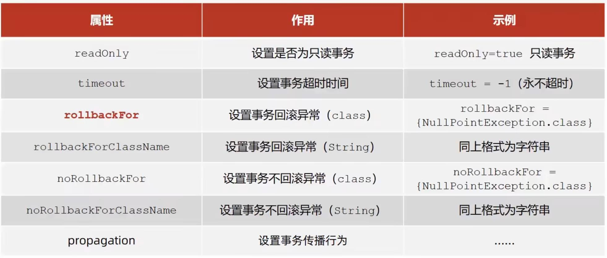

事务：在数据层保障一系列的数据库操作的原子性。
Spring事务：在数据层或业务层保障一系列的数据库操作的原子性

### 开启事务流程
* 在配置类上添加@EnableTransactionManagement注解
* 在业务层接口上添加@Transactional注解
* 设置事务管理器
```java
    @Bean
    public PlatformTransactionManager transactionManager(DataSource dataSource) {
        DataSourceTransactionManager ptm = new DataSourceTransactionManager();
        ptm.setDataSource(dataSource);
        return ptm;
    }
```
DataSource根据实现技术进行选择，MyBatis框架使用的是JDBC事务。

### Spring事务角色
**事务管理员**：发起事务方，在Spring中通常指代业务层开启事务的方法。
**事务协调员**：加入事务方，在Spring中通常指代数据层方法，也可以是业务层方法。
也就是说，外面大的事务就是事务管理员。里面的事务就是事务协调员。
如转账操作是个大的事务，里面为每个账户加钱减钱就是里面的小事务。所以转账操作相当于事务管理员，里面的加钱减钱就是事务协调员。

### 事务相关配置

在@Transactional注解的括号中进行配置。
对于rollbackFor：默认只有error系列的错误或运行时错误才会进行回滚。如果IO错误也要回滚，那么可以用roolbackFor进行设置。

对于propagation：关于事务传播属性，有以下配置。用来配置事务协调员是否加入事务管理员的逻辑。

