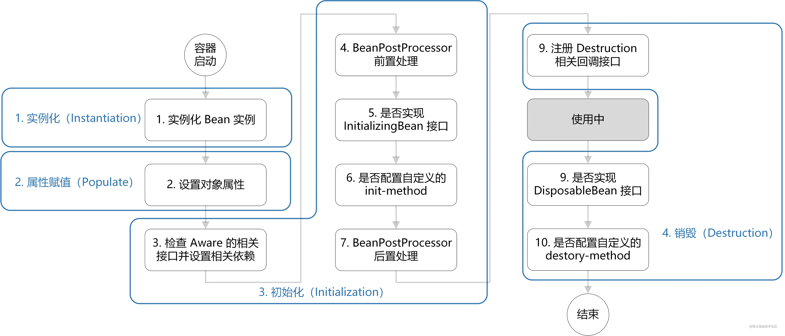
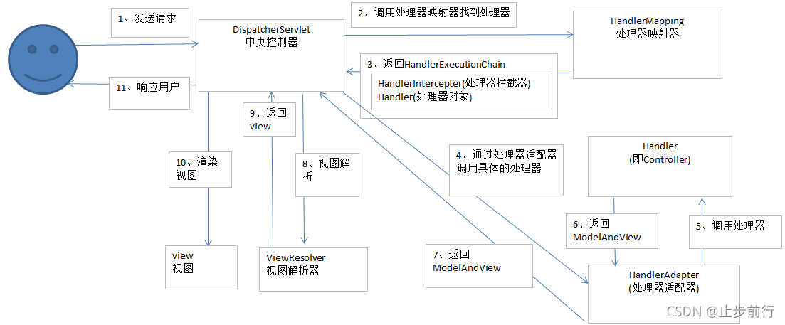

ctrl+alt+u 看类图
ctrl+F12   看所有方法
classpath：代表resources目录。

## BeanFactory 与 ApplicationContext
### ApplicationContext 接口功能
* 国际化（根据不同的locale获取不同的翻译结果）
* 根据通配符获取资源（获取静态资源）
* 获取配置信息（获取property文件中配置的信息）
* 发布事件（用于实现组件解耦）

### BeanFactory 实现
BeanFactory最重要的实现类是DefaultListableBeanFactory。具体可以看SpringTests.A02.TestBeanFactory

### ApplicationContext 实现类
* ClassPathXmlApplicationContext
* FileSystemXmlApplicationContext
* XmlWebApplicationContext
* WebApplicationContext
* AnnotationConfigServletWebServerApplicationContext：具体可以看A02.ApplicationImpl

## Bean 生命周期
### 四个阶段
  

实例化、属性赋值、初始化、销毁

### 模板方法设计模式
Bean的生命周期流程是固定的，每个流程后面执行哪一类后处理器也是固定的。但是可以注册后处理器来增强getBean功能。这就是模板方法模式的一个体现。 

## 后处理器
后处理器是Spring提供的扩展点

### 常见Bean后处理器
CommonAnnotationBeanPostProcessor: @Resource @PostConstruct @PreDestroy
AutowiredAnnotationBeanPostProcessor: @Autowired @Value
ConfigurationPropertiesBindingPostProcessor: @ConfigurationProperties

### 常见工厂后处理器
ConfigurationClassPostProcessor: @ComponentScan @Bean @Import @ImportResource
MapperScannerConfigurer: @MapperScan (SSM整合时使用这个后处理器整合Mybatis，SpringBoot不常用)

## Bean 的初始化与销毁
Spring提供了以下三种方式指定Bean的初始化函数，执行的先后顺序就是排序的顺序
* @PostConstruct
* 实现 InitializingBean 接口
* @Bean(initMethod="initMethod")

销毁顺序也有三种，先后顺序同上。
* @PreDestroy
* DisposableBean
* @Bean(destroyMethod="destroyMethod")

## Scope
singleton, prototype, request, session, application

### 单例Bean依赖多例Bean
依赖request、session、application也类似
* @Lazy与@Autowire配合使用
* 在多例Bean的类上添加@Scope(value="prototype", proxyMode=ScopedProxyMode.TARGET_CLASS)
* 注入ObjectFactory<YourPrototypeClass>而不是YourPrototypeClass
* 注入AplicationContext，然后利用getBean方法获得多例Bean

## AOP

### AOP 之 ajc 增强
利用aspectj插件进行增强，直接在编译阶段改动类的字节码。增强的动作与Spring无关。代理的原理是生成一个被代理类的子类，重写父类中的被代理方法实现的增强，因此无法对静态方法进行代理（因为静态方法可以被继承，但是不能被重写），也无法对final修饰的类/方法进行代理，同时还存在this调用问题。

### AOP 之 agent 增强
在java的类加载阶段改动类的字节码。好处同上，了解即可。

### AOP 之 proxy 增强
代理类没有源码，而是在运行期间直接生成代理类的字节码。生成后的字节码也要通过类加载器加载后才能调用。

#### jdk
特点：生成的代理类是被代理类的兄弟。因此两者无法强制转换，且被代理类可以是final类。被代理类必须实现接口

#### cglib
特点：生成的代理类是目标类的子类。因此目标类不能被final修饰，加了会报错，目标方法也不能被final修饰，加了就不会增强。目标方法也不能是static类型，同时如果目标类在目标方法A中调用了目标方法B，那么这里的B就没办法走代理了，这就是this调用问题。

### Spring 选择代理
默认情况下：如果目标实现了接口，用jdk代理。否则使用cglib代理
proxyTargetClass=True时，无论怎样都使用cglib代理

### 代理创建时机

无循环依赖：BeanA 依赖 BeanB。BeanB创建->初始化->创建代理->BeanA创建->依赖注入BeanB->初始化。
有循环依赖：BeanA 与 BeanB 循环依赖。BeanA创建->BeanB创建->BeanA创建代理并将代理对象暂存于二级缓存->给BeanB注入BeanA->BeanB初始化->BeanB创建代理->BeanA初始化


### 适配器模式
作用：将一个类的接口转换成客户希望的另外一个接口。适配器模式使得原本由于接口不兼容而不能一起工作的那些类可以一起工作。
Spring中使用AspectJ中的接口来解析@Before @After等注解，而Spring最后执行这些方法是用的MethodInterceptor接口，这两套接口不适配，于是Spring就使用适配器模式进行接口适配。比如使用MethodBeforeAdviceAdapter接口将AspectJMethodBeforeAdvice适配为MethodBeforeAdviceInterceptor（实现了MethodInterceptor接口）

### 责任链模式
servlet中的filter，Spring中的MethodInterceptor都是用的责任链模式。避免请求发送者和接收者耦合在一起。

```java
public class Interceptor {
    public Object invoke(Invocation invocation) {
        // before logic
        Object ret =  invocation.preceed();
        // after logic;
        return ret;
    }
}
public class Invocation {
    List<Interceptor> list;
    Method method;
    int idx = 0;
    public Object proceed() {
        if (idx == list.size()) {
            return method.invoke(); // 执行原方法
        } 
        return list.get(idx++).invoke(this);  // 属于隐式递归
    }
}
```

## SpringMCV

  

HandlerMapping
HandlerAdapter
HandlerExceptionResolver

HandlerAdapter：处理器适配器。用于 解析参数，处理注解，适配handler。
HandlerMapping：根据request路径，找到HandlerExecutionChain

控制器方法执行流程：