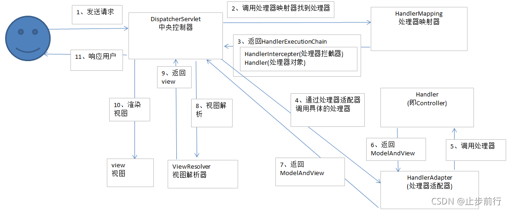

# Spring refresh

# Spring Bean
## 生命周期
  
1. **实例化**：使用bean的构造方法进行实例化。先使用@Autowire注解修饰的构造方法，如果没有，使用默认构造方法。
2. **依赖注入**：注入bean的依赖
    * AutowiredAnnotationBeanPostProcessor处理@Autowired及@Value标注的成员进行注入。通过将被注入的对象封装为InjectionMetadata进行依赖注入。
    * CommonAnnotationBeanPostProcessor处理@Resource标注的成员，也是使用InjectionMetadata进行依赖注入
3. **初始化阶段**：
    * 处理Aware接口：如BeanNameAware, BeanFactoryAware.
    * 调用初始化方法：有三种指定初始化方法的手段。调用顺序如下：@PostContruct，InitializingBean接口，@Bean(initMethod)
   * 将可销毁的Bean进行登记：
      * 实现DisposableBean接口
      * 实现AutoCloseable接口
      * @Bean(distroyMethod)
      * Bean中有@PreDestroy标注的方法
      * Bean中存在方法名为close或shutdown的方法
4. **销毁阶段**：
   * singleton bean：在ApplicationContext.close时销毁，此时会找到所有DisposableBean的名字，进行逐一销毁
   * 自定义scope bean在作用于对象生命周期结束时销毁
   * prototype bean：通过手动调用AutowireCapableBeanFactory.destroyBean方法进行销毁

# Spring 事务
## 事务传播机制
[带你读懂Spring 事务——事务的传播机制](https://zhuanlan.zhihu.com/p/148504094)
* **REQUIRED（默认）**：如果当前没有事务，则自己新建一个事务，如果当前存在事务，则加入这个事务。
* **SUPPORTS**：当前存在事务，则加入当前事务，如果当前没有事务，就以非事务方法执行
* **MANDATORY**：当前存在事务，则加入当前事务，如果当前事务不存在，则抛出异常。
* **REQUIRES_NEW**：创建一个新事务，如果存在当前事务，则挂起该事务。
* **NOT_SUPPORTED**：始终以非事务方式执行,如果当前存在事务，则挂起当前事务
* **NEVER**：不使用事务，如果当前事务存在，则抛出异常
* **NESTED**：如果当前没有事务，则自己新建一个事务，如果当前存在事务，则在嵌套事务中执行（即开一个子事务）。**如果子事务出现异常，父事务catch住了异常，则子事务回滚，父事务不受影响。如果父事务出现异常，子事务会跟着回滚**

## 事务失效场景
1. **异常类型不对**：Spring 默认对RuntimeException和Error的子类才会进行回滚，其它异常不会报错。如FileNotFoundException属于检查异常，不会回滚。@Transcational(rollbackFor=Exception.class) 配置所有异常都会回滚。
2. **异常没有抛出**：异常在事务内部被catch住了，没有抛出去，就不会进行回滚。解决办法是将异常重新抛出，或调用`TransactionInterceptor.currentTranactionStatus().setRollbackOnly();`方法，使用这个方法就会通知事务切面这次执行操作需要回滚。也就不会出现下面这个事务失效场景。
3. **切面顺序导致异常没有抛给事务切面**：首先进入事务切面（事务切面优先级最低，也就会最先执行），再进入自定义切面，最后是事务方法。事务方法抛出的异常在自定义切面被catch了，没有抛出，导致事务切面不知道发生了异常。
4. **@Transactional注解必须加在公共方法上**。
5. **父子容器导致事务失效**：父容器配置了@EnableTransactionManagement，子容器没配，导致子容器里的Bean都没有支持事务。解决办法一是缩小子容器的扫描返回，让所有使用了@Tranactional注解的Bean都不在子容器中出现（子容器找不到就会去父容器找，父容器的Bean支持事务）。解决办法二是所有bean放在同一容器里（Spring Boot就是只是用了一个容器）
6. **本类方法调用不会走代理**。比如foo()和bar()都在同一个类，bar()加了事务注解，foo()中调用了bar()方法，bar()方法没有走代理，因此事务注解的配置失效。解决办法是获得代理对象再调用方法。1）自己注入自己，注入的是代理对象。2）使用AopContext.currentProxy()来获得代理对象。
7. 原子性失效。由于事务使用代理实现，因此具体的业务逻辑在目标方法上执行，事务的提交与回滚在代理方法上执行。因此在目标方法上添加synchronized无法保证整个事务的原子性。

# SpringMVC 执行流程
  
3. 返回的HandlerExecutionChain包含HandlerInterceptor和HandlerMethod，HandlerMethod里面包含controller的bean对象以及method对象。
5. 由于Handler的参数多种多样，因此这里还需要对参数进行处理，才能传给Handler的Method进行调用。
6. 同理也需要对返回值进行处理，传统的mvc模型需要返回视图对象，现在的前后端分离架构只需要返回字符串，或者需要将返回结果写入reponsebody里。

拦截器：拦截器返回false就不会执行后面的拦截器和真正的handlerMethod。
ResponseBody注解：加了这个注解之后，会在处理返回值的时候返回一个json对象，并标识ModelAndView已经处理，因此后面就不回对视图进行解析了，而是将这个json对象加入到responsebody里。
出现异常：第五步如果正常执行，就会返回一个ModelAndView对象，如果执行出现异常，那么会调用HandlerExceptionResolver去处理这些异常。同时出现异常之后就不会执行拦截器的postHandle

# 注解
## Spring注解
**事务**
@Transactional
@EnableTransactionManagement
**核心**
@Order
**切面**
@EnableAspectJAutoProxy
**组件扫描与配置类**
@Component
@Controllere
@Serivice
@Repository
@ComponentScan
@Conditional 添加条件，满足条件才添加Bean
@Configuration
@Bean
@Import 导入其它配置类
@Lazy 懒加载
@PropertySource 读取Property文件，以键值的形式加入到Environment对象中
**依赖注入**
@Autowired
@Qualifier
@Value

**MVC**

mapping
@Mapping
@RequestMapping
@Get/Post/Put/Delete/PatchMapping

**rest**
@RequestBody
@ResponseBody
@ResponseStatus 控制相应的状态码
@RestController 是@Controller和@ResponseBody的组合

**统一处理**
@ControllerAdvice
@ExceptionHandler

**参数**
@RequestHeader  获取request指定header的数据
@CookieValue   获取Cookie的值
@PathVariable  获取路径信息
@RequestParam 

**转换与格式化**
@DateTimeFormat
@NumberFormat
@InitBinder 设置自定义转换器

**ajax**
@CrossOrigin

**SpringBoot**
@SpringBootApplication
@EnableAutoConfiguration
@SpringBootConfiguration

# Spring 中有哪些设计模式
单例模式
工厂方法模式：BeanFactory中的getBean()方法
适配器模式：SpringMVC中的HandlerAdapter
代理模式：AOP
责任链模式：HandlerInterceptor
观察者模式：Spring中的event。
模板方法模式：refresh()、 

# 循环依赖
一级缓存singletonObjects：存放成品对象
二级缓存earlySingletonObjects：存放半成品对象
三级缓存singletonFactories：将半成品封装成工厂
AOP代理是通过BeanPostProcessor实现的，PostProcessor在实例化之后执行，因此实例化之后的对象，和AOP代理后的对象不是同一个对象。因此不能直接将实例化后的半成品对象放入一级缓存中。
Spring中的解决办法是引入三级缓存，在三级缓存中存放ObjectFactory。通过ObjectFactory可以获取原始对象或原始对象的代理对象，假设A和B循环依赖，A在实例化后会生成一个ObjectFactory存放到三级缓存中，然后发现A依赖B，于是创建B，那么B在依赖注入阶段会从ObjectFactory中找到A的ObjectFactory，通过这个工厂获得代理后的对象。然后将这个代理后的对象缓存到earlySingletonObjects中。最终完成B的依赖注入和初始化，然后完成A的依赖注入和初始化。

## 构造方法循环依赖
@Lazy注解加在构造方法的参数上
