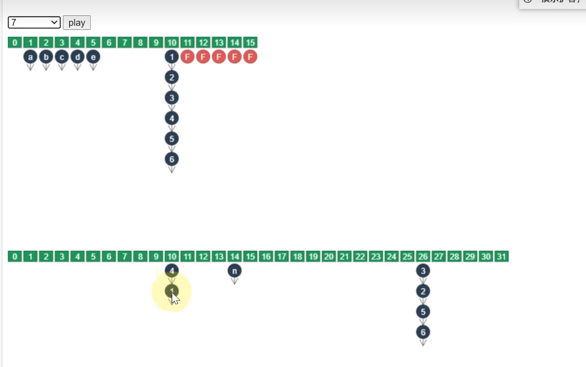

ArrayBlockQueue
ConcurrentHushMap
ConcurrentLinkedDeque
ConcurrentLinkedQueue
ConcurrentSkipListMap
ConcurrentSkipListSet
CopyOnWriteArrayList
CopyOnWriteArraySet
DelayQueue
LinkedBlockingDeque
LinkedBlockingQueue
LinkedTransferQueue
PriorityBlockingQueue

Blocking通常基于锁实现
CopyOnWrite：写时复制一份，在新的数组中修改。读时不加锁
Concurrent：内部大部分使用cas优化，且并发度较高。
    弱一致性：遍历时弱一致性、求size时弱一致性、读取弱一致性

具体的源码部分之后有空再看

1.7 HashMap并发扩容时，由于头插法可能会导致死链问题。

# ConcurrentHushMap
扩容：将原来的数组A上的数据移动到扩容数组B上。每移动完一条链表，就将对应未知的链表置为已经扩容完成的状态。扩容的时候需要对链表头加锁。

  
如果链表长度为1，则直接从原来的数组中移动到新数组中。
如果链表长度大于1，则将原来链表数据复制到新数组对应位置上。
当某个链表完成之后，在数组对应位置链接一个FINISH，标志当前位置迁移完成。

**扩容时并发查**：
* 查找的数据在已完成部分：到新的链表中找
* 查找的数据在未开始部分：在旧的链表中找
* 查找的数据在正在迁移的那个链表当中：在旧的链表中找。注意前面说过如果迁移的链表长度大于1的时候，需要复制链表中的节点。因此迁移过程中不会破坏原来那个链表的链接关系。

**扩容时并发put**：
* put的数据在未开始部分：按照正常逻辑加锁put即可，在旧的链表中put。
* put的数据应该放到正在迁移的那个链表中：阻塞等待。
* put的数据在已完成部分：执行put的线程帮忙执行迁移工作。