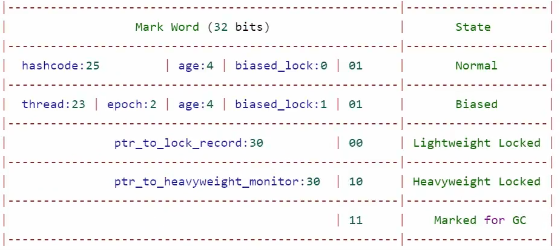

[TOC]
### 基础知识
**临界资源**：虽然多个进程可以共享系统中的各种资源，但其中许多资源一次只能为一个进程所使用，我们把一次仅允许一个进程使用的资源称为临界资源。许多物理设备都属于临界资源，如打印机等。此外，还有许多变量、数据等都可以被若干进程共享，也属于临界资源。
**临界区**：对临界资源的访问，必须互斥地进行，在每个进程中，访问临界资源的那段代码称为临界区。
**管程**：操作系统中使用信号量的机制来实现线程的同步与互斥。但是缺点在于难以设计，以及代码难以阅读与维护。因此有人提出了管程的概念。管程是一个抽象的概念模型，管程的内部将对共享资源的访问操作进行了封装，在管程的内部使用信号量机制确保共享资源的同步与互斥，这样只需要在管程中加入一个共享资源，然后调用封装好的对这个共享资源的操作，在管程的外部不需要考虑同步操作。这样可以大大简化线程同步与互斥的实现难度。
**java中的管程**：java的管程使用的是简化的MESA模型。MESA模型中的条件变量可以有多个，而java内置的管程中只能有一个条件变量。java的synchronized关键字是基于管程实现的，锁住的对象就是临界资源。

### java对象内存布局
java对象由两部分组成：对象头和数据部分。并且java采用填充的方式，保证了java对象一定是8字节的倍数。
**对象头**
对象头包括两个部分，一个字长的Mark Word，一个字长的Klass Pointer。（如果是数组对象，那么在对象头中还有一个字段用来表示数组长度）
* Klass Pointer是对象类型指针，指向当前对象所在的类，虚拟机通过这个指针确定该对象时哪个类的实例。
* Mark Word：记录哈希码、分代年龄、锁标志、偏向线程id等信息。Mark Word的数据结构不固定，根据对象的状态不同会有不同的数据结构。这样的设计可以在尽可能小的空间内存储尽可能多的信息。以下表格是64位虚拟机下的对象头结构
```java
|------------------------------------------------------------------------------------------------------------------|
|                                              Object Header(128bits)                                              |
|------------------------------------------------------------------------------------------------------------------|
|                                   Mark Word(64bits)                |  Klass Word(64bits)    |      State         |
|------------------------------------------------------------------------------------------------------------------|
| unused:25|identity_hashcode:31|unused:1|age:4|biase_lock:0|lock:01 | OOP to metadata object |      Nomal         |
|------------------------------------------------------------------------------------------------------------------|
| thread:54|      epoch:2       |unused:1|age:4|biase_lock:1|lock:01 | OOP to metadata object |      Biased        |
|------------------------------------------------------------------------------------------------------------------|
|                     ptr_to_lock_record:62                 |lock:00 | OOP to metadata object | Lightweight Locked |
|------------------------------------------------------------------------------------------------------------------|
|                    ptr_to_heavyweight_monitor:62          |lock:10 | OOP to metadata object | Heavyweight Locked |
|------------------------------------------------------------------------------------------------------------------|
|                                                           |lock:11 | OOP to metadata object |    Marked for GC   |
|------------------------------------------------------------------------------------------------------------------|

```


### synchronized与管程
**synchronized原理**：当尝试使用synchronized给对象加锁的时候，该对象头的Mark Word部分就指向一个ObjectMonitor对象。当一个线程想要获取锁时就会查看对象头的状态，如果状态为01就代表没有被加锁，那么该线程就会将对象头替换成指向对应ObjectMonitor的指针。如果状态为10就代表已经加锁了，就需要在ObjectMonitor的一个队列里面等待。

jdk1.5之前，synchronized只有一个实现方法，那就是管程，在1.6之后加入了很多优化操作，1.6之后的重量级锁就是用管程实现的。
管程只在重量级锁中存在。重量级锁就是临界资源，它所拥有的notify、wait、notifyAll就是访问这个临界资源的方法。每个重量级锁对应一个ObjectMonitor对象，这三个部分组成了一个完整的管程，用来实现对重量级锁的各种操作。

**ObjectMonitor类**
Object Monitor翻译过来就是对象管程。这个类通过C++实现，由JVM创建对象，每个ObjectMonitor对象对应一个重量级锁。它持有几个比较重要的字段。
* _owner：指向持有锁的线程地址。
* _WaitSet：存放调用了wait方法而进行等待的队列。
* _EntryList：存放等待获得锁的线程的集合。这个集合里的所有线程都处于block状态。
* _recursions：锁的重入次数。
* _count：线程获取锁的次数。
* _header：存放锁的对象头

**线程获得重量级锁**
如果_owner为空，则可以获得锁，并将_owner置为自己。否则进入_EntryList集合。

**线程释放重量级锁**
将_owner置为空。如果_EntryList集合不为空，则让_EntryList集合中的线程竞争锁。
如果_WaitSet和_EntryList都为空，则还原锁的对象头部分。

**wait、notify、notifyAll**
这三个方法都是需要多个线程一起合作使用，因此使用场景都是在重量级锁下，也就是管程下。
==以下方法都要配合synchronized一起使用==
* wait：线程调用wait方法后会进入_WaitSet队列等待。此时状态waiting。**调用后会释放锁**
* wait(long)：等待一定时间没被唤醒，就不继续等待了。此时状态是timed waiting
* notify：会唤醒_WaitSet队列中等待的一个线程，具体唤醒哪一个由操作系统决定。
* notifyAll：会唤醒_WaitSet队列中等待的所有线程。

**wait notify正确使用方法**
```java
// wait() 用法要配合while(true)使用
synchronized(lock) {
    while(true) {
        if(条件不满足) {
            lock.wait();
        }
    }
    // 条件满足后的其它操作
}
// 除非非常确信，否则建议使用notifyAll来唤醒线程。
synchronized(lock) {
    lock.notifyAll();
}
```

### 轻量级锁
由于每个重量级锁都会和Object Monitor对象关联，因此性能较低。而很多时候虽然使用了多线程，但是多个线程对同一个锁之间不会产生竞争，这时候再使用重量级锁就不合适了。
如果让我们自己来设计轻量级锁，该怎么设计？首先轻量级锁为了保证足够轻量，就不应该和Object Monitor对象关联。那么我们要怎么知道哪个线程拥有哪个锁呢？可以在线程中使用一个数据结构记录自己拥有哪些锁。这个数据结构需要做到锁和线程的双向绑定，这样万一有其它线程竞争的时候，知道这个锁已经被占有了。那么该怎么设计这个数据结构呢？让线程拥有锁很简单，只需要在这个数据结构中保持锁对象的指针即可。但是要怎么让锁知道自己被哪个线程持有呢？可以利用对象头的Mark Word来实现，当锁被持有之后立即修改这个锁的对象头的Mark Word，修改之后的Mark Word需要保证：其它线程读到之后知道这不是我的锁，持有该锁的线程读到之后知道我已经拥有这个锁了。这样万一在持有锁的期间有其它线程竞争这个锁，就膨胀到重量级锁即可。要知道轻量级锁的一个前提假设就是：发生多个线程竞争同一个锁的概率很低。
上面提到的数据结构，实际上就是Lock Record。

**Lock Record作用** 
Lock Record的作用是锁与线程的双向绑定。当某个线程t1使用轻量级锁的方式锁定了锁对象lock后。在这个线程的栈中会有一个锁记录（Lock Record），锁记录里保存了指向锁对象的指针。同时锁对象会将自己的标志位置为00（即轻量级锁状态），并持有一个Lock Record的指针。

**Lock Record锁记录**
**Lock Record存储在线程的栈中**。每个Lock Record包含两部分数据。一部分是指向锁的指针(oop），另一部分是**替换头**（displaced header）。替换头的作用是保存锁对象原来的Mark Word。
要注意轻量级锁只在没有发生锁争用的时候起效。如果出现两条以上的线程争用同一个锁，那么轻量级锁就不再有效。

**加锁过程**
首先在线程的栈中创建一个锁记录。然后尝试用CAS操作替换Mark Word。如果CAS操作成功，则说明加锁成功，此时锁的Mark Wrod部分已经替换成该Lock Record的地址加上最后两位的00了。CAS操作有以下两种情况会失败：
* 这个锁被占用，但是Mark Word字段的ptr_to_lock_record指向当前线程的某个锁记录，说明这个锁已经被我拥有了。此时将新创建的锁记录的替换头置为0。并进入同步代码块执行。
* 这个锁被其它线程占用，说明发生了竞争，将轻量级锁升级为重量级锁（先申请一个Monitor，然后修改Lock的Mark Word为重量级锁并将指针指向申请到的Monitor，然后修改Owner为当前持有锁的线程，并将自己加入阻塞队列并陷入阻塞）。

通过上述步骤可知，如果同一个线程重复申请同一锁，会创建多个锁记录。

**解锁过程**
如果最后两位是00，则Lock Record出栈并恢复lock的Mark Word（如果当前锁记录的置换头为0，那么只要出栈就好，不用恢复，因为此时这个锁还在被我占用）。如果最后两位是10，则进入重量级锁的解锁流程。

### 偏向锁
参考：[25 张图吃透「偏向锁」，这个 JVM又爱又恨的崽](https://jishuin.proginn.com/p/763bfbd7033f)
轻量级锁的使用场景是“多个线程交替进入临界区，不会产生竞争”。但是如果大多数情况下只有一个线程进入临界区，那么如果仍然采用轻量级锁的话，每次都访问临界区都有一次CAS操作，仍然比较耗时。有没有什么办法可以连CAS操作都不要呢？可以使用偏向锁，当大多数情况下只有一个线程想要进入临界区的时候，会对锁进行一个偏向操作，如果是这个线程想要进入临界区，那么不用进行CAS操作，直接进就好。jdk6到jdk14默认开启了偏向锁，jdk15之后又默认关闭了偏向锁，因为给JVM增加了很大的复杂度，维护成本过高，而且现在的并发程度导致偏向锁没什么用武之地，所以随着版本升级，JVM可能会慢慢抛弃偏向锁的使用。

**偏向状态下的Mark Word字段**
thread：偏向的线程id。（是操作系统分配的id）
age：分代年龄。
biased_lock：为1代表是偏向锁，否则不是偏向锁。
lock：01。最后三位是101，代表处在偏向锁状态
epoch：epoch是重偏向次数。同一个class的所有对象的epoch相同。每次发生重偏向时，都要在虚拟机中将所有该class对象的
可以看到，处在偏向锁状态的对象没办法存储hashcode，因此，只要对象计算过了hashcode，那就没办法使用偏向锁。如果在同步块内计算hashcode，则会直接从偏向锁升级成重量级锁。如果在同步块外计算，那么下次再次进入同步块的时候，使用的就是轻量级锁。另外，wait等方法是重量级锁独有的，一旦调用该方法，就会立即升级成重量级锁。

**加锁过程**
```java
if(后三位是101) { // 101为可偏向状态
    if(线程id == 0) { // 还未偏向某个线程，此时称为匿名偏向
        将线程id改为当前线程，表示偏向到了当前线程
    } else if(线程id == 当前线程id) {
        已经偏向到当前线程，直接进入同步代码块运行
    } else {
        偏向了其它线程，此时进行撤销偏向。将锁升级到轻量级锁或重量级锁
    }
}
```

**解锁过程**
线程不会主动释放偏向锁。

**撤销偏向**
从偏向状态撤回普通状态，也就是最后三位从101变成001。撤销偏向的动作发生在有多个线程获得同一个锁的情况。

**批量重偏向**
当某个类的所有对象，撤销偏向的次数达到一定程度（默认20，jdk17默认15），则会进行批量重偏向，将该类所有处于偏向状态的对象偏向到下一个申请的线程。

**批量撤销**
当某个类的所有对象，撤销偏向的次数达到一定程度（默认40），则会进行批量撤销偏向操作。将该类所有处于偏向状态的对象的偏向状态撤销。之后再次申请该类的任何对象作为锁时，都默认使用轻量级锁。

**偏向锁的升级机制**
* 当在同步代码块外计算过锁的hashcode时，就会将偏向锁升级成轻量级锁。
* 当在同步代码块内部计算锁的hashcode时，会直接从偏向锁升级成重量级锁。
* 当有多个线程竞争锁，则会将锁升级成轻量级锁。
* 如果epoch次数超过阈值（默认为40）后，JVM会认为不应该对该class的对象采用偏向锁机制。这样就会标记该class为不可偏向，以后对于该class的所有对象，直接进入轻量级锁的流程。

**epoch逻辑**
批量重偏向和批量撤销都是基于epoch来实现的。每个类拥有一个epoch，每个对象也拥有一个epoch。具体逻辑可以看[这篇博客](https://www.cnblogs.com/sunddenly/articles/15106363.html#:~:text=%E6%89%B9%E9%87%8F%E9%87%8D%E5%81%8F%E5%90%91%E4%BC%9A%E5%85%88,%E9%87%8D%E6%96%B0%E5%81%8F%E5%90%91%E7%BB%99%E5%BD%93%E5%89%8D%E7%BA%BF%E7%A8%8B)

**延迟开始**
偏向锁默认延迟开启，这是因为jvm刚开始的时候会有很多加锁操作，如果不延迟开启的话，就会有很多偏向锁的升级过程。默认延迟开启的时间为4s。也就是说，4s之前创建的对象，默认不采用偏向锁。4s之后创建的对象，默认采用偏向锁。设置虚拟机参数`-XX:BiasedLockingStartupDelay=0`可以取消延迟开启。

**过时**
在jdk15之后，默认不开启偏向锁。jdk15中如果设置虚拟机参数`-XX:+UseBiasedLocking`和`-XX:BiasedLockingStartupDelay=0`，会报以下警告
```java
Java HotSpot(TM) 64-Bit Server VM warning: Option UseBiasedLocking was deprecated in version 15.0 and will likely be removed in a future release.
Java HotSpot(TM) 64-Bit Server VM warning: Option BiasedLockingStartupDelay was deprecated in version 15.0 and will likely be removed in a future release.
```

### 锁优化
**锁消除**
Hotspot虚拟机会对热点代码进行编译优化。其中有一个优化操作就是进行逃逸分析，如果lock不会发生线程逃逸，就会将没有必要的加锁操作去除。

**锁粗化**
将对同一个变量的连续的非常细粒度的加锁解锁操作进行合并，合并成一整个的加锁解锁操作。比如将循环内部的加锁解锁操作，挪到循环外部上来。

**自旋优化**
当申请获得锁的时候，发现锁被占用了，此时不立即进入阻塞，而是尝试多申请几次。这个行为叫自旋重试。如果在重试几次之后发现此时是无锁状态了，那么就节省了线程上下文切换的开销。如果重复了若干次还是没有成功，那么仍然需要进入阻塞状态。因此可以知道，自旋优化一定是发生在多核处理机上才有用。
自适应自旋：根据之前自旋操作是否成功，来动态调整自旋的次数。
自旋发生在什么阶段：**轻量级锁不会自旋，重量级锁会尝试自旋**。可能是因为轻量级锁存在的意义就在于“多个线程之间不会发生竞争”这个假设成立。参考：[Synchronized 轻量级锁会自旋？好像并不是这样的。](https://www.cnblogs.com/yescode/p/14474104.html)


### 总结

**偏向锁原理**
当锁对象处于偏向锁状态时，会直接在锁对象的mark word中存储持有该锁的线程的引用。当同一个线程多次获取同一把锁时就只需要判断当前偏向锁持有的线程引用是否是自己，如果是自己那就直接获取成功。否则升级成轻量级锁

**偏向锁升级**
* 当前锁对象处于偏向锁状态时（只是偏向，没有线程正在临界区），如果其它线程希望进入临界区（即多个线程交替进入临界区）。会升级成轻量级锁。
* 当被偏向的线程正在临界区中时，如果其它线程抢占该锁（多个线程争用同一把锁）。会升级成重量级锁。
* 由于偏向锁不能保存一致性哈希码（identity hash code），因此当锁对象计算过一致性哈希码时就不允许进入偏向锁状态。
  * 当在同步代码块外计算过锁的hashcode时，就会将偏向锁升级成轻量级锁。
  * 当在同步代码块内部计算锁的hashcode时，会直接从偏向锁升级成重量级锁。

**轻量级锁原理**
轻量级锁是通过Lock Record实现的。线程会使用CAS操作尝试修改对象的Mark Word字段为指向Lock Record的指针。如果CAS操作成功则表示加锁成功。如果CAS操作失败首先会检查Mark word字段是否为指向Lock Record的指针，如果是则表明已经加锁过了，否则加锁，进入重量级锁过程。
Lock Record的作用是锁与线程的双向绑定。当某个线程t1使用轻量级锁的方式锁定了锁对象lock后。在这个线程的栈中会有一个锁记录（Lock Record），锁记录里保存了指向锁对象的指针。同时锁对象会将自己的标志位置为00（即轻量级锁状态），并持有一个Lock Record的指针。

**重量级锁的原理**
重量级锁的底层关联一个Monitor对象。这个监视器本质上是依赖于操作系统的互斥锁实现的。
重量级锁的工作流程：当系统检查到锁是重量级锁之后，会把等待想要获得锁的线程进行阻塞，被阻塞的线程不会消耗cpu。但是阻塞或者唤醒一个线程时，都需要操作系统来帮忙，这就需要从用户态转换到内核态，而转换状态是需要消耗很多时间的，有可能比用户执行代码的时间还要长，所以重量级锁的开销还是很大的。

**锁优化**
锁消除、锁粗化、自适应自旋
