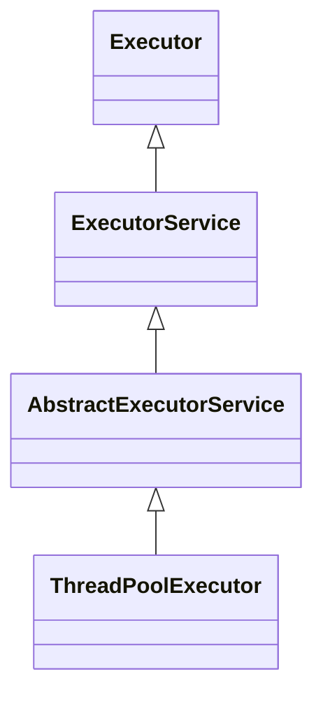

[TOC]
参考这篇文章：[Java线程池实现原理及其在美团业务中的实践](https://tech.meituan.com/2020/04/02/java-pooling-pratice-in-meituan.html)
设计线程池的目的是什么？假设有很多需要执行的小任务，如果为每个小任务都创建一个新的线程来执行，那么会在线程的创建、销毁与切换上花费大量时间。因此考虑在创建线程之后不要立即销毁，这样下次再有任务进来的时候，就可以直接使用线程池中的线程，而不是立即创建一个新的线程。
如果让我设计一个线程池，我会怎么设计？首先线程池里需要有线程，还需要由一个队列来保存需要执行的任务。每次有任务来的时候就加到队列中，线程不断从队列中拿任务执行。由于线程需要一直存活，当线程获取任务失败时就进入阻塞。当所有线程都在忙且队列满了的时候该怎么办呢？因此需要设计拒绝策略，当队列满了且线程都在忙的时候就执行拒绝策略。以上就是一个简单的线程池设计。

### java线程池
**总体设计**

Executor是一个接口，用于将任务的提交和执行机制进行解耦
ExecutorService对Executor进行了扩充。主要是提供了一些对线程池的管理操作（如关闭线程池）和任务的执行操作等。
AbstractExecutorService是对ExecutorService的抽象实现。提供了对ExecutorService的默认实现。
java中线程池的核心实现类是ThreadPoolExecutor。

**ThreadPoolExecutor的一些成员变量**
allowCoreThreadTimeOut：是否允许核心线程死亡。
corePoolSize：最大的核心线程数量
maximumPoolSize：最大线程数量
ctl：用来记录线程状态与当前线程数。前三个字节是状态，后面29个字节是存活线程数
handler：拒绝策略
keepAliveTime：如果线程可以死亡，那么在闲置keepAliveTime后死亡。


### 线程池的五种状态
* RUNNING：111
* SHUTDOWN：000 不接收新任务，会处理完当前任务和队列中的任务
* STOP：001 立即停止当前任务，抛弃队里中的任务
* TIDYING：010 所有线程都已经terminated，workerCount为0了。那么线程池就会变成TIDYING状态。
* TERMINATED：011 `terminated()`执行完之后的状态。

线程池的五种状态和线程数量存放在一个原子整型ctl中。前三位用来表示状态，后面29位用来表示线程数。这样设计是为了能用一次cas操作修改线程池状态和线程数量。

### 线程池成员
核心线程：即使闲置也不会终止。如果设置了`allowCoreThreadTimeOut=true`，则会在闲置`keepAliveTime`后终止线程
救急线程：如果阻塞队列满了，仍然进来任务，则会创建救急线程。救急线程会在闲置`keepAliveTime`后终止。
阻塞队列：如果核心线程都在运行，就将进来的任务加到阻塞队列里。

### 拒绝策略
当核心线程、阻塞队列、救急线程都不可用时，此时再进来一个任务就会启用拒绝策略。拒绝策略可以在创建线程池的时候自己提供，也可以使用jdk提供的拒绝策略。
* AbortPolicy：抛出一个运行时异常。这是**默认**的拒绝策略
* CallerRunsPolicy：让调用者处理这个任务。
* DiscardPolicy：抛弃这个任务，什么都不做。
* DiscardOldestPolicy：抛弃阻塞队列头部的任务。

自己提供拒绝策略的时候，只需要实现传入一个`RejectedExecutionHandler`接口的实现即可。

### 钩子函数
需要继承ThreadPoolExecutor类并重写钩子函数。以下时jdk提供的三个钩子函数

* beforeExecute：在执行任务之前回调
* afterExecute：在任务执行完后回调
* terminated：在线程池中的所有任务执行完毕后回调

### 创建线程池
##### 构造方法
```java
public ThreadPoolExecutor(int corePoolSize,  // 核心线程数量
                              int maximumPoolSize, // 最大线程数量（核心+救急）
                              long keepAliveTime,  // 空闲等待时间
                              TimeUnit unit,       // keepAliveTime的单位
                              BlockingQueue<Runnable> workQueue, // 阻塞队列
                              ThreadFactory threadFactory,   // 用于定义创建线程的操作
                              RejectedExecutionHandler handler) // 拒绝策略
```

##### 工厂方法
* CachedThreadPool：带缓冲线程池。当有可用的空闲线程时直接使用这个空闲线程，否则创建一个新线程。实际上就是指定核心线程为0，让所有线程都是救急线程就可以达到这个效果。
* FixedThreadPool：固定大小线程池。保持固定数量的线程。
* ScheduledThreadPool：创建一个数量固定的线程池，支持执行定时性或周期性任务。取代Time
* SingleThreadExecutor：单线程线程池。让核心线程和最大线程都为1即可。可以保证任务的顺序执行。
* WorkStealingPool：并行线程池。实际上创建的是ForkJoinPool。==ForkJoin线程池很难用，之后再看==
```java
// 延迟一秒，每两秒打印一次
public class ScheduledThreadPoolTest {
    public static final Logger logger = LogManager.getLogger(ScheduledExecutorService.class);
    public static void main(String[] args) {
        ScheduledExecutorService service = Executors.newScheduledThreadPool(2);
        Runnable runnable = () -> {
            try {
                Thread.sleep(1000);
                logger.info("running");
            } catch (InterruptedException e) {
                e.printStackTrace();
            }
        };
        logger.info("start");
        service.scheduleAtFixedRate(runnable, 1, 2, TimeUnit.SECONDS);
        service.scheduleAtFixedRate(runnable, 1, 2, TimeUnit.SECONDS);
    }
}
```

### api使用
**submit**：返回一个Future对象。在其它线程调用future.get即可得到线程处理结果。
**invokeAll**：提交一个集合中所有任务。返回一个Future的集合。只有所有任务都执行完后才能获得结果
**invokeAny**：提交一个集合中的所有任务。返回最先执行完的任务的结果，其它任务就不执行了。
**shutdown**：将线程池的状态变成shutdown。
**shutdownNow**：将线程池的状态变成stop，打断所有线程然后结束。返回的是队列中的任务。
**isShutdown**：不是running就返回true


### 核心参数
* corePoolSize：核心线程数量。
* maximumPoolSize：最大线程数量。
* keepAliveTime：救急线程的存活时间。还有一个unit可以控制单位。
* workQueue：工作队列，用来保存
* threadFactory：用来控制线程的创建（可以给线程起名字）。
* handler：用来控制拒绝策略