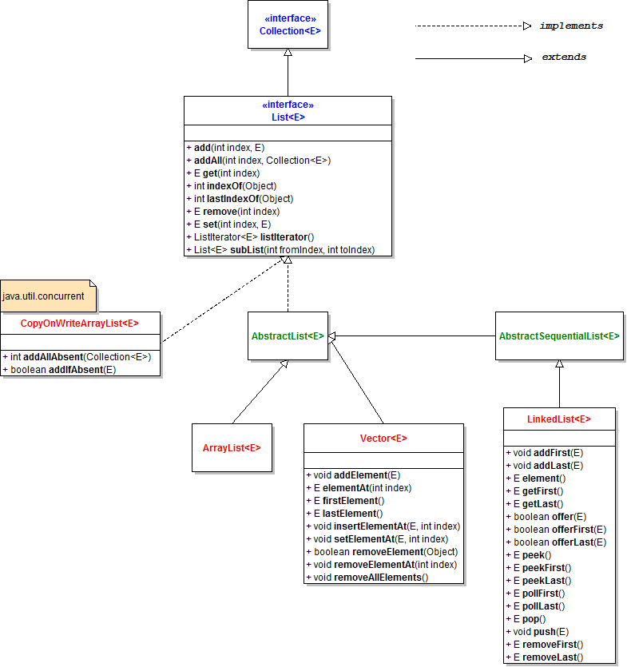
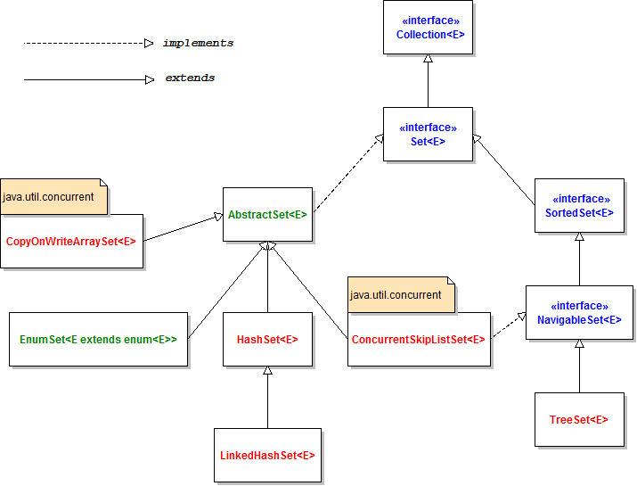

[TOC]
# Java集合
### List
##### 类图

##### ArrayList和LinkList
- ArrayList底层用数组实现，因此具有数组的一系列特征，增删效率低，根据下标查找元素效率高。数组默认的初始长度为10，扩容算法大致如下：newLength = oldLength + Math.max(oldLength>>1, growLength)。
- LinkedList底层用双向链表实现，因此具有链表的一些特征，增删效率高，根据下标查找元素的效率低。数组默认初始长度为10。当查找第i个元素时，首先判断i在哪一边，然后选择从左边还是右边进行遍历。这样最多只需要遍历一半的节点。
- ArrayList和LinkedList都可以存储null，元素可重复，元素保持插入时的顺序
- ArrayList和LinkedList都是线程不安全的。
- 对LinkedList进行遍历时，因为普通的for循环通过下标查找元素，效率极低。可以使用增强的for循环或者迭代器。也可以用removeFirst和removeLast进行循环。
- 对ArrayList进行遍历时，由于实现了RandomAccess接口，所以支持快速随机访问。使用普通的for循环遍历效率较高。

##### 线程安全的ArrayList
- ==Vector==是ArrayList的一个替代类，Vector为每个方法都加了synchronized，因此并发性低。现在已经逐渐被淘汰了。
- ==Collections.synchronizedList==这种方法在读写的时候都会加锁，不支持多个线程并发读和一个线程写多个线程读，因此并发度也较低。synchronizedList是一个fail-fast iterator，在进行迭代时需要放在synchronized块中。
```java
List list = Collections.synchronizedList(new ArrayList());

synchronized (list) {
    Iterator i = list.iterator(); // Must be in synchronized block
    while (i.hasNext())
        foo(i.next());
}
```

- ==CopyOnWriteArrayList==在读的时候不加锁，仅在写入的时候加锁，但是由于写的操作需要复制数组，因此多使用在数组不怎么被修改的情况下。CopyOnWriteArrayList时fail-safe iterator，可以直接进行迭代，将代码放在synchronized块中。更多细节：[为什么线程安全的List推荐使用CopyOnWriteArrayList，而不是Vector](https://segmentfault.com/a/1190000038689569)
- CopyOnWriteArrayList保证线程安全的主要手段：1）array被volatile修饰，保证了array的可见性。2）在新版本中不再用ReentrantLock修饰lock，而是在需要加锁的地方用synchronized(lock)获得锁。保证了线程安全。以下是将元素添加到数组末尾的源码。
```java
    public boolean add(E e) {
        synchronized (lock) {    //获得锁
            Object[] es = getArray();
            int len = es.length;
            es = Arrays.copyOf(es, len + 1); //对数组进行扩容
            es[len] = e;
            setArray(es);  //将地址指向扩容后的数组
            return true;
        }
    }
```
### Set
##### 类图


##### HashSet和TreeSet
Set集合中不允许出现重复元素，通过重写hashCode和equals方法实现元素不重复。
- HashSet：通过重写HashCode和equals实现元素的唯一性。允许值为null。值无序，不记录插入顺序。线程不安全。默认初始容量16，装载因子0.75。底层通过HashMap实现，数据记录在key中，value默认存储了一个object的静态常量（[为什么不直接存null？这样还更省空间](https://www.cnblogs.com/zhhiyp/p/9720739.html)）。由于HashSet是由HashMap实现的，因此空间上存在一定程度的浪费（每个条目需要存储value）
- TreeSet：通过比较器实现元素的唯一性。不允许值为null。值有序。可以实现默认排序（升序）和定制排序。线程不安全。TreeSet是基于TreeMap的NavigableSet实现。元素存在TreeMap的key中，value同上。
在要比较的对象中实现Comparable即可。
```java
public class Main {
    public static void main(String[] args) throws ClassNotFoundException {
        TreeSet<Student> set = new TreeSet();
        set.add(new Student("zs", 10));
        set.add(new Student("ls", 12));
        set.add(new Student("zs", 11));
        set.add(new Student("zs", 1));
        for (Student stu : set) {
            System.out.println(stu.toString());
        }
    }
}

class Student implements Comparable {
    String name;
    int age;
    public Student(String name, int age) {
        this.name = name;
        this.age = age;
    }
    @Override
    public int compareTo(Object o) {//先按名字排序，名字一样按年龄排序
        Student stu = (Student) o;
        if (name.compareTo(stu.name) == 0) {
            if (age == stu.age) return 0;
            else return age > stu.age ? 1 : -1;
        } else return name.compareTo(stu.name);
    }

    @Override
    public String toString() {
        return "Student{" +
                "name='" + name + '\'' +
                ", age=" + age +
                '}';
    }
}
```
# Java字典
### 前言
##### 类图
待补充
##### 红黑树简单介绍
**红黑树**：由2-3-4树发展而来。有以下五个性质：
①节点是红色/黑色
②根节点一定是黑色
③每个叶节点（NIL节点、空节点）是黑色的
④每个红色节点的两个子节点都是黑色的（从每个叶子到根的所有路径上不能有两个连续的红色节点）
⑤从任一节点到其每个叶子的所有路径都包含相同数目的黑色节点（因为红黑树是从2-3-4树发展而来）
**红黑树的特点**：①树高最大为$2log_2(n+1)$；②时间复杂度为$log_2(n+1)$；③相对于AVL树，牺牲了一定的平衡性比降低了树旋转频率，AVL树的平衡性要求过高，很容易发生不平衡。

### HashMap、Hashtable、LinkedHashMap、TreeMap
**HashMap：**
- HashMap不记录插入顺序，如果要保持插入顺序，可以使用LinkedHashMap。
- 默认的初始化大小为16。每次扩容为原来的2倍。默认装载因子是0.75。通过将null的hash值设成0，允许值为null。由于size是2的幂次，使散列时具有分布不均的缺点，HashMap中对此做了一些特别的处理([HashMap：为什么容量总是为2的次幂](https://blog.csdn.net/u010841296/article/details/82832166))。hash计算方式：`(h = key.hashCode()) ^ (h >>> 16)`
- 数据结构是  table（桶） + 链表/红黑树 
- 何时树化：如果size < 64，则不会进行树化，而是对将桶进行扩容处理(resize)。如果size >= 64，在链表长度大于8时进行树化，在树大小小于6时退化成链表。

**HashTable：**
- 默认的初始化大小是11。newCapacity = (oldCapacity << 1) + 1。默认装载因子0.75。不支持null。
- HashTable支持多线程。如果不需要线程安全，建议使用HashMap；如果需要线程安全，建议使用ConcurrentHashMap。

**LinkedHashMap：**
- 继承自HashMap，持有一个双向链表，用于保持插入顺序。

**TreeMap：**
- 实现了NavigableMap，NavigableMap是对SortedMap的一个增强。使用TreeMap可以实现对Entry进行排序，可以执行比较器，也可以使用默认比较器，具体可以参考上面的TreeSet。

### 线程安全的HashMap
- HashTable是线程安全的。效率低。
- 使用Collocation.SynchronizedMap。性能一般。
- ConcurrentHashMap。推荐使用。

### 其它常见map
##### WeakHashMap
[理解Java的强引用、软引用、弱引用和虚引用](https://juejin.cn/post/6844903665241686029)
[WeakHashMap和HashMap的区别](https://www.cnblogs.com/panie2015/p/5608998.html)
WeakHashMap对象通过弱引用来引用key。当除了自身有对key的引用外，此key没有其他引用那么当垃圾回收时，这个条目将会被回收。
```java
    public static void main(String[] args) {
        Map map = new WeakHashMap();
        // Map map = new HashMap();
        String a = new String("a"); //考虑一下为什么要用new来创建String
        String b = new String("b"); //因为通过new创建出来的字符串，不进入字符串常量池。只在堆中
        String c = new String("c"); //而a = "a"创建出来的字符串指向的是常量池的地址。常量池指向的是堆中实际地址。至于字符串池中的对象何时被gc，暂时不知道。
        map.put(a, "this is a");
        map.put(b, "this is b");
        map.put(c, "this is c");
        System.out.println(map);

        map.remove(a);
        c = null;
        System.gc();
        System.out.println(map);    //{b=this is b}
    }
```
如果value有对key的强引用，将会导致无法清除key，即如果value有对key的强引用，那么使用WeakHashMap就毫无意义。

##### ConcurrentHashMap
一种线程安全的HashMap。基于数组+链表/红黑树实现。
扩容：扩容时锁住链表/红黑树的头结点。对于某一个链表迁移完成之后，使用一个标志节点放在原来的位置，代表迁移完成。

##### IdentityHashMap
和HashMap最大的区别就是IdentityHashMap使用==来区分key，当key1 != key2时，认为是两个不同的key。而HashMap用equal()方法区分key。

##### Properties
一个用来操作配置文件的类。由于现在基本使用Spring，所以遇到的时候再总结。


