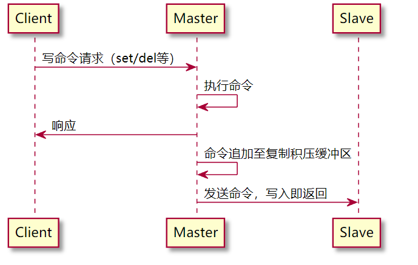
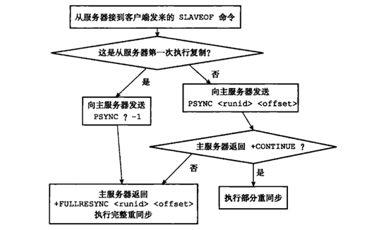

redis 节点分为主节点与从节点。通常在主节点进行写操作，在从节点进行读操作。redis通过主从复制来保证主从数据的一致。

CAP原理：
C - Consistent  一致性
A - Availability  可用性
P - Partition tolerace  分区容错性
网络分区发生时，一致性和可用性难两全。

Redis的主从数据是异步同步的，所以分布式Redis系统不满足一致性要求。但是Redis主从同步保证最终一致性。

# 主从复制概述

主从复制：将一台Redis服务器（主节点）的数据，复制到其它Redis服务器（从节点）。

**主从复制的作用：**
* 数据冗余
* 故障恢复：主节点出现问题时，可以由从节点提供服务。
* 负载均衡：实现读写分离，主节点提供写服务，从节点提供读服务。
* 高可用基石：主从复制是哨兵机制和集群能够实现的基础。

## 主从复制的三个阶段

主从复制大体可分为三个阶段：连接建立阶段、数据同步阶段、命令传播阶段

### 连接建立阶段

该阶段的主要作用在于主从节点之间建立连接，为数据同步做好准备。
这一阶段的详细步骤参考[这篇文章](https://www.cnblogs.com/kismetv/p/9236731.html#t31)

### 数据同步阶段

这一阶段主要作用就是进行主从节点之间的数据同步。根据主从节点状态的不同分为全量同步与增量同步。

什么时候进行全量同步：
* slave节点第一次连接master节点时
* slave节点断开时间太久，repl_baklog中的offset已经被覆盖时

什么时候进行增量同步：
* slave节点断开又恢复，并且在repl_baklog中能找到offset时。

### 命令传播阶段

完成同步操作后，就会进入命令传播阶段。这一阶段中当master执行完新的写命令后，会将该命令追加到缓冲区中，然后异步地发送给slave，slave接收命令并执行，同时维护offset。
  
由于命令发送过程是异步的，不能保证每次都发送成功。因此从节点会每隔一段时间向主节点发送一次心跳来判断是否存在数据缺失。
**心跳检测：** 从节点默认以每秒一次的频率向主节点发送一次心跳信息，命令格式为`REPLCONF ACK <offset>`。这里的offset代表slave中最新的复制偏移量，master会将这个偏移量和自己的offset对比。如果从节点存在数据确实，主节点就会推送缺失的数据。

# 增量同步与全量同步

## 全量同步（全量复制）

主从第一次数据同步，或其它无法进行增量同步的情况下会采用全量同步，此时从节点会同步主节点的全部数据。

过程：
1. 主节点执行bgsave，后台生成RDB文件。并使用一个缓冲区记录从现在开始执行的所有写命令。
2. RDB文件生成完后，主节点将生成的RDB文件发送给从节点；从节点清理旧数据，然后载入新的RDB文件数据。
3. 主节点将缓冲区中的所有写命令发送给从节点，从节点执行这些写命令，将数据库状态更新至最新

## 增量同步（部分复制）

### 增量同步实现机制

增量同步能够实现依赖于以下三个重要概念

**1. 复制积压缓冲区**：主节点内部维护了一个**固定长度的、先进先出(FIFO)队列**作为复制积压缓冲区，默认大小为1MB。在主节点进行命令传播时，不仅会将命令同步到从节点，还会将写命令写入复制积压缓冲区中。这个缓冲区保存主节点最近执行的写命令，时间较早的写命令会被挤出缓冲区。

**2. offset**：复制偏移量。主从节点都会维护一个offset。主节点向缓冲区写命令就会将offset+N字节。从节点每次从主节点接收命令也会将offset+N字节。两个offset之差就代表主从节点之间相差多少字节的数据。当字节数超过复制积压缓冲区时就需要进行全量复制。

**3. Replication ID**：标识数据版本(history)。相同的ID代表数据集相同（但是不一定是同一时间的）。一个节点持有两个ID，目的是当主节点宕机后推举出了新的主节点，新的主节点节点持有原来旧的主节点的ID，同时生成新的ID。其它从节点可以用旧的ID来向新的master进行增量同步。[Replication ID explained](https://redis.io/docs/management/replication/#replication-id-explained)

为什么新的主节点需要更新它的ID？如果保持原有ID的话，违反了这样一个事实：same ID and same offset of any two random instances mean they have the same data set

### psync命令执行过程
  

# 参考资料
[Redis专题：一文搞懂主从复制原理！](https://segmentfault.com/a/1190000039242024#item-3-7)
[深入学习Redis（3）：主从复制](https://www.cnblogs.com/kismetv/p/9236731.html#t33)
[彻底搞懂 Redis 主从复制机制](https://zhuanlan.zhihu.com/p/151740247)
[Redis replication](https://redis.io/docs/management/replication/#important-facts-about-redis-replication)