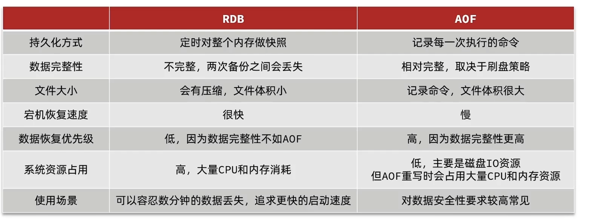

[Redis persistence](https://redis.io/docs/management/persistence/#log-rewriting)
[COW奶牛！Copy On Write机制了解一下](https://developer.aliyun.com/article/893644)

## fork与copy-on-write

fork是类Unix操作系统上创建进程的主要方法，用于创建子进程。新的进程复制老的进程自身就叫fork。

### copy-on-write

copy-on-write：如果创建子进程时将父进程的内存复制给子进程，会导致fork操作耗时太长。因此就有了copy-on-write这项技术。fork创建出的子进程与父进程共享内存空间。
copy-on-write技术**实现原理**：
> fork()之后，kernel把父进程中所有的内存页的权限都设为read-only，然后子进程的地址空间指向父进程。当父子进程都只读内存时，相安无事。当其中某个进程写内存时，CPU硬件检测到内存页是read-only的，于是触发页异常中断（page-fault），陷入kernel的一个中断例程。中断例程中，kernel就会把触发的异常的页复制一份，于是父子进程各自持有独立的一份。

**好处**：减少fork时带来的瞬时延时。可减少不必要的资源分配。
**缺点**：如果在fork之后两个进程还要继续进行写操作，就会产生大量的分页错误，这就得不偿失了。

## RDB

RDB持久化是指以指定的时间间隔将内存快照保存到RDB文件中。

优点：

* 大数据量重启比AOF要快。
* RDB文件很适合做数据备份，RDB文件体积更小。RDB文件是内存快照。
* RDB很适合做灾难恢复，将RDB文件备份后可以将文件转移到其它数据中心存储
* RDB性能较高。Redis的父进程唯一的工作就是创建一个子进程来完成其余的工作，父进程不会执行磁盘的IO操作。

缺点：

* RDB持久化会每隔一段时间进行一次快照备份，当两次备份之间发生了redis服务器异常停止时（如停电关机）会丢失部分数据。
* RDB需要经常fork()来创建子进程。fork()操作通常比较耗时，这会导致redis服务停止一段时间来执行fork()操作。AOF也需要进行fork()操作但是没那么频繁。

### 内存快照Snapshotting

默认情况下Redis会将内存快照存入dump.rdb二进制文件中。可以配置Redis每N秒如果有至少M次数据改变就进行一次内存快照。也可以手动调用SAVE或BGSAVE命令。

#### 内存快照如何工作的

* redis 执行 forks 创建子进程。
* 子进程将数据写入临时RDB文件中
* 子进程完成新的RDB文件的写入时，就替换旧的RDB文件。

这种方法让redis从copy-on-write中受益。

## AOF

AOF(Append Only File)是指将所有的写操作进行持久化，然后再服务器重启时可以重新执行这些操作来恢复数据。

优点：

* AOF可以有不同的数据刷新策略：no fsync at all, fsync every second, fsync at every query. 在默认的fsync every second策略下写性能仍然很好。这种策略最多只会丢失一秒钟的数据。
* AOF log是 append-only log，所以在突然断电时也不会产生文件损坏的问题。当文件因为某些原因以半条命令结尾，redis-check-aof工具也能轻易解决这个问题。
* 当文件过大时redis能够在后台自动进行文件的重写。redis保证这个重写过程是安全的。

缺点：

* AOF文件大小通常比RDB文件要大。因为AOF存储的是操作，RDB存储的是内存快照。
* AOF性能可能比RDB要低。
* Redis 7.0版本以前，在重写期间对数据库进行写入的话，会消耗大量内存（因为新命令会存放在内存buffer中）。
* Redis 7.0版本以前重写期间到达的所有写命令都被写入磁盘两次。

### Append-only file

快照的持久性较差。如果Redis服务器宕机了，电源发生故障，或者不小心执行了kill -9，那么可能会导致最新数据没有来得及进行持久化。如果应用程序需要保证数据的持久性，那么就可以使用AOF。
在配置文件中使用如下方法开启AOF。

```txt
appendonly yes
```

Redis7.0之后AOF文件分为基本文件（base file）和增量文件（incremental file）。基本文件（最多一个）存放AOF重写时原本的文件，增量文件（可能有多个）记录重写期间新增的操作。

### 重写(rewriting)
#### 为什么需要重写
AOF文件可能会记录无用的命令，比如将一个计数器自增100次，前99次对于数据恢复是无用的。当AOF文件越来越大时会发生重写，将log文件进行压缩。
重写是完全安全的，当Redis对旧的file重写时，会创建一个新的file，这个file中会用最少的操作重建当前数据集（合并操作，去除无用操作等），当新的file完成后会用新的file替换旧的file。
> The rewrite is completely safe. While Redis continues appending to the old file, a completely new one is produced with the minimal set of operations needed to create the current data set, and once this second file is ready Redis switches the two and starts appending to the new one.
在重写期间不会阻塞redis服务。
在Redis7.0之前，重写期间的新增操作存放在内存缓冲区中。在Redis7.0之后重写期间的新增操作存放在新的增量文件中，同时用一个临时的清单文件跟踪新生成的基本文件和增量文件。

#### 重写的过程
**Redis执行AOF重写的过程不是通过分析旧的AOF文件实现的。而是通过直接获取键对应的值**。Linux上用fork()创建了子进程之后，子进程和父进程共享内存空间。只有当父/子进程发生内存写入的时候才会复制这一部分的内存空间给子进程。这就是写时复制。写时复制是为了防止创建子进程的时候复制大量内存空间，而这些被复制的内存空间很可能在子进程的整个生命周期内都不被修改。

Redis < 7.0
* 主进程执行fork创建子进程
* 子进程开始写新的AOF文件
* 父进程将新增的命令写入内存缓冲区中（同时还要写入旧的AOF文件中，这样即使重写失败也能保证数据安全）
* 重写完成后，将内存缓冲区中的命令写入新的AOF文件中
* 将旧的删掉，将新的rename成旧的，这一步操作是原子的。

Redis >= 7.0 的时候，在重写期间不是将增量的命令写入内存缓冲区，而是写入一个新的增量AOF文件中（不需要写入旧的AOF文件了）。如果重写失败，那么旧的AOF文件会加上新的AOF文件。


### 数据刷新策略
在写日志的时候，实际上是将数据写入到操作系统内核的page cache中，如果此时操作系统崩溃，那么存储在page cache中的数据就会丢失。Linux 操作系统提供了一个fsync()方法来将page cache中的数据同步到磁盘中。下面的三个策略就是控制fsync()命令的执行时机。

* appendfsync always: 所有的写操作立即fsync。很慢很安全。
* appendfsync everysec: 每秒钟fsync一次。足够快（2.4之后和snapshotting一样快）。遇到崩溃的情况最多丢失一秒的数据。
* appendfsync no: 不进行fsync，只是将数据交到操作系统手中。由操作系统决定什么时候进行刷新（通常Linux会将数据每隔30秒刷新到磁盘中）

### 如何选择

如果希望保证数据安全性，那么应该两种策略都使用
如果能够容忍几分钟的数据丢失，那么就只用RDB即可
不推荐只使用AOF，因为不时地使用RDB进行数据备份通常是一个好的选择
  
