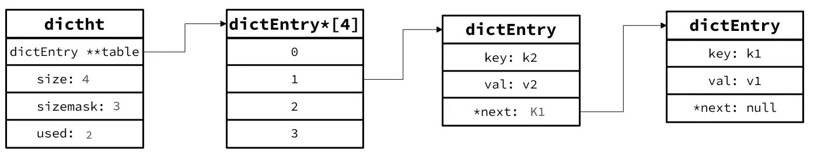
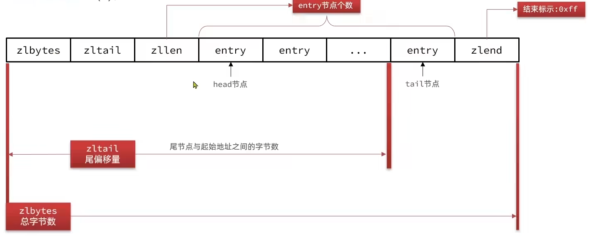
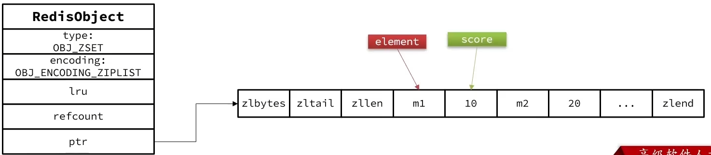
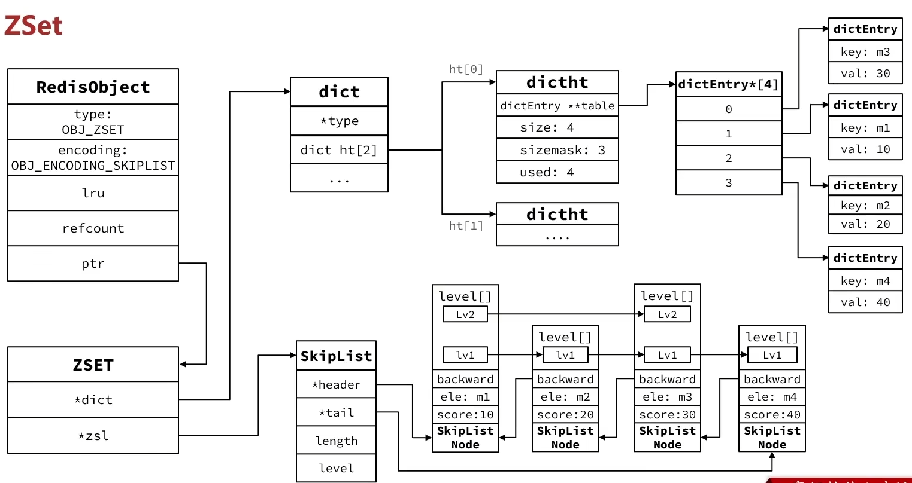
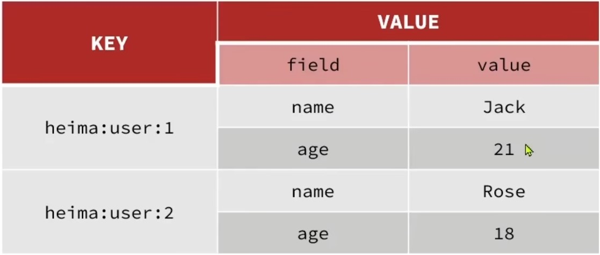

[TOC]
## redis七种内部数据结构
### 简单动态字符串SDS（Simple Dynamic String）
```c
struct __attribute__ ((__packed__)) sdshdr8 {
    uint8_t len; /* used */
    uint8_t alloc; /* excluding the header and null terminator*/
    unsigned char flags; /* 3 lsb of type, 5 unused bits */
    char buf[];
};
```
C语言字符串就是一个以\0结尾的常量，redis对c语言字符串进行了如上的一个封装。除了sdshdr8，还有sdshdr16，sdshdr32，sdshdr64。
* len：字符串长度，不包括\0。
* alloc：为buf分配的空间，不包括\0。sdshdr8的alloc用uint8_t修饰，所以最大为255，即buf最大为255，而字符串最后需要跟一个\0，因此最多存放254个字节的字符串。
* flags：标志位，用来标识属于哪一类sds
* buf：真正存放字符串的buffer，字符串后跟一个\0，用来适配c语言字符串。buf是一个**柔型数组**。
* **扩容机制**：采用**空间预分配**的方法进行扩容。假设扩容后长度为n，如果n大于1M，那么为buf分配1M+n+1的空间，否则分配2n+1的空间。

### intset
intset是一个元素唯一且有序的int set。
[Redis内部数据结构详解(7)——intset](http://zhangtielei.com/posts/blog-redis-intset.html)
```c
typedef struct intset {
    uint32_t encoding;
    uint32_t length;
    int8_t contents[];
} intset;

/* Note that these encodings are ordered, so:
 * INTSET_ENC_INT16 < INTSET_ENC_INT32 < INTSET_ENC_INT64. */
#define INTSET_ENC_INT16 (sizeof(int16_t))
#define INTSET_ENC_INT32 (sizeof(int32_t))
#define INTSET_ENC_INT64 (sizeof(int64_t))
```
* encoding：编码方式，用来标识每个int所占的内存大小。
* length：set长度
* contents：int数组，这里的int8_t只是占位用的，真正的数据大小由encoding标识。

**升级机制**：为了节省内存，不是一开始就为intset的每个int分配最大8个字节，而是从2个字节往上升级来的。假设开始时set中所有数据都在int16范围之内，则每个这个intset的编码为INTSET_ENC_INT16，每个int占用两个字节。此时进来了一个int16范围之外int32范围之内的数据，则需要将编码格式改成INTSET_ENC_INT32，同时移动所有int让每个数字都在新编码格式下的对应位置上，然后插入新进来的int。

intset通过**二分查找**来查找元素。因此综上，intset的**数据规模不能太大**，否则性能较差。

### dict
dict代表字典，是key-value对的集合。
```c
typedef struct dictEntry {
    void *key;  // void指针可以指向任何类型的数据。
    union {
        void *val;
        uint64_t u64;
        int64_t s64;
        double d;
    } v;
    struct dictEntry *next;  // 用于构造链表
} dictEntry;

/* This is our hash table structure. Every dictionary has two of this as we
 * implement incremental rehashing, for the old to the new table. */
typedef struct dictht {
    dictEntry **table;
    unsigned long size;
    unsigned long sizemask;
    unsigned long used;
} dictht;

typedef struct dict {
    dictType *type;
    void *privdata;
    dictht ht[2];
    long rehashidx; /* rehashing not in progress if rehashidx == -1 */
    int16_t pauserehash; /* If >0 rehashing is paused (<0 indicates coding error) */
} dict;

typedef struct dictType {
    uint64_t (*hashFunction)(const void *key);
    void *(*keyDup)(void *privdata, const void *key);
    void *(*valDup)(void *privdata, const void *obj);
    int (*keyCompare)(void *privdata, const void *key1, const void *key2);
    void (*keyDestructor)(void *privdata, void *key);
    void (*valDestructor)(void *privdata, void *obj);
    int (*expandAllowed)(size_t moreMem, double usedRatio);
} dictType;
```
dictEntry：key-value对存储的地方。
dictht：hash table
dict：字典本身
dictType：里面定义了一系列的函数，它通过自定义的方式使得dict的key和value能够存储任何类型的数据。

dictht.size：hash table分配的内存大小，**一定是2的倍数**
dictht.sizemask：值为size-1，在用hash函数求出hash值后，用来将结果取余用的
dictht.used：存储的dictEntry个数
dictht.table：哈希表

dict.type：一个指向dictType结构的指针。
dict.privdata：一个私有数据指针。由调用者在创建dict的时候传进来。
dict.ht[2]：两个哈希表，第二个用来扩容用。
dict.rehashidx：当前rehash的索引。值为-1代表不在rehash，否则用来表示当前rehash进行到哪一步了。
dict.pauserehash：判定是否在rehash

**负载因子**：ratio=used/size
**dict的扩容**：插入元素前触发检查，当ratio>=1时发生扩容。扩容后的大小为大于used+1的下一个2^n
**dict的收缩**：删除元素后触发收缩检查，当ratio<0.1时发生收缩。收缩后的大小为大于used的下一个2^n
**渐进式rehash**：在扩容和收缩的过程中需要将元素进行rehash，然后插入新的table中。具体过程如下：
* 计算扩容或收缩后的realsize
* 按照新的size申请空间，并赋给dict.ht[1]
* 设置rehashidx为0
* 每次执行增删改查的时候，都检查一下rehashidx是否大于-1，如果是代表正在进行rehash，此时当前操作负责将dict.ht[0].table[rehashidx]的所有数据rehash到dict.ht[1]的对应位置上。直至所有数据全部完成rehash
* 将dict.ht[1]的值赋值给dict.ht[0]，并释放相应内存。
* 将rehashidx赋值为-1，代表rehash结束
* 在rehash过程中，新增元素直接写入ht[1]，查询、修改、删除操作会在dict.ht[0]和dict.ht[1]上一次查找并执行。

### ziplist
ziplist可以看成一种特殊的双端链表，但是其内存空间是连续的。
[Redis内部数据结构详解(4)——ziplist](http://zhangtielei.com/posts/blog-redis-ziplist.html)


**连锁更新问题**：
prevrawlen会记录前一个entry占用的总字节数，当前一项占用字节数小于254，那么prevrawlen长度为1个字节，如果前一项占用字节数大于254，那么prevrawlen长度为5个字节。此时如果有若干个连续的长度为250~253之间的entry，只要有一个entry的长度变成大于254，那么位于它之后的所有字节长度都会产生变化，那么此时就产生了连锁更新问题。
[连锁更新](http://redisbook.com/preview/ziplist/cascade_update.html)

### quicklist
[Redis内部数据结构详解(5)——quicklist](http://zhangtielei.com/posts/blog-redis-quicklist.html)
quicklist是节点为ziplist的双端链表。
`list-max-ziplist-size`：用来设置ziplist最大尺寸。如果为正值，则代表ziplist能包含的最大entry数量。如果为负值，则{-1, -2, -3, -4, -5}分别代表ziplist大小不能超过{4, 8, 16, 32, 64}KB
`list-compress-depth`：如果quicklist有很多个ziplist组成，往往靠中间的数据节点很少用到，靠两边的数据节点经常用到。此时可以选择将中间的数据节点进行压缩，进一步节省内存空间。这里的`list-compress-depth`代表两端不被压缩的节点个数，为0代表所有数据都不被压缩；为1代表两端各有1个节点不被压缩，为2代表两端各有2个节点不被压缩，以此类推。

### skiplist
[Redis内部数据结构详解(6)——skiplist](http://zhangtielei.com/posts/blog-redis-skiplist.html)
和经典的跳表比较类似，上面的链接讲的很清楚。
```c
#define ZSKIPLIST_MAXLEVEL 32 /* Should be enough for 2^64 elements */
#define ZSKIPLIST_P 0.25      /* Skiplist P = 1/4 */

/* ZSETs use a specialized version of Skiplists */
typedef struct zskiplistNode {
    sds ele;
    double score;
    struct zskiplistNode *backward;
    struct zskiplistLevel {
        struct zskiplistNode *forward;
        unsigned long span;
    } level[];
} zskiplistNode;

typedef struct zskiplist {
    struct zskiplistNode *header, *tail;
    unsigned long length;
    int level;
} zskiplist;
```
zskiplistNode.ele：存放的元素
zskiplistNode.score：排序的score
zskiplistNode.backward：前一个节点指针
zskiplistNode.level：
zskiplistNode.level.forward：指向后续节点的指针
zskiplistNode.level.span：跨度，代表当前指针跨越了多少个节点

zskiplist.header：头指针
zskiplist.tail：尾指针
zskiplist.length：长度
zskiplist.level：等级

### redis object
```c
/* The actual Redis Object */
#define OBJ_STRING 0    /* String object. */
#define OBJ_LIST 1      /* List object. */
#define OBJ_SET 2       /* Set object. */
#define OBJ_ZSET 3      /* Sorted set object. */
#define OBJ_HASH 4      /* Hash object. */

typedef struct redisObject {
    unsigned type:4;
    unsigned encoding:4;
    unsigned lru:LRU_BITS; /* LRU time (relative to global lru_clock) or
                            * LFU data (least significant 8 bits frequency
                            * and most significant 16 bits access time). */
    int refcount;
    void *ptr;
} robj;
```
robj.type：类型
robj.encoding：编码
robj.lru：last resently used。占用24个bit，用于内存淘汰
robj.refcount：对象引用计数器，无人引用可以被回收。
robj.ptr：指向真实数据的指针

## 暴露在外的五种类型
### OBJ_STRING 
String类型，是Redis中最简单的存储类型，其value是字符串，不过根据字符串的格式不同可分为以下三类：
* string：普通字符串
* int：整数字符串，可以做自增自减操作
* float：浮点字符串，可以做自增自减操作

-----

* OBJ_ENCODING_RAW：robj的ptr部分存储一个指向sds的指针。
* OBJ_ENCODING_EMBSTR：当sds数据部分长度不超过44字节时，obj和sds的长度就不超过64字节，可以用一个内存块存储，避免产生内存碎片。
* OBJ_ENCODING_INT：robj的ptr部分存储的就是int数据，而不是指针。此时不需要用到sds。

### OBJ_LIST
redis中的List类型可以看做是一个双向链表结构。支持从链表的两端进行操作。

-----

* OBJ_ENCODING_QUICKLIST：3.2之前list使用linked_list和zip_list实现，3.2之后统一使用quick_list实现。

### OBJ_SET
Redis的Set结构与Java中的HashSet类型，可以看成一个value为null的HashMap。

-----
* OBJ_ENCODING_HT：HT就是上面提到的dict，key用来存元素，value统一为null。
* OBJ_ENCODING_INTSET：当所有数据都是整数时，且元素数量不超过`set-max-intset-entries`时，采用intset编码以节省内存。

### OBJ_ZSET
Redis的SortedSet是一个可排序的set集合，SortedSet中的每个元素都带有一个score属性，可以基于score属性对元素排序。

------

zset是sortedset，每一个元素需要指定一个score和member。
zset根据score值排序
member必须唯一
可以根据member查询score

* OBJ_ENCODING_ZIPLIST：数据量不多的时候，采用ziplist结构来节省内存空间，ziplist相邻两个entry分别存储member和score。使用ziplist需要满足两个条件：元素数量小于`zset_max_ziplist_entries`，默认128；每个元素都小于`zset_max_ziplist_value`，默认64。ziplist不支持排序而且本身没有键值对的概念，因此是通过zset编码实现的。

* OBJ_ENCODING_SKIPLIST：如果不能使用ziplist，则使用如下结构。同时用dict和skiplist来存储数据。用skiplist来满足排序功能，用dict来满足查询功能以及member唯一的功能。这个结构的优点是性能非常优秀，缺点是占用内存。


### OBJ_HASH
Hash类型，其value是一个无序字典。


--------
hash和zset非常类似，因此编码和zset类似。
hash需要满足键值对存储
需要根据键获取值
键必须唯一
* OBJ_ENCODING_ZIPLIST：数据量不多的时候，采用ziplist结构来节省内存空间，ziplist相邻两个entry分别存储key和value。使用ziplist需要满足两个条件：元素数量小于`hash_max_ziplist_entries`，默认512；每个元素都小于`hash_max_ziplist_value`，默认64。
* OBJ_ENCODING_HT：如果不能使用ziplist，则采用dict进行存储。
