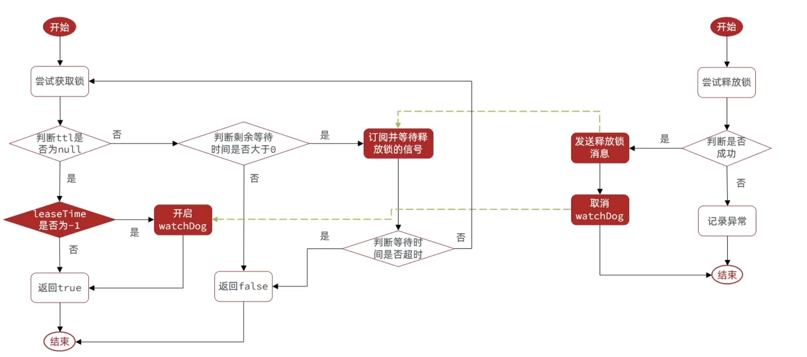

# 基于mysql的分布式锁
### 悲观锁
使用一张表记录锁。表中每一行代表一个资源（或者说是一把锁），每一行中记录获取锁的线程和重入次数等。为了防止锁超时，可以添加锁定时间和超时时间字段。使用select ... for update来实现悲观锁。
**加锁**：在获取锁的时候判断这个锁是否存在，如果不存在这添加一行数据表示加锁。如果已经存在，则判断加锁线程是否是自己，如果是自己的话就将count+1代表重入次数加一。
**解锁**：将count减一，如果结果为0则删除这个锁。

### 乐观锁
select ... for update加行锁的方式开销较大，在并发不高的情况下可以使用乐观锁。本质上就是在表中增加一个版本号的字段。
**加锁**：使用select获取version和count。然后更新时判断version是否和上次查出来的version相同，如果相同，说明这段时间内没有发生锁的争用，就可以放心加锁了。
**解锁**：解锁也需要判断version。使用的是cas的思想避免加行锁。

### 优缺点
优点：实现简单
缺点：性能较低，并发度不高。

# 基于redis实现的分布式锁
1、setnx
setnx是不存在则插入key。这种方案的缺陷是如果在客户端加锁期间崩溃了，就会导致这把锁一直存在。
2、setnx+expire
解决办法是加上过期时间，这样当客户端加锁期间崩溃了，也会在超过过期时间后自动删除这把锁。
**加锁：** set lockName threadId ex 10 nx
**解锁：** 判断redis中的threadId和当前threadId是否相同，如果相同则可以删除，否则什么也不做。防止业务超时后将其它线程的锁删除了

这种方式仍然存在缺陷：当业务阻塞时，锁过期释放了业务还没执行完。
3、redisson 的 watch dog 机制
当线程第一次获取到锁时，启动watch dog线程。这个线程的作用是每隔一段时间就将锁的有效期延长，保证锁不会过期释放。默认redis的expire是30s，看门狗每隔10s就将redis的expire恢复到30s。

只有在没有指定加锁时间（leaseTime）时看门狗机制才会生效。

4、RedLock
[Redis分布式锁之Redlock算法，那些你可能不知道的秘密！](https://juejin.cn/post/7063084321111801863)