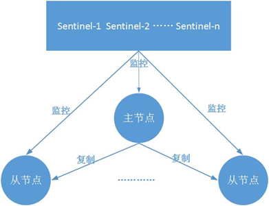

# 哨兵概述

**哨兵作用：**
* 监控：哨兵会持续监控主从节点是否还在正常工作
* 通知：被监控的Redis节点出现问题可以通知给系统管理员或其他计算机程序。
* 自动故障恢复：如果主节点出现故障，可以自动推选一个从节点作为主节点。
* 配置提供者：客户端可以通过哨兵获取到当前主节点的地址。如果主节点地址发生变化，哨兵也可以通知客户端新的主节点地址。

**架构**
  

# 哨兵实现原理

## 发现问题（主观下线与客观下线）

SDOWN：主观下线，单个哨兵认为主节点失去连接。哨兵向其它节点发送ping命令，如果超过一定时间（默认30s）没有收到从该节点的回复则认为该节点主观下线。
ODOWN：客观下线，超过半数以上的哨兵认为主节点失去连接。客观下线只针对主节点。发生客观下线则会选择一个哨兵进行failover。

## 解决问题（选举新的master）

**选举新的主节点**

哨兵根据以下四个方面在从节点中选举新的主节点
* 与master的断开时间
* 从节点优先级
* 从节点的offset
* Run ID

首先去除与主节点断开时间过长的从节点，然后按照以下顺序进行选择：
1. 首先按照redis.conf配置中的replica-priority进行排序。数值越低优先级越高。
2. 如果优先级相同。就按照offset进行排序，与主节点越接近的越先考虑
3. 如果优先级和offset都相同，就按照run ID选择。选择run ID字典序最小的从节点最为新的主节点。（run ID字典序更小不是什么优点，但是选择一个确定的从节点比随机选择要好）

# 参考资料
[High availability with Redis Sentinel](https://redis.io/docs/management/sentinel/)
[深入学习Redis（4）：哨兵](https://www.cnblogs.com/kismetv/p/9609938.html)
[一张图搞定redis哨兵机制](https://www.jianshu.com/p/3a98c0cbf6de)