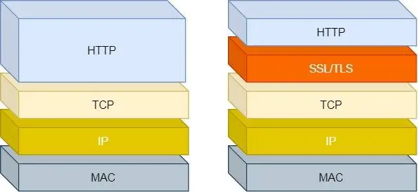
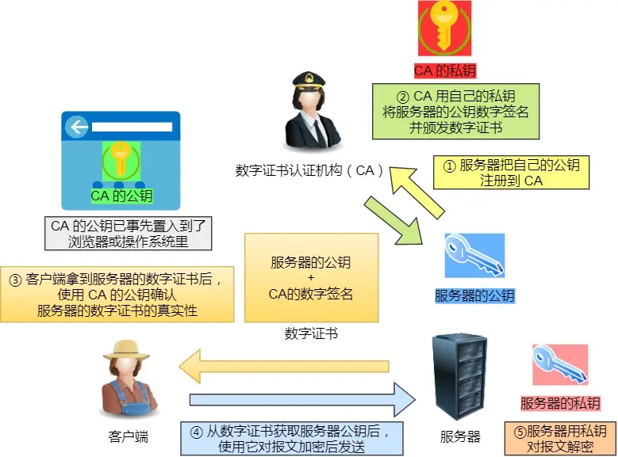
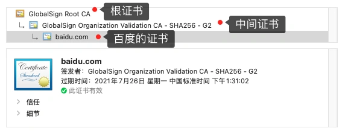
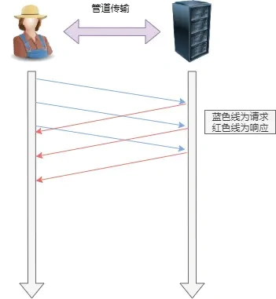
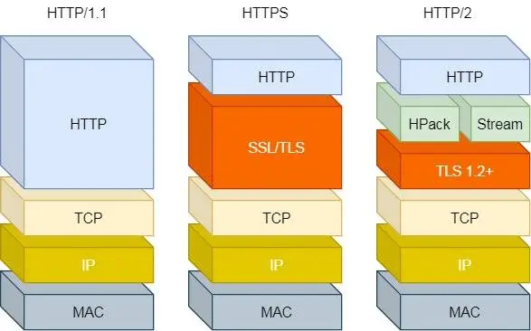
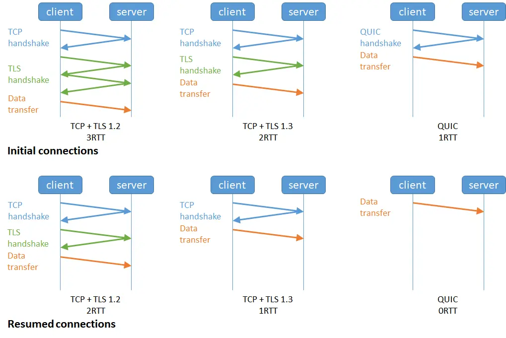

# HTTPS 如何实现安全性
信息加密：保证交互信息无法被监听。使用混合加密实现。
校验机制：保证无法篡改通信内容。使用摘要算法实现。
身份证书：保证访问的网站是真实可靠的（而不是中间人伪造的）。使用数字证书实现。
  

## 混合加密
**对称加密**：只使用一个密钥，通信两端使用这个秘钥进行加密和解密。运算速度快，其缺点在于无法做到安全的秘钥交换（如果A与B进行交互，一开始只有A有秘钥，A是无法安全地通过网络将秘钥交给B的）。
**非对称加密**：使用两个秘钥，即公钥和私钥。公钥加密后只能私钥解密，私钥加密后只能公钥解密。非对称加密用于**解决秘钥交换问题**，但是速度慢。
**混合加密**：在通信建立阶段采用非对称加密方式获得**会话秘钥**。在TSL连接建立完成之后就使用对称加密方式进行加密通信。由于使用非对称加密来获得会话秘钥，因此会话秘钥是完全安全的。

私钥加密，公钥解密：保证消息不会被冒充。
公钥加密，私钥解密：保证内容安全

## 摘要算法
可以使用哈希算法保证内容不被篡改。使用哈希算法计算出内容的哈希值，内容变了哈希值也会变。可以通过检测哈希值的方式判断内容是否被篡改。

有了哈希值之后，如果内容被篡改就能够识别出来了，但是不能检测出内容和哈希值一起被篡改的情况。我们可以通过非对称加密来保证消息不会被冒充。服务器使用私钥对哈希值加密，客户端使用公钥进行解密来确保消息不会被冒充。

## 公钥认证
通过摘要算法+非对称加密我们可以保证：
* 消息不被篡改（哈希算法）
* 消息是由持有私钥的一方发送的（非对称加密）

但是不能确定消息是被真实的服务端发送的。也就是我以为我向baidu.com发送请求，但是实际上消息被一个中间人劫持了。这个中间人自己持有一对公钥和私钥，中间人利用它所持有的私钥对假的哈希值进行加密，然后如果我们使用这个中间人发送的公钥进行解密就会发现解密成功。因此我们需要保证公钥是从真实的服务端发来的。也就是说，公钥需要和一个实体进行绑定。

数字证书：CA使用私钥签名别人的公钥形成数字证书，客户端拿着CA的公钥验证数字证书是否有效。如果有效则说明没有被中间人劫持。

### CA机构
  

**公钥需要和一个通信实体进行绑定。而公钥与特定实体绑定通常是由认证中心（Certification Authority, CA）完成的**。CA的作用是证实一个实体的真实身份（即向你保证你访问的网站是真实的网站），并将这个实体与其对应的公钥绑定起来，生成一个证书。

**CA机构的信任链**：我们向CA申请的证书一般不是**根CA**签发的，而是**中间CA**签发的。这里涉及到一个信用链：默认互联网中的所有实体都信任根CA（这些根CA一般都是直接内嵌在操作系统或者浏览器中），根CA会信任某些中间CA机构，这些中间CA机构又会信任其他的CA机构，这样就形成了一条信任链。比如下面的baidu.com就是三级证书，GlobalSign Root CA就是根CA颁发的证书。
  

选择一个CA机构最重要的就是它的权威与可信度。因此通常越权威的CA机构颁发的证书，对申请人身份的审核就要越严格且频繁。可以参考这篇文章：[签发一张SSL证书的成本是0，为什么还卖那么贵？](https://www.51cto.com/article/681215.html)

# HTTP发展史
## HTTP1.1
HTTP1.0使用的是HTTP短连接，无法在一个TCP连接中发送多个HTTP请求，每次发送HTTP请求都要重新进行TCP三次握手。

**HTTP1.1优点**
* 简单：报文格式是header+body，头部信息是简单的key-value**文本**形式，易于理解。
* 相比HTTP1.0，优点在于提出了长连接通信方式，可以在一个TCP连接中发送多个HTTP请求。

**缺点**
* 无状态，使用cookie解决
* 明文传输不安全，使用HTTPS解决。
* 会出现队头阻塞问题
* 请求只能从客户端开始，服务器只能被动响应

**队头阻塞**：一个HTTP请求发送后，服务器迟迟没有相应，那么后续的所有HTTP请求都会阻塞。

**管道传输**
发送一个HTTP请求后等待服务器相应完成之后，才能发送下一个HTTP请求，这叫串行传输。管道传输允许HTTP发送多个请求而不必等待服务器相应，这叫管道传输。管道传输的限制在于服务器需要按照请求的发送顺序进行返回。
实际上管道传输基本不被使用，原因主要是实现困难，调试困难，具体可以看这里：[Why is pipelining disabled in modern browsers?](https://stackoverflow.com/questions/30477476/why-is-pipelining-disabled-in-modern-browsers)。
  

### GET与POST
**GET**
GET 的语义是从服务器获取指定的资源。
GET注重性能优化，
GET请求的payload在语义上没有定义，因此在GET的body部分添加数据可能导致服务器拒绝访问。
GET请求的相应是可缓存的，浏览器可以通过缓存GET请求来提升性能。
HEAD方法和GET方法完全相同，除了服务器响应是不能在body部分携带数据
**POST**
POST 的语义是根据请求负荷（报文body）对指定的资源做出处理

## HTTP2
HTTP2协议本身没有强制规定一定使用TLS加密，但是**几乎所有浏览器都只支持带TLS协议的HTTP2**。
  

### 相对于HTTP1.1的改进
**头部压缩**
HTTP/2 会压缩头（Header）如果你同时发出多个请求，他们的头是一样的或是相似的，那么，协议会帮你消除重复的部分。

这就是所谓的 HPACK 算法：在客户端和服务器同时维护一张头信息表，所有字段都会存入这个表，生成一个索引号，以后就不发送同样字段了，只发送索引号，这样就提高速度了。

**二进制格式**
HTTP1.1采用纯文本形式的报文。HTTP2全面采用二进制格式报文。由于直接发送二进制报文，因此增加了数据传输效率（因为客户端无需将报文转换成二进制）

**并发传输**
使用stream机制解决了HTTP1.1中的队头阻塞问题，一个TCP连接对应多个流，一个流对应一个请求。多个请求可以并行传输。

**服务器推送**
服务器可以主动向客户端发送消息。

### 不足
**队头阻塞问题**
由于TCP协议限制，一个流发生丢包后会影响其它的流。

**连接建立较慢**
TCP与TLS是分层的，TCP三次握手占用1-RTT时间，TLS四次握手占用2-RTT时间，因此总共需要消耗3-RTT时间。

**不支持连接迁移**
TCP通过（源端口，源ip，目的端口，目的ip）来标识一条TCP连接。那么当网络切换时源IP会变，因此所有的TCP连接都需要断开重连。

## HTTP3
使用QUIC协议替代TCP协议。

### 优点
* 某个流发生丢包，不会阻塞其它的流。因此**不存在队头阻塞问题**。
* **更快的连接建立**。HTTP3中，由于QUIC与TLS不是分层的，而是QUIC内部包含了TLS，且QUIC使用的是TLS1.3，因此总共只需要1-RTT即可完成建立连接与密钥协商两部分。在第二次连接的时候能达到0-RTT效果。
  
* **连接迁移**：QUIC协议使用连接ID来标识通信的两个端点，因此在网络切换时就不需要重连。

### TLS1.3
TLS1.3 只需要一个RTT时间，TLS1.2 需要2-RTT。对于密钥交换算法，废除了不支持前向安全性的 RSA 和 DH 算法，只支持 ECDHE 算法。

