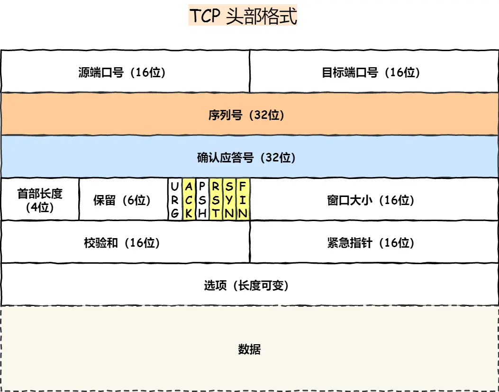
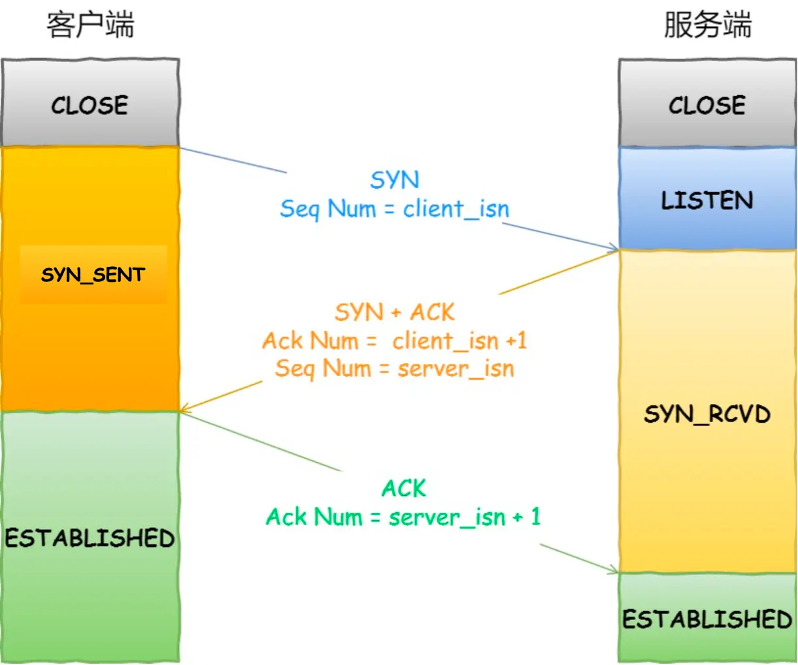
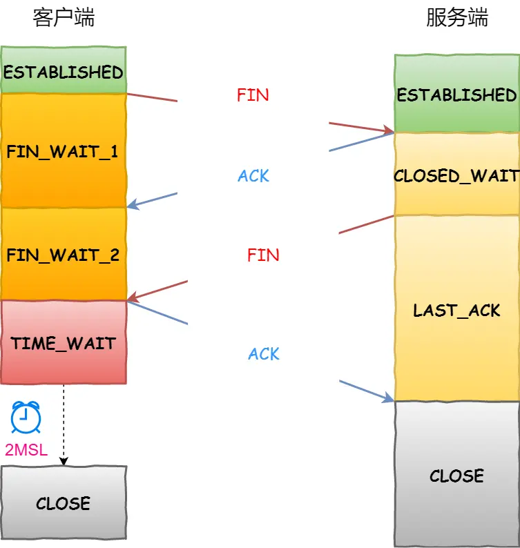
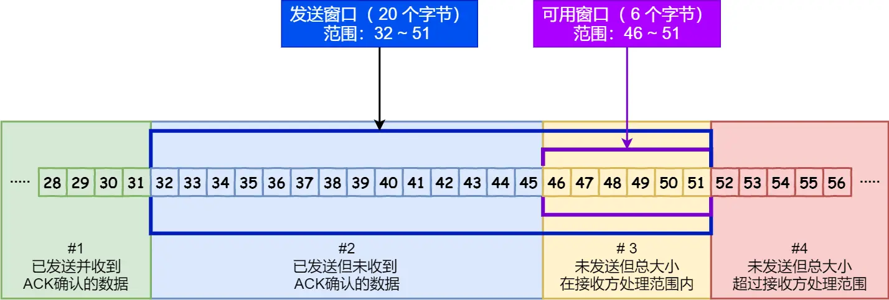
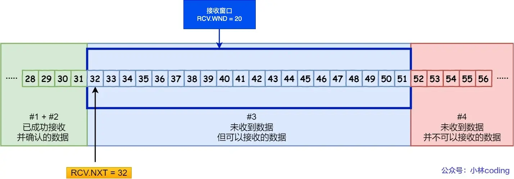
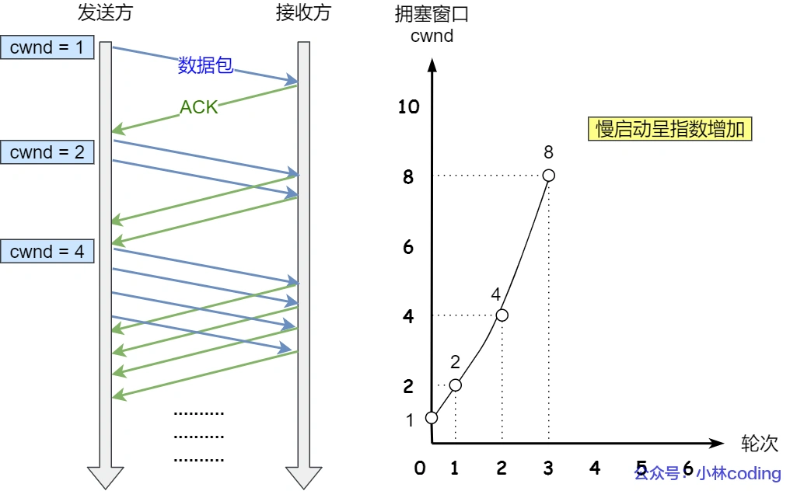
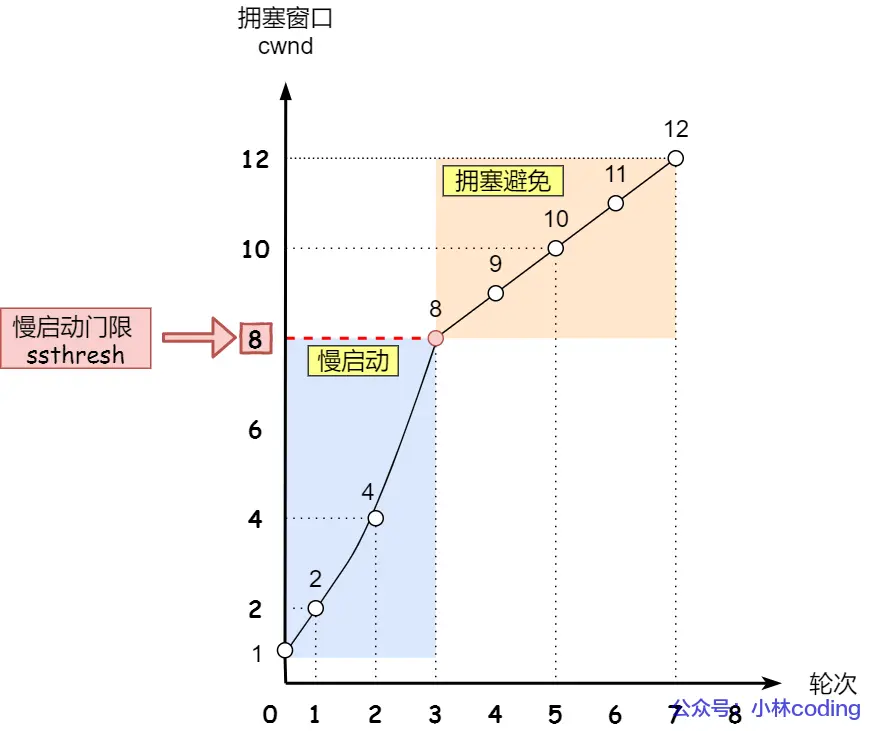
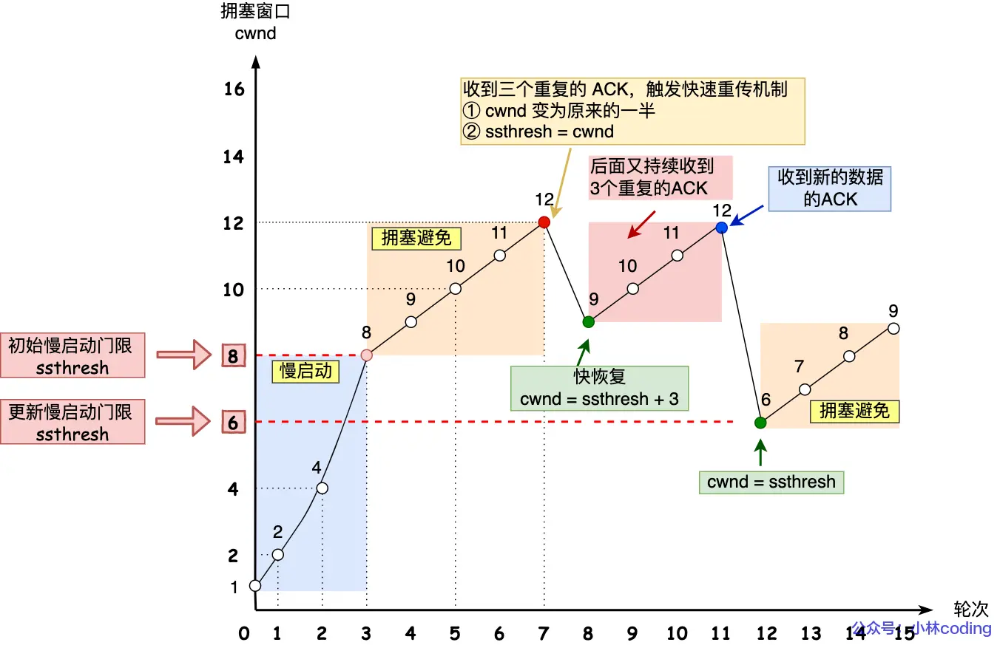

## TCP
### TCP 头部格式
  

### TCP 协议特点
* **面向连接**：一定是「一对一」才能连接，不能像 UDP 协议可以一个主机同时向多个主机发送消息，也就是一对多是无法做到的；

* **可靠的**：无论的网络链路中出现了怎样的链路变化，TCP 都可以保证一个报文一定能够到达接收端；

* **字节流**：用户消息通过 TCP 协议传输时，消息可能会被操作系统「分组」成多个的 TCP 报文，如果接收方的程序如果不知道「消息的边界」，是无法读出一个有效的用户消息的。并且 TCP 报文是「有序的」，当「前一个」TCP 报文没有收到的时候，即使它先收到了后面的 TCP 报文，那么也不能扔给应用层去处理，同时对「重复」的 TCP 报文会自动丢弃。

## TCP 连接与释放
### 三次握手
  

第一次握手：同步标识+客户端序列号
第二次握手：同步标识+服务端序列号，确认标识+客户端序列号+1
第三次握手：确认标识+服务端序列号+1

**为什么是三次握手而不是两次：两次不能阻止历史连接**
场景：客户端发送了SYN请求后宕机了一段时间，重启后又发送了一条SYN请求，此时这两条SYN请求的序列号值不相等（如果是超时重传的话，序列号相等）。
三次握手：服务端收到旧的SYN之后进入SYN_RCVD状态，同时给客户端发送SYN+ACK请求，客户端收到请求后发现序列号不对，于是给服务端发送RST信号中止连接，此时服务端状态变成LISTEN。新的SYN来了之后又可以正常连接。
两次握手：服务端收到旧的SYN之后进入ESTABLISHED状态，并向客户端发送SYN+ACK请求，客户端收到请求后发现序列号不对，但是已经晚了，服务端的连接已经建立起来了，客户端没机会中止这次连接了。新的SYN来了之后服务端会丢弃这个请求，因为服务端认为连接已经建立起来了。

**第一次握手丢失了，会发生什么？**
**客户端会重传SYN报文**，而且重传的SYN报文的序列号都一样。重传具体机制写在操作系统内核里。Linux默认重传5次，下一次重传和这一次的时间间隔分别是1，2，4，8，16。第五次重传后会等待32s，如果还没有相应则断开TCP连接。

**第二次握手丢失了，会发生什么？**
客户端重传SYN报文，服务器重传SYN-ACK报文。

**第三次握手丢失了，会发生什么？**
服务端会重传SYN-ACK报文。如果达到最大重传次数后还没有收到客户端的第三次握手，那么服务端就会断开连接。

**SYN洪泛攻击**
假设攻击者短时间伪造不同 IP 地址的 SYN 报文，服务端每接收到一个 SYN 报文，就进入SYN_RCVD 状态，但服务端发送出去的 ACK + SYN 报文，无法得到未知 IP 主机的 ACK 应答，久而久之就会占满服务端的半连接队列，使得服务端不能为正常用户服务。

### 四次挥手
  
第一次挥手：客户端向服务端发送 结束标识。表示客户端不再发送数据。
第二次挥手：服务端向客户端发送 确认标识。表示服务端不再接收数据。
第三次挥手：服务端向客户端发送 结束标识。表示服务端不再发送数据。
第四次挥手：客户端向服务端发送 确认标识。表示客户端不再接收数据。

**客户端在发送ACK报文之后，需要等待2MSL再进入CLOSE状态，为什么？**
MSL 是 Maximum Segment Lifetime，报文最大生存时间，它是任何报文在网络上存在的最长时间，超过这个时间报文将被丢弃。
等待2MSL再进入CLOSE状态，主要是防止最后一个ACK报文丢失导致服务端无法正常关闭。如果最后的ACK报文丢失，那么服务端重传的FIN报文一定会在2MSL时间内发送给客户端。也就是说2MSL时长其实是相当于至少允许报文丢失一次。

**为什么需要四次挥手？**
因为客户端在发送FIN之后，服务端可能有部分数据还没来得及发给客户端，因此需要等这一批数据发送完成之后，服务端才能向客户端发送FIN标识。

**什么情况下是三次挥手？**
如果服务端收到FIN标识之后，没有要发给客户端的数据了，那么服务端会将ACK报文和FIN报文合并起来发送给客户端。这样就只有三次挥手了。

**第一次挥手丢失会发生什么？**
客户端发送的FIN报文丢失，会导致**客户端超时重传**。如果超过最大重传次数，那么客户端会直接断开连接。

**第二次挥手丢失会发生什么？**
服务端ACK报文丢失，会导致**客户端超时重传**。

**第三次挥手丢失会发生什么？**
服务端会重发FIN报文。如果超过最大重传次数，那么服务端会直接断开连接。

**第四次挥手丢失会发生什么？**
客户端的ACK报文丢失，会导致服务端重发FIN报文。由于客户端会等待2MSL才进入CLOSE状态，因此至少允许ACK报文丢失一次。

## 重传机制
超时重传：当超过指定时间后（RTO：Retransmission Timeout 超时重传时间），没有收到对方的ACK应答报文，就会触发超时重传。
快速重传：当连续收到三个相同的ACK报文时触发快速重传。
SACK方法：选择性确认。这种方式需要在 TCP 头部「选项」字段里加一个 SACK 的东西，它可以将已收到的数据的信息发送给「发送方」，这样发送方就可以知道哪些数据收到了，哪些数据没收到，知道了这些信息，就可以只重传丢失的数据。
Duplicate SACK：Duplicate SACK 又称 D-SACK，其主要使用了 SACK 来告诉「发送方」有哪些数据被重复接收了。

## 滑动窗口
如果每发一条TCP报文，都要等待ACK才能发下一个，速度就太慢了。滑动窗口就是代表可以一次性发送若干条TCP报文，服务器接收到这些报文之后放到滑动窗口中（实际上就是内存缓冲区）同时一次性发送若干条ACK。

可用窗口大小可能为0，如果接收方接收到报文之后一直来不及处理，那么可用窗口的大小就会变成0。

**发送方滑动窗口**
  
**接收方的滑动窗口**
  

## 流量控制
TCP 提供一种机制可以让「发送方」根据「接收方」的实际接收能力控制发送的数据量，这就是所谓的流量控制。

不让流量太大：不会发送超过对方滑动窗口大小的数据。
不让流量太小：如果接收方每处理几个字节数据，滑动窗口每往右移一点，发送方就发送几个字节数据。那么传输效率就会很低（因为TCP+IP头信息有40个字节）。使用Nagle算法来延迟发送数据（核心思想就是需要满足一定条件才会发送数据）

## 拥塞控制
**拥塞窗口** cwnd是发送方维护的一个状态变量，它会根据网络的拥塞程度动态变化的。

我们在前面提到过发送窗口 swnd 和接收窗口 rwnd 是约等于的关系，那么由于加入了拥塞窗口的概念后，此时**发送窗口的值是swnd = min(cwnd, rwnd)**，也就是拥塞窗口和接收窗口中的最小值。

拥塞窗口 cwnd 变化的规则
* 只要网络中没有出现拥塞，cwnd 就会增大；
* 一旦网络中出现了拥塞，cwnd 就减少；
* 发生了超时重传，就会认为网络出现了拥塞。

### 拥塞控制算法
**慢启动**
慢启动：当发送方每收到一个 ACK，拥塞窗口 cwnd 的大小就会加 1。
  

**拥塞避免**
当拥塞窗口 cwnd 「超过」**慢启动门限** ssthresh 就会进入拥塞避免算法。一般来说 ssthresh 的大小是 65535 字节。

拥塞避免：每当收到一个 ACK 时，cwnd 增加 1/cwnd。
  

**拥塞发生**
出现超时重传时的拥塞发生算法。
* ssthresh 设为 cwnd/2，
* cwnd 重置为 1 （是恢复为 cwnd 初始化值，我这里假定 cwnd 初始化值 1）

发生快速重传时的拥塞发生算法。
* cwnd = cwnd/2 ，也就是设置为原来的一半;
* ssthresh = cwnd; （减半后的cwnd赋值给ssthresh）

**快速恢复**
  
